# Azure AI Search Integration for Functions

## Metadata

- **Name**: Azure AI Search Integration for Functions
- **Type**: Enabler
- **ID**: ENB-833671
- **Approval**: Approved
- **Capability ID**: CAP-833610
- **Owner**: Development Team
- **Status**: Ready for Implementation
- **Priority**: High
- **Analysis Review**: Not Required
- **Code Review**: Not Required

## Technical Overview
### Purpose
Integrate Azure AI Search with Azure Functions for serverless search operations and document indexing. Support search query execution from HTTP-triggered functions, automatic document indexing from blob/cosmos triggers, vector search capabilities, and environment-specific configuration optimized for serverless search patterns.

## Functional Requirements

| ID | Name | Requirement | Priority | Status | Approval |
|----|------|-------------|----------|--------|----------|
| FR-833672 | Search Query Execution | Execute full-text and vector search queries from Azure Functions | Must Have | Ready for Implementation | Approved |
| FR-833673 | Document Indexing | Index documents to Azure AI Search from blob or cosmos triggers | Must Have | Ready for Implementation | Approved |
| FR-833674 | Batch Indexing | Support batch document upload for efficient indexing operations | Must Have | Ready for Implementation | Approved |
| FR-833675 | Search Filters | Apply OData filters and facets in search queries from functions | Must Have | Ready for Implementation | Approved |
| FR-833676 | Vector Search | Generate embeddings and perform vector similarity searches | Must Have | Ready for Implementation | Approved |
| FR-833677 | Autocomplete Support | Provide autocomplete and suggestions functionality from HTTP functions | Medium | Ready for Implementation | Approved |
| FR-833678 | Index Management | Create and update search indexes programmatically from functions | Medium | Ready for Implementation | Approved |
| FR-833679 | Environment Configuration | Configure search service endpoints per environment using app settings | Must Have | Ready for Implementation | Approved |
| FR-833680 | Semantic Ranking | Use semantic ranking for improved search relevance | Medium | Ready for Implementation | Approved |
| FR-833681 | Search Result Highlighting | Return highlighted search result snippets | Must Have | Ready for Implementation | Approved |

## Non-Functional Requirements

| ID | Name | Type | Requirement | Priority | Status | Approval |
|----|------|------|-------------|----------|--------|----------|
| NFR-833682 | Search Response Time | Return search results in under 300ms from function execution | Must Have | Ready for Implementation | Approved |
| NFR-833683 | Indexing Performance | Index up to 1,000 documents per minute from function triggers | High | Ready for Implementation | Approved |
| NFR-833684 | Cold Start Impact | Minimize cold start delay for search functions under 2 seconds | Must Have | Ready for Implementation | Approved |
| NFR-833685 | Cost Efficiency | Optimize search queries to minimize search unit consumption | Must Have | Ready for Implementation | Approved |
| NFR-833686 | Scalability | Auto-scale function instances to handle 100 concurrent search requests | High | Ready for Implementation | Approved |
| NFR-833687 | Monitoring | Track search operations and indexing metrics in Application Insights | Must Have | Ready for Implementation | Approved |

## Dependencies

### Internal Upstream Dependency

| Enabler ID | Description |
|------------|-------------|
| ENB-068592 | Environment Configuration provides AI Search connection settings |
| ENB-613819 | Azure Function Runtime executes search functions |
| ENB-833631 | Blob Storage Integration provides documents for indexing |
| ENB-833651 | Cosmos DB Integration provides documents for indexing |

### Internal Downstream Impact

| Enabler ID | Description |
|------------|-------------|
| ENB-613840 | HTTP Trigger Handler executes search queries |

### External Dependencies

**External Upstream Dependencies**: Azure AI Search service, Azure OpenAI for embeddings

**External Downstream Impact**: Client applications consuming search results

## Technical Specifications

### Enabler Dependency Flow Diagram

```mermaid
flowchart TD
    ENB_833671["ENB-833671<br/>AI Search Integration<br/>🔍"]
    
    CONFIG["Environment Config<br/>Search Endpoint<br/>⚙️"]
    RUNTIME["Function Runtime<br/>Search SDK<br/>⚡"]
    
    CONFIG --> ENB_833671
    RUNTIME --> ENB_833671
    
    HTTP["HTTP Trigger<br/>Search Requests<br/>🌐"]
    BLOB["Blob Trigger<br/>Document Upload<br/>📦"]
    COSMOS["Cosmos Trigger<br/>Data Changes<br/>🗄️"]
    
    HTTP --> ENB_833671
    BLOB --> ENB_833671
    COSMOS --> ENB_833671
    
    SEARCH["Search Execution<br/>Query Processing<br/>🔎"]
    INDEX["Document Indexing<br/>Batch Upload<br/>📝"]
    VECTOR["Vector Search<br/>Embeddings<br/>🧠"]
    
    ENB_833671 --> SEARCH
    ENB_833671 --> INDEX
    ENB_833671 --> VECTOR
    
    AISEARCH["Azure AI Search<br/>Search Index<br/>☁️"]
    
    SEARCH --> AISEARCH
    INDEX --> AISEARCH
    VECTOR --> AISEARCH
    
    OPENAI["Azure OpenAI<br/>Embedding Generation<br/>🤖"]
    FILTER["Filters & Facets<br/>OData<br/>🔍"]
    HIGHLIGHT["Result Highlighting<br/>Snippets<br/>✨"]
    
    VECTOR --> OPENAI
    SEARCH --> FILTER
    SEARCH --> HIGHLIGHT
    
    MONITORING["Application Insights<br/>Search Metrics<br/>📊"]
    ENB_833671 --> MONITORING

    classDef enabler fill:#e3f2fd,stroke:#1976d2,stroke-width:2px
    classDef config fill:#fff3e0,stroke:#f57c00,stroke-width:2px
    classDef trigger fill:#e8f5e8,stroke:#388e3c,stroke-width:2px
    classDef core fill:#f3e5f5,stroke:#7b1fa2,stroke-width:2px
    classDef azure fill:#ffebee,stroke:#c62828,stroke-width:2px
    
    class ENB_833671 enabler
    class CONFIG,RUNTIME config
    class HTTP,BLOB,COSMOS trigger
    class SEARCH,INDEX,VECTOR,FILTER,HIGHLIGHT core
    class AISEARCH,OPENAI,MONITORING azure
```


### API Technical Specifications

| API Type | Operation | Channel / Endpoint | Description | Request / Publish Payload | Response / Subscribe Data |
|----------|-----------|---------------------|-------------|----------------------------|----------------------------|
| HTTP | POST | /api/search | Execute search query from function | Search request | Search results |
| Function | Method | searchClient.search() | Search using SDK | SearchOptions | SearchResults |
| Function | Method | searchClient.uploadDocuments() | Index documents | Document array | IndexResult |
| Function | Method | openAIClient.getEmbeddings() | Generate embeddings | Text | Vector array |
| Config | Settings | Application Settings | Configure search endpoint | - | - |

### Data Models


### Class Diagrams


### Sequence Diagrams


### Dataflow Diagrams


### State Diagrams


## Configuration Examples

### local.settings.json
```json
{
  "IsEncrypted": false,
  "Values": {
    "AzureWebJobsStorage": "UseDevelopmentStorage=true",
    "FUNCTIONS_WORKER_RUNTIME": "node",
    "SearchServiceEndpoint": "https://lease-sentry-dev.search.windows.net",
    "SearchServiceKey": "<dev-search-key>",
    "SearchIndexName": "lease-documents-dev",
    "OpenAIEndpoint": "https://lease-sentry-openai-dev.openai.azure.com",
    "OpenAIKey": "<dev-openai-key>",
    "OpenAIEmbeddingModel": "text-embedding-ada-002"
  }
}
```

### Search Function Implementation
```typescript
import { AzureFunction, Context, HttpRequest } from "@azure/functions";
import { SearchClient, AzureKeyCredential } from "@azure/search-documents";
import { OpenAIClient } from "@azure/openai";

const searchEndpoint = process.env.SearchServiceEndpoint!;
const searchKey = process.env.SearchServiceKey!;
const indexName = process.env.SearchIndexName!;

const searchClient = new SearchClient(
  searchEndpoint,
  indexName,
  new AzureKeyCredential(searchKey)
);

const searchFunction: AzureFunction = async (
  context: Context,
  req: HttpRequest
): Promise<void> => {
  const searchText = req.query.q || req.body?.searchText;
  const filter = req.query.filter || req.body?.filter;
  const useVectorSearch = req.query.semantic === 'true';

  if (!searchText) {
    context.res = {
      status: 400,
      body: { error: 'Search text is required' }
    };
    return;
  }

  context.log(`Executing search: "${searchText}" (Vector: ${useVectorSearch})`);

  try {
    let searchResults;

    if (useVectorSearch) {
      // Vector search with semantic ranking
      searchResults = await performVectorSearch(context, searchText, filter);
    } else {
      // Standard full-text search
      searchResults = await performTextSearch(context, searchText, filter);
    }

    context.res = {
      status: 200,
      body: {
        searchText,
        count: searchResults.count,
        facets: searchResults.facets,
        results: searchResults.results
      },
      headers: {
        'Content-Type': 'application/json'
      }
    };
  } catch (error) {
    context.log.error('Search error:', error);
    context.res = {
      status: 500,
      body: { error: 'Search failed', details: error.message }
    };
  }
};

async function performTextSearch(
  context: Context,
  searchText: string,
  filter?: string
) {
  const results = await searchClient.search(searchText, {
    filter,
    facets: ['status', 'propertyType', 'monthlyRent,interval:500'],
    top: 10,
    includeTotalCount: true,
    highlightFields: ['content', 'title', 'propertyAddress'],
    highlightPreTag: '<mark>',
    highlightPostTag: '</mark>'
  });

  const documents = [];
  for await (const result of results.results) {
    documents.push({
      score: result.score,
      document: result.document,
      highlights: result.highlights
    });
  }

  return {
    count: results.count,
    facets: results.facets,
    results: documents
  };
}

async function performVectorSearch(
  context: Context,
  searchText: string,
  filter?: string
) {
  // Generate embedding for search text
  const openAIEndpoint = process.env.OpenAIEndpoint!;
  const openAIKey = process.env.OpenAIKey!;
  const embeddingModel = process.env.OpenAIEmbeddingModel!;

  const openAIClient = new OpenAIClient(
    openAIEndpoint,
    new AzureKeyCredential(openAIKey)
  );

  const embeddingResponse = await openAIClient.getEmbeddings(
    embeddingModel,
    [searchText]
  );
  const queryEmbedding = embeddingResponse.data[0].embedding;

  // Hybrid search: text + vector
  const results = await searchClient.search(searchText, {
    vectorQueries: [{
      kind: 'vector',
      vector: queryEmbedding,
      fields: ['contentVector'],
      kNearestNeighborsCount: 10
    }],
    filter,
    top: 10,
    includeTotalCount: true
  });

  const documents = [];
  for await (const result of results.results) {
    documents.push({
      score: result.score,
      document: result.document
    });
  }

  return {
    count: results.count,
    results: documents,
    facets: {}
  };
}

export default searchFunction;
```

### Document Indexing Function
```typescript
import { AzureFunction, Context } from "@azure/functions";
import { SearchClient, AzureKeyCredential } from "@azure/search-documents";
import { OpenAIClient } from "@azure/openai";

const blobTriggerIndexer: AzureFunction = async (
  context: Context,
  blob: Buffer
): Promise<void> => {
  const blobName = context.bindingData.name;
  context.log(`Indexing document: ${blobName}`);

  try {
    // Extract text content from blob
    const content = blob.toString('utf-8');
    
    // Generate embedding for content
    const openAIClient = new OpenAIClient(
      process.env.OpenAIEndpoint!,
      new AzureKeyCredential(process.env.OpenAIKey!)
    );

    const embeddingResponse = await openAIClient.getEmbeddings(
      process.env.OpenAIEmbeddingModel!,
      [content.substring(0, 8000)] // Limit for embedding model
    );
    const contentVector = embeddingResponse.data[0].embedding;

    // Create search document
    const searchDocument = {
      id: blobName.replace(/[^a-zA-Z0-9_-]/g, '_'),
      title: blobName,
      content: content,
      contentVector: contentVector,
      uploadedAt: new Date().toISOString(),
      fileType: blobName.split('.').pop(),
      metadata: context.bindingData.metadata || {}
    };

    // Upload to search index
    const searchClient = new SearchClient(
      process.env.SearchServiceEndpoint!,
      process.env.SearchIndexName!,
      new AzureKeyCredential(process.env.SearchServiceKey!)
    );

    const result = await searchClient.uploadDocuments([searchDocument]);
    
    context.log(`Successfully indexed document: ${blobName}`, {
      succeeded: result.results.filter(r => r.succeeded).length,
      failed: result.results.filter(r => !r.succeeded).length
    });
  } catch (error) {
    context.log.error(`Error indexing document: ${blobName}`, error);
    throw error;
  }
};

export default blobTriggerIndexer;
```

### Autocomplete Function
```typescript
import { AzureFunction, Context, HttpRequest } from "@azure/functions";
import { SearchClient, AzureKeyCredential } from "@azure/search-documents";

const autocompleteFunction: AzureFunction = async (
  context: Context,
  req: HttpRequest
): Promise<void> => {
  const searchText = req.query.q || req.body?.searchText;

  if (!searchText || searchText.length < 2) {
    context.res = {
      status: 400,
      body: { error: 'Search text must be at least 2 characters' }
    };
    return;
  }

  try {
    const searchClient = new SearchClient(
      process.env.SearchServiceEndpoint!,
      process.env.SearchIndexName!,
      new AzureKeyCredential(process.env.SearchServiceKey!)
    );

    const suggestions = await searchClient.autocomplete(
      searchText,
      'sg', // Suggester name defined in index
      {
        mode: 'twoTerms',
        top: 10
      }
    );

    context.res = {
      status: 200,
      body: {
        searchText,
        suggestions: suggestions.results.map(s => s.text)
      }
    };
  } catch (error) {
    context.log.error('Autocomplete error:', error);
    context.res = {
      status: 500,
      body: { error: 'Autocomplete failed' }
    };
  }
};

export default autocompleteFunction;
```
