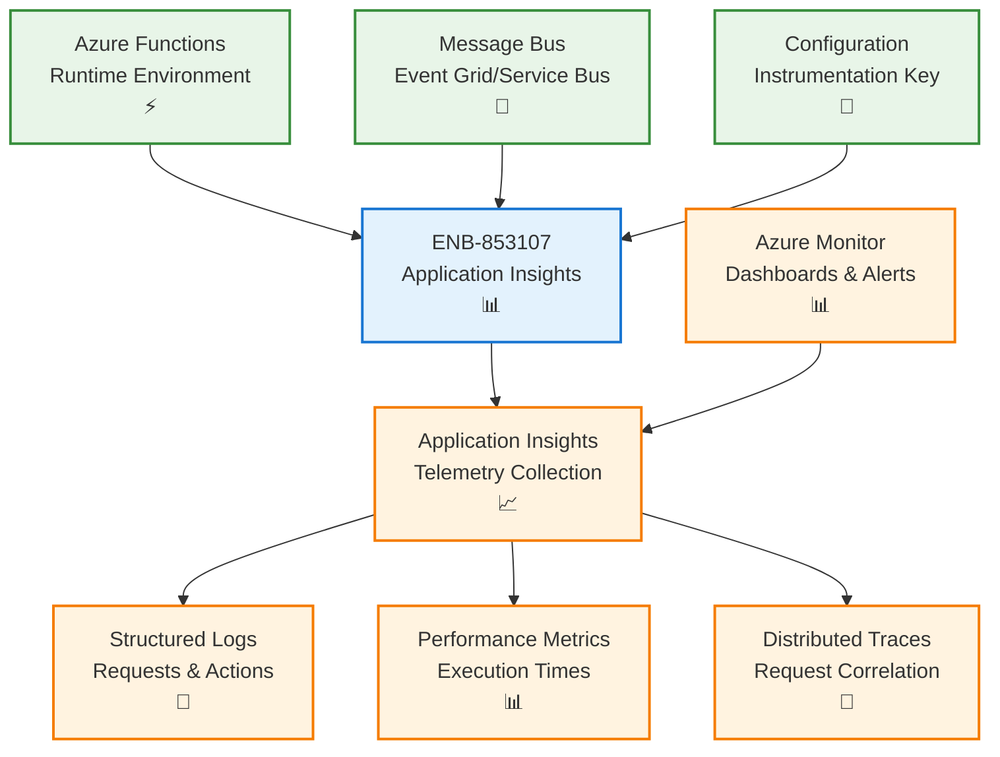
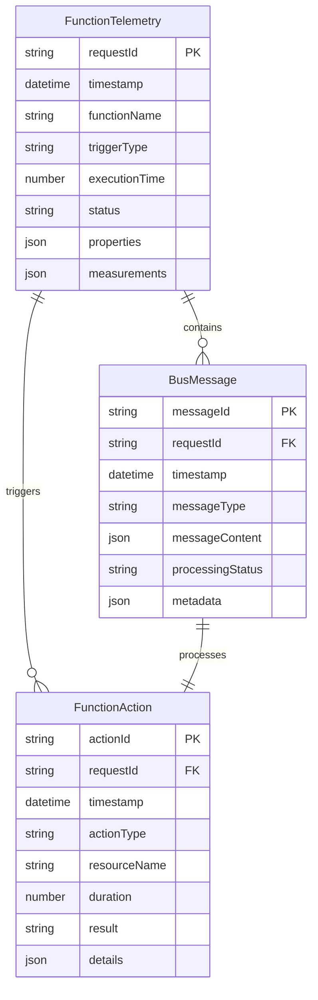
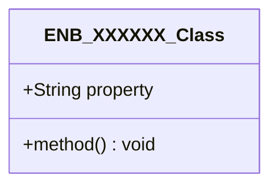
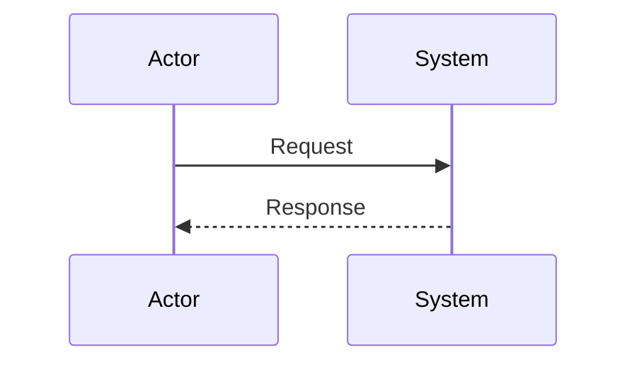
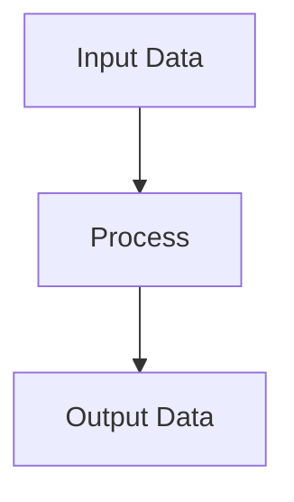
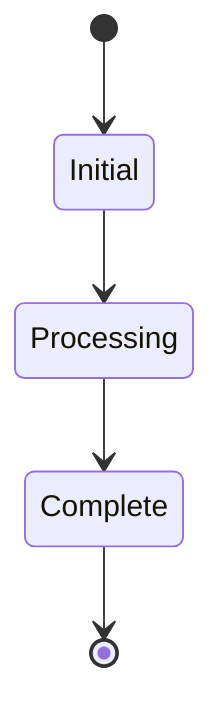

# Application Insights

## Metadata

- **Name**: Application Insights
- **Type**: Enabler
- **ID**: ENB-853107
- **Approval**: Approved
- **Capability ID**: CAP-026386
- **Owner**: Product Team
- **Status**: Ready for Implementation
- **Priority**: High
- **Analysis Review**: Required
- **Code Review**: Not Required

## Technical Overview
### Purpose
Instrument functions with Application Insights:
- accepts request-id
- log bus message and function actions for each bus message

application insights key is configurable

## Functional Requirements

| ID | Name | Requirement | Priority | Status | Approval |
|----|------|-------------|----------|--------|----------|
| FR-853107-01 | SDK Configuration | Configure Azure Functions to use Application Insights SDK with proper instrumentation key | Must Have | Ready for Implementation | Approved |
| FR-853107-02 | Request Tracking | Capture and log all incoming function requests with unique request-id correlation | Must Have | Ready for Implementation | Approved |
| FR-853107-03 | Bus Message Logging | Log all bus messages received by functions with message content and metadata | Must Have | Ready for Implementation | Approved |
| FR-853107-04 | Function Action Logging | Log all function actions and operations performed during execution | Must Have | Ready for Implementation | Approved |
| FR-853107-05 | Telemetry Correlation | Ensure proper correlation between requests, bus messages, and function actions using request-id | Must Have | Ready for Implementation | Approved |
| FR-853107-06 | Custom Metrics | Implement custom metrics for business-specific function performance indicators | Should Have | Ready for Implementation | Approved |
| FR-853107-07 | Error Tracking | Automatically capture and log all exceptions and errors with full stack traces | Must Have | Ready for Implementation | Approved |
| FR-853107-08 | Performance Monitoring | Track function execution time, cold start duration, and resource utilization | Must Have | Ready for Implementation | Approved |
| FR-853107-09 | Configurable Key | Support configurable Application Insights instrumentation key via environment variables | Must Have | Ready for Implementation | Approved |
| FR-853107-10 | Sampling Configuration | Implement adaptive sampling to manage telemetry volume and costs | Should Have | Ready for Implementation | Approved |

## Non-Functional Requirements

| ID | Name | Type | Requirement | Priority | Status | Approval |
|----|------|------|-------------|----------|--------|----------|
| NFR-853107-01 | Performance Impact | Performance | Application Insights overhead should not exceed 5% of function execution time | Must Have | Ready for Implementation | Approved |
| NFR-853107-02 | Reliability | Reliability | Telemetry collection should not cause function failures or timeouts | Must Have | Ready for Implementation | Approved |
| NFR-853107-03 | Data Security | Security | All telemetry data must be encrypted in transit and at rest | Must Have | Ready for Implementation | Approved |
| NFR-853107-04 | Scalability | Scalability | Handle telemetry from functions scaling to 100+ concurrent instances | Must Have | Ready for Implementation | Approved |
| NFR-853107-05 | Cost Management | Efficiency | Implement sampling and filtering to manage Application Insights costs within budget | Should Have | Ready for Implementation | Approved |
| NFR-853107-06 | Data Retention | Compliance | Configure appropriate data retention policies for different telemetry types | Should Have | Ready for Implementation | Approved |
| NFR-853107-07 | Real-time Monitoring | Availability | Enable real-time alerts and dashboards for critical function metrics | Must Have | Ready for Implementation | Approved |
| NFR-853107-08 | Query Performance | Performance | Application Insights queries should return results within 30 seconds | Should Have | Ready for Implementation | Approved |

## Dependencies

### Internal Upstream Dependency

| Enabler ID | Description |
|------------|-------------|
| ENB-026387 | Function runtime environment must be configured before adding Application Insights |
| ENB-026400 | Function deployment pipeline should include Application Insights configuration |

### Internal Downstream Impact

| Enabler ID | Description |
|------------|-------------|
| ENB-026420 | Logging framework depends on Application Insights for centralized telemetry |
| ENB-026440 | Monitoring and alerting capabilities depend on Application Insights data |

### External Dependencies

**External Upstream Dependencies**: Azure Application Insights service, Azure Functions runtime with Application Insights SDK

**External Downstream Impact**: Application Insights workspace, Azure Monitor, Log Analytics workspace

## Technical Specifications (Template)

### Enabler Dependency Flow Diagram

### API Technical Specifications (if applicable)

| API Type | Operation | Channel / Endpoint | Description | Request / Publish Payload | Response / Subscribe Data |
|----------|-----------|---------------------|-------------|----------------------------|----------------------------|
| SDK | Initialize | ApplicationInsights SDK | Initialize Application Insights with instrumentation key | `{instrumentationKey: "xxx", sampling: {...}}` | SDK instance |
| SDK | TrackRequest | appInsights.trackRequest() | Log HTTP request with correlation | `{name, url, duration, resultCode, success, id}` | - |
| SDK | TrackTrace | appInsights.trackTrace() | Log custom trace message | `{message, severityLevel, properties}` | - |
| SDK | TrackException | appInsights.trackException() | Log exception with context | `{exception, severityLevel, properties}` | - |
| SDK | TrackMetric | appInsights.trackMetric() | Log custom metric | `{name, value, count, min, max, properties}` | - |

### Data Models


    %% Add relationships and more entities here
```
### Class Diagrams

### Sequence Diagrams

### Dataflow Diagrams

### State Diagrams


