# Initial Log In Web Component

## Metadata

- **Name**: Initial Log In Web Component
- **Type**: Enabler
- **ID**: ENB-037678
- **Approval**: Approved
- **Capability ID**: CAP-227261
- **Owner**: Product Team
- **Status**: Ready for Implementation
- **Priority**: High
- **Analysis Review**: Required
- **Code Review**: Not Required

## Technical Overview
### Purpose
Step one of a multi-step wizard:
- This step is independently navigable by a unique url (/newlogin).
- Displays the log in options from Azure App Service Authentication (Easy Auth)

Integrates with Azure App Service Authentication (Easy Auth)
On successful login, navigates to Subscription Choice Step 2

## Functional Requirements

| ID | Requirement | Status | Priority |
|----|------------|--------|----------|
| FR-037678-01 | Display a login page at /newlogin with authentication options from Azure Easy Auth | Draft | High |
| FR-037678-02 | Integrate with Azure App Service Authentication (Easy Auth) to handle login flows | Draft | High |
| FR-037678-03 | On successful authentication, navigate the user to the Subscription Choice Step 2 | Draft | High |
| FR-037678-04 | Ensure the /newlogin URL is independently accessible without prior steps | Draft | Medium |
| FR-037678-05 | Display all available login options provided by Azure Easy Auth (e.g., Microsoft, Google, etc.) | Draft | High |
| FR-037678-06 | Display appropriate error messages for failed authentication attempts | Draft | Medium |

## Non-Functional Requirements

| ID | Requirement | Status | Priority |
|----|------------|--------|----------|
| NFR-037678-01 | Securely handle authentication tokens and prevent unauthorized access | Draft | High |
| NFR-037678-02 | Provide a clear, intuitive login interface with accessible options | Draft | High |
| NFR-037678-03 | Login page loads within 2 seconds under normal conditions | Draft | Medium |
| NFR-037678-04 | Compatible with modern browsers and Azure Easy Auth providers | Draft | Medium |
| NFR-037678-05 | Handle authentication failures gracefully without crashing the application | Draft | High |

## Dependencies

### Internal Upstream Dependency

| Enabler ID | Description |
|------------|-------------|
| | |

### Internal Downstream Impact

| Enabler ID | Description |
|------------|-------------|
| | |

### External Dependencies

**External Upstream Dependencies**: None identified.

**External Downstream Impact**: None identified.

## Technical Specifications (Template)

### Enabler Dependency Flow Diagram

```mermaid
flowchart TD
    ENB_XXXXXX["ENB-037678<br/>[Enabler Name]<br/>📡"]

    %% Add your dependency flows here

    classDef enabler fill:#e3f2fd,stroke:#1976d2,stroke-width:2px
    class ENB_XXXXXX enabler
```

### API Technical Specifications (if applicable)

| API Type | Operation | Channel / Endpoint | Description | Request / Publish Payload | Response / Subscribe Data |
|----------|-----------|---------------------|-------------|----------------------------|----------------------------|
| | | | | | |

### Data Models

### Class Diagrams

### Sequence Diagrams

### Dataflow Diagrams

### State Diagrams

