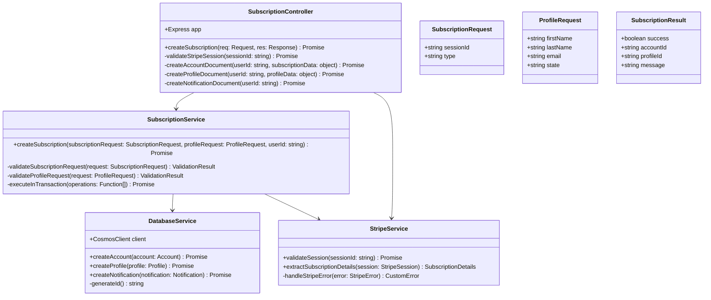

# Subscription API

## Metadata

- **Name**: Subscription API
- **Type**: Enabler
- **ID**: ENB-388018
- **Approval**: Approved
- **Capability ID**: CAP-329283
- **Owner**: Product Team
- **Status**: Ready for Implementation
- **Priority**: High
- **Analysis Review**: Required
- **Code Review**: Not Required

## Technical Overview
### Purpose
A webservice API that creates a new subscription
- POST method
- /subscription path
- Accepts a subscription request
- Accepts a profile request

Validates the session id is valid and payment is complete with Stripe
Create an account document:
- Set user id from the user id in the JWT
- Set the subscription type
- Set the subscription item id from the Stripe session
- Set the subscription id from the Stripe session
Saves the account in the "account" container in cosmos db
Create a notification document:
- Set user id from the user id in the JWT
- Set the notifications as an empty array
Save the notification in the "notification" container in cosmos db
Set the user id from the user id in the JWT on the profile document
Saves the profile document in the "profile" container in cosmos db

## Functional Requirements

| ID | Name | Requirement | Priority | Status | Approval |
|----|------|-------------|----------|--------|----------|
| FR-388018-01 | POST Endpoint | Implement POST /subscription endpoint for subscription creation | Must Have | Ready for Implementation | Approved |
| FR-388018-02 | Subscription Payload | Accept and validate subscription request payload with required fields | Must Have | Ready for Implementation | Approved |
| FR-388018-03 | Profile Payload | Accept and validate profile request payload with user information | Must Have | Ready for Implementation | Approved |
| FR-388018-04 | Stripe Validation | Validate Stripe session ID to ensure payment completion and extract subscription details | Must Have | Ready for Implementation | Approved |
| FR-388018-05 | JWT User Extraction | Extract and validate user ID from JWT token in request headers | Must Have | Ready for Implementation | Approved |
| FR-388018-06 | Account Document Creation | Create account document with proper structure for Cosmos DB storage | Must Have | Ready for Implementation | Approved |
| FR-388018-07 | Account User ID | Set user ID from JWT in account document | Must Have | Ready for Implementation | Approved |
| FR-388018-08 | Account Subscription Type | Set subscription type from request payload in account document | Must Have | Ready for Implementation | Approved |
| FR-388018-09 | Account Item ID | Set subscription item ID from validated Stripe session in account document | Must Have | Ready for Implementation | Approved |
| FR-388018-10 | Account Subscription ID | Set subscription ID from validated Stripe session in account document | Must Have | Ready for Implementation | Approved |
| FR-388018-11 | Profile Document Creation | Create and save profile document in profiles container with user information | Must Have | Ready for Implementation | Approved |
| FR-388018-12 | Profile User Association | Associate profile document with user ID from JWT | Must Have | Ready for Implementation | Approved |
| FR-388018-13 | Notification Initialization | Create notification document with empty notifications array for new user | Must Have | Ready for Implementation | Approved |
| FR-388018-14 | Error Handling | Handle validation errors, Stripe failures, and database errors with appropriate HTTP responses | Must Have | Ready for Implementation | Approved |
| FR-388018-15 | Success Response | Return success response with account and profile IDs upon successful subscription creation | Must Have | Ready for Implementation | Approved |

## Non-Functional Requirements

| ID | Name | Type | Requirement | Priority | Status | Approval |
|----|------|------|-------------|----------|--------|----------|
| NFR-388018-01 | JWT Security | Security | Secure JWT token validation and user ID extraction with proper error handling | Must Have | Ready for Implementation | Approved |
| NFR-388018-02 | Input Validation | Reliability | Comprehensive input validation against defined data schemas for all payloads | Must Have | Ready for Implementation | Approved |
| NFR-388018-03 | Response Time | Performance | API response time under 5 seconds for subscription creation including Stripe validation | Must Have | Ready for Implementation | Approved |
| NFR-388018-04 | Transaction Atomicity | Reliability | Atomic operations ensuring account, profile, and notification documents are created together or rolled back | Must Have | Ready for Implementation | Approved |
| NFR-388018-05 | Error Logging | Observability | Comprehensive error logging with correlation IDs for debugging and monitoring | Should Have | Ready for Implementation | Approved |
| NFR-388018-06 | PCI Compliance | Security | PCI DSS compliance for payment validation and Stripe session handling | Must Have | Ready for Implementation | Approved |
| NFR-388018-07 | Idempotency | Reliability | Idempotent subscription creation preventing duplicate accounts for same user/session | Should Have | Ready for Implementation | Approved |
| NFR-388018-08 | Data Encryption | Security | Encrypt sensitive data at rest and in transit for profile and account information | Must Have | Ready for Implementation | Approved |

## Dependencies

### Internal Upstream Dependency

| Enabler ID | Description |
|------------|-------------|
| ENB-847328 | JWT Authentication Middleware - provides JWT validation and user ID extraction |
| ENB-833570 | Azure Cosmos DB Integration - provides database operations for accounts, profiles, and notifications containers |

### Internal Downstream Impact

| Enabler ID | Description |
|------------|-------------|
| ENB-577934 | New Profile Web Component - calls this API to complete subscription creation |

### External Dependencies

**External Upstream Dependencies**: Stripe Payment Processing API for session validation.

**External Downstream Impact**: None identified.

## Technical Specifications (Template)

### Enabler Dependency Flow Diagram

### API Technical Specifications (if applicable)

| API Type | Operation | Channel / Endpoint | Description | Request / Publish Payload | Response / Subscribe Data |
|----------|-----------|---------------------|-------------|----------------------------|----------------------------|
| REST API | POST | /subscription | Create new subscription with account and profile | `{ "subscription": { "sessionId": "string", "type": "string" }, "profile": { "firstName": "string", "lastName": "string", "email": "string", "state": "string" } }` | `{ "success": true, "accountId": "string", "profileId": "string", "message": "string" }` |
| External API | GET | Stripe API /v1/checkout/sessions/{sessionId} | Validate Stripe session and extract subscription details | N/A | `{ "id": "string", "payment_status": "paid", "subscription": "string", "line_items": [...] }` |
| Database | CREATE | accounts container | Create account document | `{ "id": "uuid", "userId": "string", "subscriptionType": "string", "subscriptionItemId": "string", "subscriptionId": "string", "createdAt": "datetime" }` | Document ID |
| Database | CREATE | profiles container | Create profile document | `{ "id": "uuid", "userId": "string", "firstName": "string", "lastName": "string", "email": "string", "state": "string", "createdAt": "datetime" }` | Document ID |
| Database | CREATE | notifications container | Create notification document | `{ "id": "uuid", "userId": "string", "notifications": [], "createdAt": "datetime" }` | Document ID |

### Data Models

### Class Diagrams

### Sequence Diagrams

### Dataflow Diagrams

### State Diagrams

