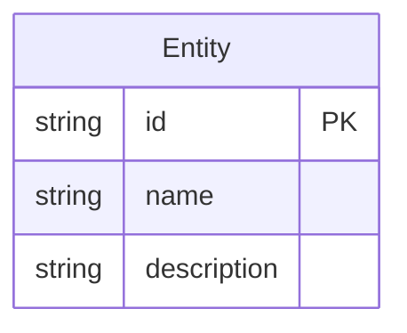
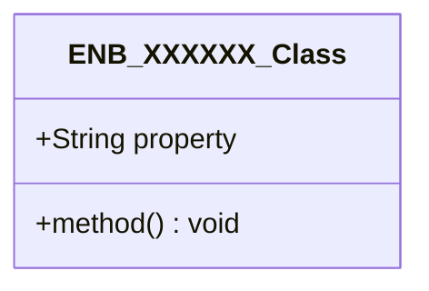
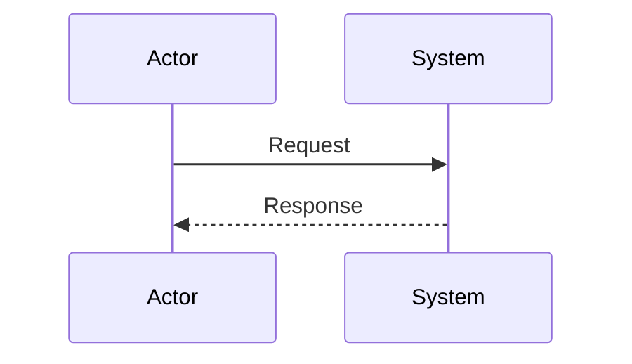
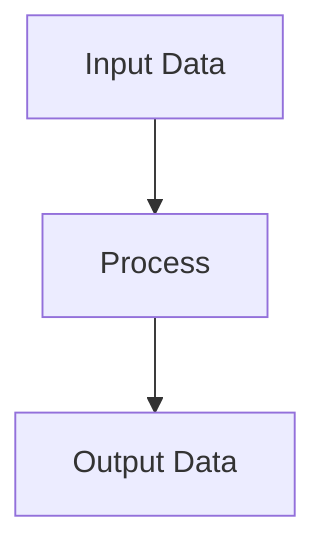
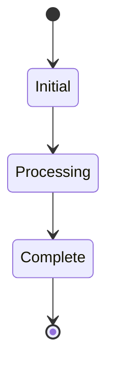

# Subscription Choice Web Component

## Metadata

- **Name**: Subscription Choice Web Component
- **Type**: Enabler
- **ID**: ENB-390020
- **Approval**: Not Approved
- **Capability ID**: CAP-754457
- **Owner**: Product Team
- **Status**: In Draft
- **Priority**: High
- **Analysis Review**: Required
- **Code Review**: Not Required

## Technical Overview
### Purpose
Step two of a multi-step wizard:
- This step is independently navigable by a unique url (/newsubscription)
- A selection of the the three subscription options: Starter, or Pro
- A description of the options from the Universal Subscription Options
- A grid comparison of the options from the Universal Subscription Options

On submission, navigates to step 3 (/payment)
Adds the selected subscription (free, starter, pro) to the subscription object

## Functional Requirements

| ID | Requirement | Status | Priority |
|----|------------|--------|----------|
| FR-390020-01 | Display subscription selection page at /newsubscription | Draft | High |
| FR-390020-02 | Show three subscription options: Free, Starter, Pro | Draft | High |
| FR-390020-03 | Display descriptions for each subscription option from Universal Subscription Options | Draft | High |
| FR-390020-04 | Provide grid comparison of subscription features from Universal Subscription Options | Draft | High |
| FR-390020-05 | Allow user to select one subscription option | Draft | High |
| FR-390020-06 | Validate subscription selection before submission | Draft | High |
| FR-390020-07 | Navigate to /payment page on successful submission | Draft | High |
| FR-390020-08 | Update subscription object with selected option (free/starter/pro) | Draft | High |
| FR-390020-09 | Ensure page is independently navigable | Draft | Medium |
| FR-390020-10 | Handle invalid or missing subscription selection | Draft | Medium |

## Non-Functional Requirements

| ID | Requirement | Status | Priority |
|----|------------|--------|----------|
| NFR-390020-01 | Page loads within 2 seconds | Draft | High |
| NFR-390020-02 | Responsive design for mobile and desktop | Draft | High |
| NFR-390020-03 | Accessible to screen readers and keyboard navigation | Draft | High |
| NFR-390020-04 | Secure handling of subscription data | Draft | High |
| NFR-390020-05 | Intuitive user interface for selection | Draft | Medium |
| NFR-390020-06 | Compatible with modern browsers | Draft | Medium |
| NFR-390020-07 | Clear visual hierarchy for subscription comparison | Draft | Medium |

## Dependencies

### Internal Upstream Dependency

| Enabler ID | Description |
|------------|-------------|
| | |

### Internal Downstream Impact

| Enabler ID | Description |
|------------|-------------|
| | |

### External Dependencies

**External Upstream Dependencies**: None identified.

**External Downstream Impact**: None identified.

## Technical Specifications (Template)

### Enabler Dependency Flow Diagram

```mermaid
flowchart TD
    ENB_XXXXXX["ENB-390020<br/>[Enabler Name]<br/>📡"]

    %% Add your dependency flows here

    classDef enabler fill:#e3f2fd,stroke:#1976d2,stroke-width:2px
    class ENB_XXXXXX enabler
```

### API Technical Specifications (if applicable)

| API Type | Operation | Channel / Endpoint | Description | Request / Publish Payload | Response / Subscribe Data |
|----------|-----------|---------------------|-------------|----------------------------|----------------------------|
| | | | | | |

### Data Models

### Class Diagrams

### Sequence Diagrams

### Dataflow Diagrams

### State Diagrams

