# New Profile Web Component

## Metadata

- **Name**: New Profile Web Component
- **Type**: Enabler
- **ID**: ENB-577934
- **Approval**: Approved
- **Capability ID**: CAP-329283
- **Owner**: Product Team
- **Status**: Ready for Implementation
- **Priority**: High
- **Analysis Review**: Required
- **Code Review**: Not Required

## Technical Overview
### Purpose
Step four of a multi-step wizard:
- This step is independently navigable by a unique url (/newprofile).
- Adds the session id to the subscription request
- Enables the user to enter a First Name, Last Name, Email address (pre-populates with any email address from the login), State from a drop down of the 50 u.s. states

On submission, call the Subscription API passing it the subscription and profile request
On success, navigates to the Contracts Page (/contracts)

## Functional Requirements

| ID | Name | Requirement | Priority | Status | Approval |
|----|------|-------------|----------|--------|----------|
| FR-577934-01 | Profile Page Display | Display profile creation page at /newprofile | Must Have | Ready for Implementation | Approved |
| FR-577934-02 | Session ID Integration | Add session id to subscription request | Must Have | Ready for Implementation | Approved |
| FR-577934-03 | First Name Input | Provide form for First Name input | Must Have | Ready for Implementation | Approved |
| FR-577934-04 | Last Name Input | Provide form for Last Name input | Must Have | Ready for Implementation | Approved |
| FR-577934-05 | Email Input | Provide form for Email input with pre-population | Must Have | Ready for Implementation | Approved |
| FR-577934-06 | State Selection | Provide dropdown for State selection (50 US states) | Must Have | Ready for Implementation | Approved |
| FR-577934-07 | Form Validation | Validate all form inputs | Must Have | Ready for Implementation | Approved |
| FR-577934-08 | Subscription API Call | Call Subscription API with subscription and profile data | Must Have | Ready for Implementation | Approved |
| FR-577934-09 | Success Navigation | Navigate to /contracts on successful submission | Must Have | Ready for Implementation | Approved |
| FR-577934-10 | Error Handling | Handle API errors and display to user | Must Have | Ready for Implementation | Approved |

## Non-Functional Requirements

| ID | Name | Type | Requirement | Priority | Status | Approval |
|----|------|------|-------------|----------|--------|----------|
| NFR-577934-01 | Email Pre-population | Usability | Pre-populate email from login if available | Should Have | Ready for Implementation | Approved |
| NFR-577934-02 | Responsive Design | Usability | Responsive form design for mobile and desktop | Must Have | Ready for Implementation | Approved |
| NFR-577934-03 | Accessibility | Usability | Accessible form controls and navigation | Must Have | Ready for Implementation | Approved |
| NFR-577934-04 | Form Security | Security | Secure form submission with input sanitization | Must Have | Ready for Implementation | Approved |
| NFR-577934-05 | Page Load Performance | Performance | Page loads within 2 seconds | Must Have | Ready for Implementation | Approved |
| NFR-577934-06 | Client Validation | Usability | Client-side validation for better user experience | Should Have | Ready for Implementation | Approved |
| NFR-577934-07 | Browser Compatibility | Compatibility | Compatible with modern browsers | Medium | Ready for Implementation | Approved |

## Dependencies

### Internal Upstream Dependency

| Enabler ID | Description |
|------------|-------------|
| | |

### Internal Downstream Impact

| Enabler ID | Description |
|------------|-------------|
| | |

### External Dependencies

**External Upstream Dependencies**: None identified.

**External Downstream Impact**: None identified.

## Technical Specifications (Template)

### Enabler Dependency Flow Diagram

```mermaid
flowchart TD
    ENB_XXXXXX["ENB-577934<br/>[Enabler Name]<br/>📡"]

    %% Add your dependency flows here

    classDef enabler fill:#e3f2fd,stroke:#1976d2,stroke-width:2px
    class ENB_XXXXXX enabler
```

### API Technical Specifications (if applicable)

| API Type | Operation | Channel / Endpoint | Description | Request / Publish Payload | Response / Subscribe Data |
|----------|-----------|---------------------|-------------|----------------------------|----------------------------|
| | | | | | |

### Data Models

### Class Diagrams

### Sequence Diagrams

### Dataflow Diagrams

### State Diagrams

