# Checkout Session API

## Metadata

- **Name**: Checkout Session API
- **Type**: Enabler
- **ID**: ENB-918796
- **Approval**: Approved
- **Capability ID**: CAP-480705
- **Owner**: Product Team
- **Status**: Ready for Implementation
- **Priority**: High
- **Analysis Review**: Required
- **Code Review**: Not Required

## Technical Overview
### Purpose
A webservice API that creates a new Stripe checkout session
- POST method
- /checkoutsession path
- Accepts a session id
- Returns the session checkout response that includes a client secret
- Follows the instructions from Stripe found here: https://docs.stripe.com/checkout/embedded/quickstart

## Functional Requirements

| ID | Requirement | Status | Priority |
|----|------------|--------|----------|
| FR-918796-01 | Implement POST /checkoutsession endpoint | Draft | High |
| FR-918796-02 | Accept session id in request payload | Draft | High |
| FR-918796-03 | Create new Stripe checkout session using Stripe API | Draft | High |
| FR-918796-04 | Return checkout session response with client secret | Draft | High |
| FR-918796-05 | Follow Stripe embedded checkout quickstart instructions | Draft | High |
| FR-918796-06 | Handle Stripe API errors and return appropriate responses | Draft | High |
| FR-918796-07 | Validate session id input | Draft | Medium |
| FR-918796-08 | Ensure secure communication with Stripe | Draft | High |

## Non-Functional Requirements

| ID | Requirement | Status | Priority |
|----|------------|--------|----------|
| NFR-918796-01 | Response time under 3 seconds | Draft | High |
| NFR-918796-02 | Handle up to 100 concurrent requests | Draft | Medium |
| NFR-918796-03 | Secure handling of Stripe API keys | Draft | High |
| NFR-918796-04 | PCI compliance for payment processing | Draft | High |
| NFR-918796-05 | 99.9% uptime for the API | Draft | High |
| NFR-918796-06 | Comprehensive error logging | Draft | Medium |

## Dependencies

### Internal Upstream Dependency

| Enabler ID | Description |
|------------|-------------|
| | |

### Internal Downstream Impact

| Enabler ID | Description |
|------------|-------------|
| | |

### External Dependencies

**External Upstream Dependencies**: None identified.

**External Downstream Impact**: None identified.

## Technical Specifications (Template)

### Enabler Dependency Flow Diagram

```mermaid
flowchart TD
    ENB_XXXXXX["ENB-918796<br/>[Enabler Name]<br/>📡"]

    %% Add your dependency flows here

    classDef enabler fill:#e3f2fd,stroke:#1976d2,stroke-width:2px
    class ENB_XXXXXX enabler
```

### API Technical Specifications (if applicable)

| API Type | Operation | Channel / Endpoint | Description | Request / Publish Payload | Response / Subscribe Data |
|----------|-----------|---------------------|-------------|----------------------------|----------------------------|
| | | | | | |

### Data Models

### Class Diagrams

### Sequence Diagrams

### Dataflow Diagrams

### State Diagrams

