# Subscription Configurations

## Metadata

- **Name**: Subscription Configurations
- **Type**: Enabler
- **ID**: ENB-828574
- **Approval**: Approved
- **Capability ID**: CAP-081697
- **Owner**: Product Team
- **Status**: Ready for Implementation
- **Priority**: High
- **Analysis Review**: Required
- **Code Review**: Not Required

## Technical Overview
### Purpose
Each subscription will have a unique set of Stripe id's that will be required when calling into the Stripe integration per environment (dev, test, production).
- enforce payment available on both the website and webserver that when false bypasses the need to make a payment from Stripe
- secret key: starts with sk_ and is available on the webserver
- public key: starts with pk_ and is available on the website
- starter price id: for the starter subscription type, starts with price_ and is available on the website
- pro price id: for the pro subscription type, starts with price_ and is available on the website
- The free subscription type does not integrate with Strip and has no pricing information

## Functional Requirements

| ID | Name | Requirement | Priority | Status | Approval |
|----|------|-------------|----------|--------|----------|
| FR-828574-01 | Secret Key Storage | Store Stripe secret key per environment with sk_ prefix | Must Have | Ready for Implementation | Approved |
| FR-828574-02 | Public Key Storage | Store Stripe public key per environment with pk_ prefix | Must Have | Ready for Implementation | Approved |
| FR-828574-03 | Starter Price ID | Store starter subscription price ID per environment with price_ prefix | Must Have | Ready for Implementation | Approved |
| FR-828574-04 | Pro Price ID | Store pro subscription price ID per environment with price_ prefix | Must Have | Ready for Implementation | Approved |
| FR-828574-05 | Payment Bypass Flag | Implement payment available flag to bypass Stripe integration for free subscriptions | Must Have | Ready for Implementation | Approved |
| FR-828574-06 | Secret Key Access | Provide secret key access to webserver components only | Must Have | Ready for Implementation | Approved |
| FR-828574-07 | Public Key Access | Provide public key access to website components only | Must Have | Ready for Implementation | Approved |
| FR-828574-08 | Price ID Access | Provide price IDs access to website components only | Must Have | Ready for Implementation | Approved |
| FR-828574-09 | Environment Configuration | Support environment-specific configurations (dev/test/production) | Must Have | Ready for Implementation | Approved |
| FR-828574-10 | Free Subscription Handling | Handle free subscription without Stripe integration | Must Have | Ready for Implementation | Approved |
| FR-828574-11 | Key Validation | Validate Stripe key formats and prefixes | Should Have | Ready for Implementation | Approved |
| FR-828574-12 | Payment Bypass Enforcement | Enforce payment bypass when payment available flag is false | Must Have | Ready for Implementation | Approved |

## Non-Functional Requirements

| ID | Name | Type | Requirement | Priority | Status | Approval |
|----|------|------|-------------|----------|--------|----------|
| NFR-828574-01 | Secret Key Security | Security | Secure storage and access control for Stripe secret keys | Must Have | Ready for Implementation | Approved |
| NFR-828574-02 | Environment Isolation | Security | Environment isolation for configuration data | Must Have | Ready for Implementation | Approved |
| NFR-828574-03 | Configuration Performance | Performance | Fast configuration retrieval for payment processing | Must Have | Ready for Implementation | Approved |
| NFR-828574-04 | Configuration Validation | Reliability | Validate configuration completeness and format | Should Have | Ready for Implementation | Approved |
| NFR-828574-05 | Audit Logging | Observability | Log configuration access and changes | Should Have | Ready for Implementation | Approved |
| NFR-828574-04 | Comprehensive validation of Stripe configuration values | Draft | High |
| NFR-828574-05 | Audit logging for configuration changes | Draft | Medium |
| NFR-828574-06 | Configuration versioning and rollback capability | Draft | Medium |
| NFR-828574-07 | PCI DSS compliance for payment configuration handling | Draft | High |

## Dependencies

### Internal Upstream Dependency

| Enabler ID | Description |
|------------|-------------|
| | |

### Internal Downstream Impact

| Enabler ID | Description |
|------------|-------------|
| | |

### External Dependencies

**External Upstream Dependencies**: None identified.

**External Downstream Impact**: None identified.

## Technical Specifications (Template)

### Enabler Dependency Flow Diagram

```mermaid
flowchart TD
    ENB_XXXXXX["ENB-828574<br/>[Enabler Name]<br/>📡"]

    %% Add your dependency flows here

    classDef enabler fill:#e3f2fd,stroke:#1976d2,stroke-width:2px
    class ENB_XXXXXX enabler
```

### API Technical Specifications (if applicable)

| API Type | Operation | Channel / Endpoint | Description | Request / Publish Payload | Response / Subscribe Data |
|----------|-----------|---------------------|-------------|----------------------------|----------------------------|
| | | | | | |

### Data Models

### Class Diagrams

### Sequence Diagrams

### Dataflow Diagrams

### State Diagrams

