# Software Engineering Implementation Practices

## Metadata

- **Name**: Software Engineering Implementation Practices
- **Type**: Capability
- **System**: ls
- **Component**: web-service
- **ID**: CAP-227918
- **Approval**: Approved
- **Owner**: Product Team
- **Status**: Ready for Implementation
- **Priority**: High
- **Analysis Review**: Required

## Technical Overview
### Purpose
Implementation direction and non functional requirements of the web service

## Enablers

| Enabler ID |
|------------|
| ENB-449234 |
| ENB-847346 | Node.js |
| ENB-449256 | Containerization |
| ENB-847342 |
| ENB-558144 | Linter |
| ENB-227929 | Folder Structure |
| ENB-328984 | Application Insights |

## Dependencies

### Internal Upstream Dependency

| Capability ID | Description |
|---------------|-------------|
| | |

### Internal Downstream Impact

| Capability ID | Description |
|---------------|-------------|
| | |

### External Dependencies

**External Upstream Dependencies**: None identified.

**External Downstream Impact**: None identified.

## Technical Specifications

### Capability Dependency Flow Diagram

```mermaid
flowchart TD
    %% Current Capability
    CURRENT["CAP-227918<br/>Implementation Practices<br/>⚙️"]

    %% Internal Supporting Capabilities
    INT1["CAP-227911<br/>Environments<br/>🌐"]

    %% Downstream Impacts
    DOWN1["CAP-847291<br/>RESTful API<br/>🔌"]
    DOWN2["CAP-227969<br/>Unit Testing<br/>🎯"]

    %% Dependencies Flow
    INT1 --> CURRENT
    CURRENT --> DOWN1
    CURRENT --> DOWN2

    %% Styling
    classDef current fill:#e3f2fd,stroke:#1976d2,stroke-width:3px
    classDef internal fill:#e8f5e8,stroke:#388e3c,stroke-width:2px
    classDef downstream fill:#fff3e0,stroke:#f57c00,stroke-width:2px

    class CURRENT current
    class INT1 internal
    class DOWN1,DOWN2 downstream

    %% Capability Grouping
    subgraph ORG1 ["Internal Organization - Web Service"]
        subgraph DOMAIN1 ["Foundation Domain"]
            INT1
        end
        subgraph DOMAIN2 ["Implementation Standards Domain"]
            CURRENT
        end
        subgraph DOMAIN3 ["Application Domain"]
            DOWN1
            DOWN2
        end
    end
```

### Design Overview

This capability establishes foundational implementation standards and practices for the web service, including language/framework selection, code quality enforcement, containerization, logging, and project organization.

**Key Design Principles:**
- **Language & Framework**: Node.js v20.x LTS with Express for performance and simplicity
- **Code Quality**: Zero-tolerance policy for linting errors/warnings
- **Containerization**: Docker with multi-stage builds and unique port (FR-168522)
- **Project Structure**: Clean separation between specifications and implementation
- **Logging**: Structured JSON logging with configurable levels
- **Dependency Management**: npm/pnpm with vulnerability scanning

**Architecture Pattern:**
- Layered architecture (cmd/, internal/, pkg/)
- Middleware-based request processing
- Configuration-driven behavior
- Environment-specific deployments

