# Application Insights

## Metadata

- **Name**: Application Insights
- **Type**: Enabler
- **ID**: ENB-328984
- **Approval**: Approved
- **Capability ID**: CAP-227918
- **Owner**: Product Team
- **Status**: IMPLEMENTED
- **Priority**: High
- **Analysis Review**: Required
- **Code Review**: Not Required

## Technical Overview
### Purpose
Instrument webservice with Application Insights:
- accepts request-id on the webservice header
- log handler action for each web request by request-id

application insights key is configurable

## Functional Requirements

| ID | Name | Requirement | Priority | Status | Approval |
|----|------|-------------|----------|--------|----------|
| FR-328984-01 | SDK Integration | Integrate Application Insights SDK into Express.js/Node.js webservice with proper middleware setup | Must Have | IMPLEMENTED | Approved |
| FR-328984-02 | Request ID Correlation | Extract and use request-id from HTTP headers for end-to-end request correlation | Must Have | IMPLEMENTED | Approved |
| FR-328984-03 | HTTP Request Logging | Automatically log all incoming HTTP requests with method, URL, status code, and response time | Must Have | IMPLEMENTED | Approved |
| FR-328984-04 | Handler Action Logging | Log all controller/route handler actions and business logic operations by request-id | Must Have | IMPLEMENTED | Approved |
| FR-328984-05 | Middleware Integration | Implement Express.js middleware for automatic request/response tracking and correlation | Must Have | IMPLEMENTED | Approved |
| FR-328984-06 | Database Operation Logging | Track database queries and operations with performance metrics and error handling | Should Have | IMPLEMENTED | Approved |
| FR-328984-07 | Custom Business Metrics | Implement custom metrics for business-specific operations and KPIs | Should Have | IMPLEMENTED | Approved |
| FR-328984-08 | Error Tracking | Automatically capture and log all unhandled exceptions and application errors with context | Must Have | IMPLEMENTED | Approved |
| FR-328984-09 | Configurable Instrumentation | Support configurable Application Insights instrumentation key via environment variables | Must Have | IMPLEMENTED | Approved |
| FR-328984-10 | Health Check Integration | Include application health checks and dependency monitoring in telemetry | Should Have | IMPLEMENTED | Approved |

## Non-Functional Requirements

| ID | Name | Type | Requirement | Priority | Status | Approval |
|----|------|------|-------------|----------|--------|----------|
| NFR-328984-01 | Response Time Impact | Performance | Application Insights middleware should not add more than 10ms to response time | Must Have | IMPLEMENTED | Approved |
| NFR-328984-02 | Memory Overhead | Performance | Telemetry collection should not increase memory usage by more than 15% | Must Have | IMPLEMENTED | Approved |
| NFR-328984-03 | Reliability | Reliability | Application Insights failures should not crash the webservice or affect user requests | Must Have | IMPLEMENTED | Approved |
| NFR-328984-04 | Data Security | Security | All telemetry data must be encrypted in transit and sensitive data filtered out | Must Have | IMPLEMENTED | Approved |
| NFR-328984-05 | Scalability | Scalability | Handle telemetry from webservice scaling to multiple instances behind load balancer | Must Have | IMPLEMENTED | Approved |
| NFR-328984-06 | Cost Management | Efficiency | Implement sampling and filtering to manage Application Insights costs within budget | Should Have | IMPLEMENTED | Approved |
| NFR-328984-07 | Real-time Monitoring | Availability | Enable real-time dashboards and alerts for critical webservice metrics | Must Have | IMPLEMENTED | Approved |
| NFR-328984-08 | GDPR Compliance | Compliance | Implement data anonymization and ensure compliance with data protection regulations | Must Have | IMPLEMENTED | Approved |

## Dependencies

### Internal Upstream Dependency

| Enabler ID | Description |
|------------|-------------|
| ENB-847346 | Node.js runtime environment must be configured before adding Application Insights |
| ENB-449256 | Containerization setup should include Application Insights configuration |
| ENB-227929 | Proper folder structure and middleware setup required for instrumentation |

### Internal Downstream Impact

| Enabler ID | Description |
|------------|-------------|
| ENB-449234 | API endpoints depend on Application Insights for request tracking and error handling |
| ENB-847342 | Authentication middleware depends on request correlation for security logging |
| ENB-558144 | Linting and code quality checks may depend on telemetry for performance monitoring |

### External Dependencies

**External Upstream Dependencies**: Azure Application Insights service, Application Insights SDK for Node.js, Express.js middleware

**External Downstream Impact**: Application Insights workspace, Azure Monitor, Log Analytics workspace, Azure Application Insights REST API

## Technical Specifications (Template)

### Enabler Dependency Flow Diagram

```mermaid
flowchart TD
    ENB_328984["ENB-328984<br/>Application Insights<br/>📊"]

    WEBSERVICE["Express.js Web Service<br/>Node.js Runtime<br/>🌐"]
    MIDDLEWARE["Express Middleware<br/>Request Processing<br/>🔧"]
    DATABASE["Database Layer<br/>MongoDB/CosmosDB<br/>🗄️"]
    CONFIG["Configuration<br/>Instrumentation Key<br/>🔧"]

    WEBSERVICE --> ENB_328984
    MIDDLEWARE --> ENB_328984
    DATABASE --> ENB_328984
    CONFIG --> ENB_328984

    ENB_328984 --> TELEMETRY["Application Insights<br/>Telemetry Collection<br/>📈"]
    TELEMETRY --> REQUESTS["HTTP Requests<br/>Correlation & Tracking<br/>🌐"]
    TELEMETRY --> ACTIONS["Handler Actions<br/>Business Logic<br/>⚙️"]
    TELEMETRY --> ERRORS["Error Tracking<br/>Exception Handling<br/>🚨"]

    MONITORING["Azure Monitor<br/>Dashboards & Alerts<br/>📊"] --> TELEMETRY

    classDef enabler fill:#e3f2fd,stroke:#1976d2,stroke-width:2px
    classDef service fill:#e8f5e8,stroke:#388e3c,stroke-width:2px
    classDef data fill:#fff3e0,stroke:#f57c00,stroke-width:2px

    class ENB_328984 enabler
    class WEBSERVICE,MIDDLEWARE,DATABASE,CONFIG service
    class TELEMETRY,REQUESTS,ACTIONS,ERRORS,MONITORING data
```

### API Technical Specifications (if applicable)

| API Type | Operation | Channel / Endpoint | Description | Request / Publish Payload | Response / Subscribe Data |
|----------|-----------|---------------------|-------------|----------------------------|----------------------------|
| SDK API | trackRequest | ApplicationInsights.trackRequest() | Track incoming HTTP requests with timing and metadata | `{ name: string, url: string, duration: number, resultCode: number, success: boolean, properties: object }` | N/A |
| SDK API | trackException | ApplicationInsights.trackException() | Track exceptions with stack traces and context | `{ exception: Error, properties: object, measurements: object }` | N/A |
| SDK API | trackDependency | ApplicationInsights.trackDependency() | Track external service calls (database, HTTP, etc.) | `{ name: string, data: string, target: string, duration: number, resultCode: string, success: boolean, dependencyTypeName: string }` | N/A |
| SDK API | trackTrace | ApplicationInsights.trackTrace() | Track custom trace messages for debugging | `{ message: string, severityLevel: SeverityLevel, properties: object }` | N/A |
| SDK API | trackMetric | ApplicationInsights.trackMetric() | Track custom metrics and performance counters | `{ name: string, value: number, properties: object, count: number, min: number, max: number, stdDev: number }` | N/A |
| SDK API | trackEvent | ApplicationInsights.trackEvent() | Track custom business events | `{ name: string, properties: object, measurements: object }` | N/A |
| Middleware | requestTracking | Express middleware | Automatic request tracking middleware | HTTP Request object | N/A |
| Middleware | correlation | Express middleware | Request correlation by request-id header | HTTP Request with correlation headers | N/A |

### Data Models

### Class Diagrams

### Sequence Diagrams

### Dataflow Diagrams

### State Diagrams

