# API Schema

## Metadata

- **Name**: API Schema
- **Type**: Enabler
- **ID**: ENB-352820
- **Approval**: Not Approved
- **Capability ID**: CAP-847291
- **Owner**: Product Team
- **Status**: In Draft
- **Priority**: High
- **Analysis Review**: Required
- **Code Review**: Not Required

## Technical Overview
### Purpose
Follow the API Schema found in references\api-schema.yaml and the data schema in references\data-schema.md

## Functional Requirements

| ID | Name | Requirement | Priority | Status | Approval |
|----|------|-------------|----------|--------|----------|
| FR-352820-01 | Subscription Endpoints | Implement POST /subscription (unauth), PUT /subscription (auth), DELETE /subscription (auth) as per api-schema.yaml. | High | Draft | Not Approved |
| FR-352820-02 | Profile Endpoints | Implement PUT /profile (auth), GET /profile (auth) endpoints. | High | Draft | Not Approved |
| FR-352820-03 | Support Endpoint | Implement POST /support (unauth) endpoint. | Medium | Draft | Not Approved |
| FR-352820-04 | Review Endpoint | Implement POST /review (auth) endpoint. | Medium | Draft | Not Approved |
| FR-352820-05 | Contract Endpoints | Implement POST /contract (auth), GET /contract (auth with paging/sorting/filtering), GET /contract/{id} (auth). | High | Draft | Not Approved |
| FR-352820-06 | Authentication Enforcement | Enforce authentication for required endpoints using Bearer tokens. | High | Draft | Not Approved |
| FR-352820-07 | Data Validation | Validate all request payloads against the schemas in data-schema.md. | High | Draft | Not Approved |
| FR-352820-08 | Data Storage | Store and retrieve data using Azure Cosmos DB as defined in data-schema.md. | High | Draft | Not Approved |
| FR-352820-09 | Error Handling | Return appropriate HTTP status codes and error messages for invalid requests. | High | Draft | Not Approved |
| FR-352820-10 | Response Formatting | Ensure responses match the OpenAPI schema definitions. | High | Draft | Not Approved |
| FR-352820-11 | Logging | Log all requests and responses for monitoring and debugging. | Medium | Draft | Not Approved |

## Non-Functional Requirements

| ID | Name | Type | Requirement | Priority | Status | Approval |
|----|------|------|-------------|----------|--------|----------|
| NFR-352820-01 | Response Time | Performance | API responses should be under 500ms for simple operations. | High | Draft | Not Approved |
| NFR-352820-02 | Throughput | Performance | Handle at least 1000 requests per minute. | High | Draft | Not Approved |
| NFR-352820-03 | Security | Security | Implement HTTPS, input sanitization, and protect against common vulnerabilities (OWASP Top 10). | High | Draft | Not Approved |
| NFR-352820-04 | Scalability | Scalability | Scale horizontally to handle increased load using Azure App Service or Kubernetes. | Medium | Draft | Not Approved |
| NFR-352820-05 | Reliability | Reliability | Achieve 99.9% uptime with proper error handling and retries. | High | Draft | Not Approved |
| NFR-352820-06 | Maintainability | Maintainability | Code should be modular, well-documented, and follow REST API best practices. | Medium | Draft | Not Approved |
| NFR-352820-07 | Compatibility | Compatibility | Compatible with the API client (ENB-335470) and follow OpenAPI spec. | High | Draft | Not Approved |
| NFR-352820-08 | Observability | Observability | Provide metrics, logs, and traces for monitoring with Azure Application Insights. | Medium | Draft | Not Approved |

## Dependencies

### Internal Upstream Dependency

| Enabler ID | Description |
|------------|-------------|
| | |

### Internal Downstream Impact

| Enabler ID | Description |
|------------|-------------|
| | |

### External Dependencies

**External Upstream Dependencies**: None identified.

**External Downstream Impact**: None identified.

## Technical Specifications (Template)

### Enabler Dependency Flow Diagram

```mermaid
flowchart TD
    ENB_XXXXXX["ENB-352820<br/>[Enabler Name]<br/>📡"]

    %% Add your dependency flows here

    classDef enabler fill:#e3f2fd,stroke:#1976d2,stroke-width:2px
    class ENB_XXXXXX enabler
```

### API Technical Specifications (if applicable)

| API Type | Operation | Channel / Endpoint | Description | Request / Publish Payload | Response / Subscribe Data |
|----------|-----------|---------------------|-------------|----------------------------|----------------------------|
| | | | | | |

### Data Models

### Class Diagrams

### Sequence Diagrams

### Dataflow Diagrams

### State Diagrams

