# Linter

## Metadata

- **Name**: Linter
- **Type**: Enabler
- **ID**: ENB-558144
- **Approval**: Approved
- **Capability ID**: CAP-227918
- **Owner**: Product Team
- **Status**: IMPLEMENTED
- **Priority**: High
- **Analysis Review**: Required
- **Code Review**: Not Required

## Technical Overview
### Purpose
Ensure code quality by identifying and resolving ALL linting issues using a Node linter. The codebase MUST have zero linting errors and zero linting warnings before completion.

## Functional Requirements

| ID | Name | Requirement | Priority | Status | Approval |
|----|------|-------------|----------|--------|----------|
| FR-558144-01 | ESLint Installation | Install and configure ESLint as the primary Node.js linter | High | IMPLEMENTED | Approved |
| FR-558144-02 | TypeScript ESLint | Configure @typescript-eslint/parser and @typescript-eslint/eslint-plugin for TypeScript support | High | IMPLEMENTED | Approved |
| FR-558144-03 | Prettier Integration | Integrate Prettier with ESLint using eslint-config-prettier to avoid conflicts | High | IMPLEMENTED | Approved |
| FR-558144-04 | Airbnb Style Guide | Use eslint-config-airbnb-typescript or similar industry-standard configuration | Medium | IMPLEMENTED | Approved |
| FR-558144-05 | Auto-fix Capability | Support automatic fixing of linting issues using eslint --fix command | High | IMPLEMENTED | Approved |
| FR-558144-06 | Pre-commit Hook | Integrate linter with Husky pre-commit hooks to prevent committing unlinted code | High | IMPLEMENTED | Approved |
| FR-558144-07 | CI/CD Integration | Add linting step to CI/CD pipeline that fails build on any errors or warnings | High | IMPLEMENTED | Approved |
| FR-558144-08 | IDE Integration | Configure ESLint for VS Code and other IDEs with real-time feedback | Medium | IMPLEMENTED | Approved |
| FR-558144-09 | Custom Rules | Support custom ESLint rules specific to project requirements | Medium | IMPLEMENTED | Approved |
| FR-558144-10 | Import Sorting | Enforce consistent import ordering using eslint-plugin-import | Medium | IMPLEMENTED | Approved |
| FR-558144-11 | Unused Code Detection | Detect and report unused variables, imports, and functions | High | IMPLEMENTED | Approved |
| FR-558144-12 | Code Complexity Rules | Enforce maximum cyclomatic complexity and function length limits | Medium | IMPLEMENTED | Approved |
| FR-558144-13 | Consistent Naming | Enforce naming conventions (camelCase, PascalCase, UPPER_CASE) | High | IMPLEMENTED | Approved |
| FR-558144-14 | Zero Tolerance Policy | Enforce zero linting errors and zero warnings before merge/deployment | High | IMPLEMENTED | Approved |
| FR-558144-15 | Configuration File | Maintain .eslintrc.js or .eslintrc.json with all rules documented | High | IMPLEMENTED | Approved |

## Non-Functional Requirements

| ID | Name | Type | Requirement | Priority | Status | Approval |
|----|------|------|-------------|----------|--------|----------|
| NFR-558144-01 | Linting Performance | Complete full codebase linting in under 10 seconds for incremental checks | High | IMPLEMENTED | Approved |
| NFR-558144-02 | Fast Feedback | Provide real-time linting feedback in IDE within 500ms of code change | High | IMPLEMENTED | Approved |
| NFR-558144-03 | Rule Coverage | Cover minimum 200+ ESLint rules across code quality, style, and best practices | Medium | IMPLEMENTED | Approved |
| NFR-558144-04 | Zero False Positives | Minimize false positives to less than 1% through proper configuration | High | IMPLEMENTED | Approved |
| NFR-558144-05 | Cache Performance | Use ESLint cache to improve repeat linting performance by 80%+ | Medium | IMPLEMENTED | Approved |
| NFR-558144-06 | Parallel Processing | Support parallel linting of multiple files for faster execution | Medium | IMPLEMENTED | Approved |
| NFR-558144-07 | Documentation | Provide clear documentation for all enabled rules and how to fix violations | High | IMPLEMENTED | Approved |
| NFR-558144-08 | Version Stability | Use specific ESLint version to ensure consistent behavior across environments | High | IMPLEMENTED | Approved |
| NFR-558144-09 | Error Reporting | Generate detailed, actionable error messages with line numbers and suggestions | High | IMPLEMENTED | Approved |
| NFR-558144-10 | Build Integration | Integrate seamlessly with npm scripts and build tools (Webpack, Vite) | High | IMPLEMENTED | Approved |

## Dependencies

### Internal Upstream Dependency

| Enabler ID | Description |
|------------|-------------|
| ENB-847346 | Node.js runtime and npm/pnpm package manager |

### Internal Downstream Impact

| Enabler ID | Description |
|------------|-------------|
| ENB-847292 | RESTful API code must pass linting checks |
| ENB-449234 | Logging code must adhere to linting standards |
| ENB-847328 | JWT authentication code must pass linting validation |

### External Dependencies

**External Upstream Dependencies**: ESLint, TypeScript ESLint, Prettier, Husky

**External Downstream Impact**: All source code must pass linting before deployment

## Technical Specifications (Template)

### Enabler Dependency Flow Diagram

```mermaid
flowchart TD
    ENB_558144["ENB-558144<br/>ESLint Linter<br/>🔍"]
    
    ENB_847346["ENB-847346<br/>Node.js + TypeScript<br/>📘"]
    
    ESLINT["ESLint<br/>Core Linter<br/>✓"]
    TS_ESLINT["@typescript-eslint<br/>TS Support<br/>📝"]
    PRETTIER["Prettier<br/>Code Formatter<br/>💅"]
    HUSKY["Husky<br/>Git Hooks<br/>🐕"]
    
    ENB_847346 --> ENB_558144
    ESLINT --> ENB_558144
    TS_ESLINT --> ENB_558144
    PRETTIER --> ENB_558144
    HUSKY --> ENB_558144
    
    ENB_449234["ENB-449234<br/>Logging<br/>📝"]
    ENB_847292["ENB-847292<br/>RESTful API<br/>🔌"]
    ENB_847328["ENB-847328<br/>JWT Auth<br/>🔐"]
    
    CODE_QUALITY["Code Quality<br/>Zero Errors/Warnings<br/>✓"]
    BUILD_SUCCESS["Build Success<br/>Deployment Ready<br/>✓"]
    
    ENB_558144 --> ENB_449234
    ENB_558144 --> ENB_847292
    ENB_558144 --> ENB_847328
    
    ENB_558144 --> CODE_QUALITY
    CODE_QUALITY --> BUILD_SUCCESS

    classDef enabler fill:#e3f2fd,stroke:#1976d2,stroke-width:2px
    classDef tools fill:#fff3e0,stroke:#f57c00,stroke-width:2px
    classDef success fill:#c8e6c9,stroke:#388e3c,stroke-width:2px
    
    class ENB_558144,ENB_847346,ENB_449234,ENB_847292,ENB_847328 enabler
    class ESLINT,TS_ESLINT,PRETTIER,HUSKY tools
    class CODE_QUALITY,BUILD_SUCCESS success
```

### API Technical Specifications

| API Type | Operation | Channel / Endpoint | Description | Request / Publish Payload | Response / Subscribe Data |
|----------|-----------|---------------------|-------------|----------------------------|----------------------------|
| CLI | Command | npm run lint | Run ESLint on all source files | None | Linting report with errors/warnings |
| CLI | Command | npm run lint:fix | Run ESLint and auto-fix issues | None | Fixed files and remaining issues |
| CLI | Command | npx eslint . --ext .ts,.js | Lint specific file extensions | None | Linting results |
| CLI | Command | npx eslint --cache | Lint with caching enabled | None | Faster linting with cache |
| CLI | Flag | --max-warnings 0 | Fail on any warnings | None | Exit code 1 if warnings exist |
| Git Hook | Pre-commit | .husky/pre-commit | Lint staged files before commit | Staged files | Block commit if errors |
| IDE | Integration | .vscode/settings.json | Real-time linting in editor | File changes | Inline error markers |
| API | Node API | ESLint.lintFiles(patterns) | Programmatic linting | File patterns | Array of lint results |

### Data Models

### Class Diagrams

### Sequence Diagrams

```mermaid
sequenceDiagram
    participant Dev as Developer
    participant CLI as ESLint CLI
    participant Config as Config Loader
    participant Linter as Linter Engine
    participant Rules as Rule Manager
    participant Code as Source Files

    Dev->>CLI: npm run lint
    CLI->>Config: Load .eslintrc.js
    Config-->>CLI: ESLint configuration
    CLI->>Linter: Initialize with config
    Linter->>Rules: Load enabled rules
    Rules-->>Linter: Rules loaded
    
    CLI->>Code: Read source files
    Code-->>CLI: File contents
    
    CLI->>Linter: Lint each file
    Linter->>Rules: Execute rules
    Rules->>Linter: Rule violations
    Linter-->>CLI: Lint results
    
    alt Errors or Warnings Found
        CLI-->>Dev: ❌ Report errors + warnings
        Note over Dev,CLI: MUST fix ALL issues AND warnings
        
        Dev->>CLI: npm run lint:fix
        CLI->>Linter: Auto-fix enabled
        Linter->>Code: Apply auto-fixes
        Code-->>Linter: Files updated
        Linter-->>CLI: Fixed results
        
        alt Manual fixes needed
            CLI-->>Dev: ⚠️ Manual fixes required
            Dev->>Code: Fix remaining issues
            Dev->>CLI: npm run lint
        end
        
        CLI->>Linter: Re-lint files
        Linter-->>CLI: Updated results
        
        alt Still has issues
            CLI-->>Dev: ❌ Issues/warnings remain
            Note over Dev: Loop until zero issues
        else All clean
            CLI-->>Dev: ✓ Zero errors, zero warnings
            Dev->>CLI: npm run build
            CLI-->>Dev: ✓ Build successful
            Dev->>CLI: npm test
            CLI-->>Dev: ✓ Tests pass
        end
    else No Issues or Warnings
        CLI-->>Dev: ✓ Zero errors, zero warnings
        Dev->>CLI: npm run build
        CLI-->>Dev: ✓ Build successful
        Dev->>CLI: npm test
        CLI-->>Dev: ✓ Tests pass
    end
```

### Dataflow Diagrams

```mermaid
flowchart TD
    Start[Developer Writes Code] --> Install[npm install ESLint packages]
    Install --> SetupConfig[Create .eslintrc.js]
    SetupConfig --> SetupHusky[Configure Husky hooks]
    SetupHusky --> IDESetup[Configure IDE integration]
    
    IDESetup --> CodeChange{Code Changed}
    CodeChange -->|Save file| IDELint[Real-time IDE linting]
    IDELint --> ShowErrors[Display inline errors]
    
    CodeChange -->|Git commit| PreCommit[Husky pre-commit hook]
    PreCommit --> LintStaged[Lint staged files only]
    
    LintStaged --> ParseResults{Check results}
    ShowErrors --> ManualFix{Developer fixes}
    
    ManualFix --> CodeChange
    
    ParseResults -->|Errors found| BlockCommit[❌ Block commit]
    ParseResults -->|Warnings found| BlockCommit
    ParseResults -->|Clean| AllowCommit[✓ Allow commit]
    
    BlockCommit --> AutoFix{Auto-fixable?}
    AutoFix -->|Yes| RunFix[npm run lint:fix]
    AutoFix -->|No| ManualFix
    
    RunFix --> VerifyFix{All fixed?}
    VerifyFix -->|No| ManualFix
    VerifyFix -->|Yes| LintStaged
    
    AllowCommit --> CI[CI/CD Pipeline]
    CI --> FullLint[npm run lint --max-warnings 0]
    
    FullLint --> CICheck{Zero issues?}
    CICheck -->|No| FailBuild[❌ Build Failed]
    CICheck -->|Yes| Build[npm run build]
    
    Build --> BuildCheck{Build OK?}
    BuildCheck -->|No| FailBuild
    BuildCheck -->|Yes| Test[npm test]
    
    Test --> TestCheck{Tests Pass?}
    TestCheck -->|No| FailBuild
    TestCheck -->|Yes| Complete[✓ Zero Issues - Deploy Ready]
    
    FailBuild --> NotifyDev[Notify Developer]
    NotifyDev --> ManualFix
    Complete --> Deploy[Deploy to Production]
```

### State Diagrams

