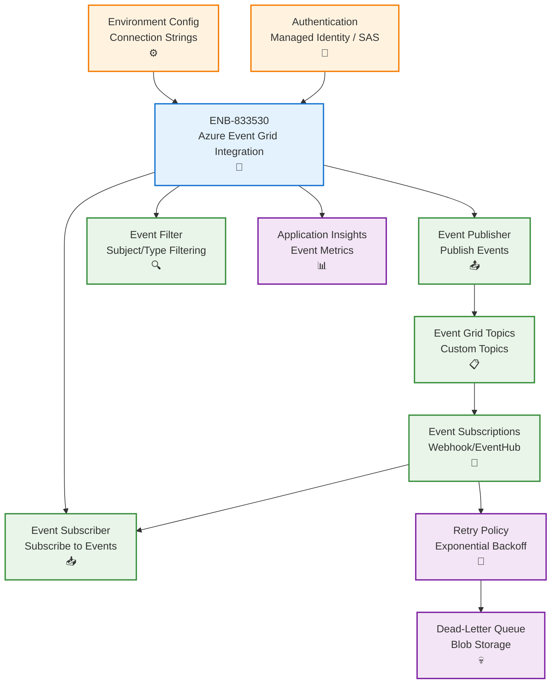
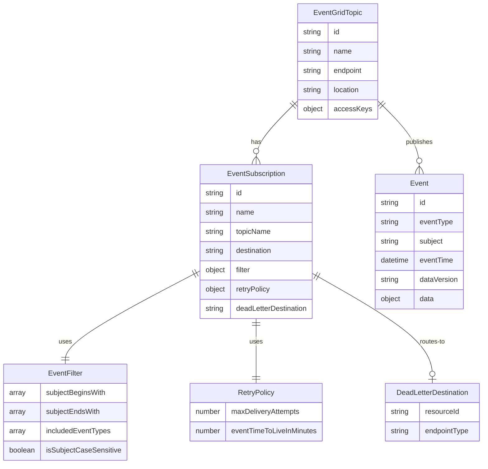
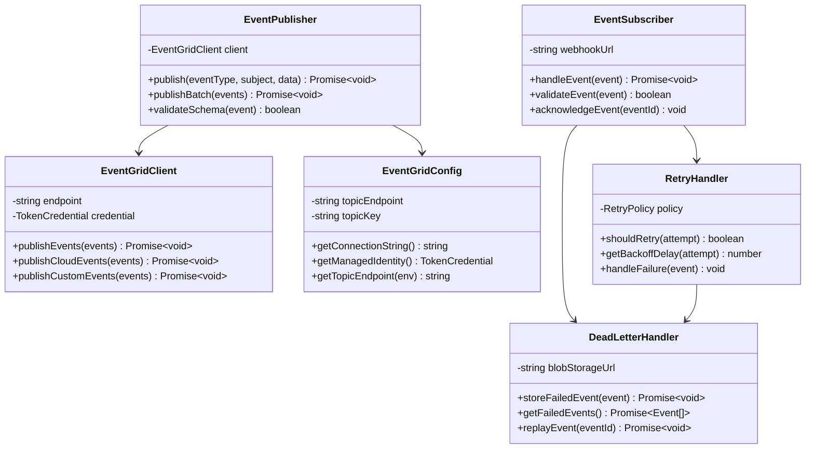
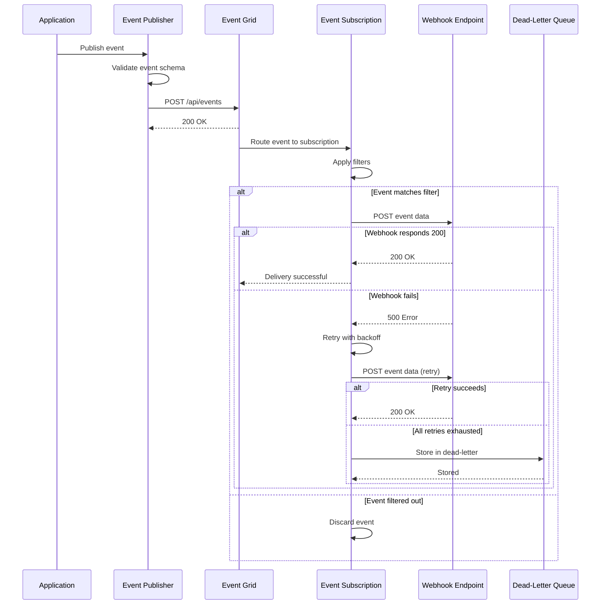
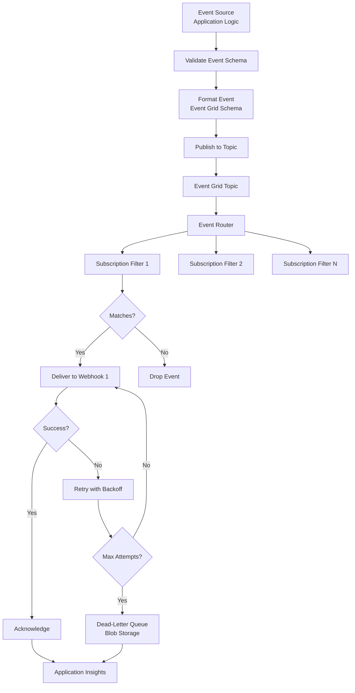
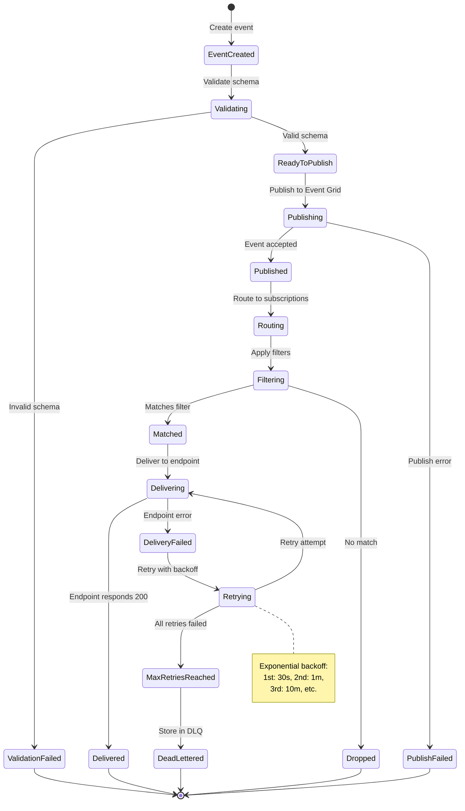

# Azure Event Grid Integration

## Metadata

- **Name**: Azure Event Grid Integration
- **Type**: Enabler
- **ID**: ENB-833530
- **Approval**: Approved
- **Capability ID**: CAP-833529
- **Owner**: Development Team
- **Status**: Ready for Implementation
- **Priority**: High
- **Analysis Review**: Not Required
- **Code Review**: Not Required

## Technical Overview
### Purpose
Integrate Azure Event Grid for publishing and subscribing to event-driven messages across the application. Support topic-based pub/sub patterns, event schemas, dead-letter queues, and retry policies with environment-specific configuration for connection endpoints and authentication.

## Functional Requirements

| ID | Name | Requirement | Priority | Status | Approval |
|----|------|-------------|----------|--------|----------|
| FR-833531 | Event Publishing | Publish events to Event Grid topics with custom event schemas and metadata | Must Have | Ready for Implementation | Approved |
| FR-833532 | Event Subscription | Subscribe to Event Grid events with webhook or Event Hub endpoints | Must Have | Ready for Implementation | Approved |
| FR-833533 | Event Filtering | Filter events by subject, event type, and custom data properties | Must Have | Ready for Implementation | Approved |
| FR-833534 | Retry Configuration | Configure retry policies including maximum attempts, backoff intervals, and expiration time | Must Have | Ready for Implementation | Approved |
| FR-833535 | Dead-Letter Queue | Route failed events to dead-letter destination (Blob Storage or Storage Queue) | Must Have | Ready for Implementation | Approved |
| FR-833536 | Event Schema Validation | Validate events against Event Grid schema or CloudEvents schema | Must Have | Ready for Implementation | Approved |
| FR-833537 | Environment Configuration | Configure Event Grid endpoints, topics, and authentication per environment (dev, test, prod) | Must Have | Ready for Implementation | Approved |
| FR-833538 | Authentication | Support managed identity, SAS tokens, and access keys for authentication | Must Have | Ready for Implementation | Approved |
| FR-833539 | Custom Topics | Create and manage custom Event Grid topics for domain-specific events | Must Have | Ready for Implementation | Approved |
| FR-833540 | Event Tracing | Track event delivery status and correlation IDs for distributed tracing | Must Have | Ready for Implementation | Approved |

## Non-Functional Requirements

| ID | Name | Type | Requirement | Priority | Status | Approval |
|----|------|------|-------------|----------|--------|----------|
| NFR-833541 | Event Delivery Latency | Deliver events to subscribers within 5 seconds under normal conditions | Must Have | Ready for Implementation | Approved |
| NFR-833542 | Throughput | Support publishing up to 5,000 events per second per topic | High | Ready for Implementation | Approved |
| NFR-833543 | Reliability | Guarantee at-least-once delivery with 99.99% delivery success rate | Must Have | Ready for Implementation | Approved |
| NFR-833544 | Security | Encrypt all events in transit using TLS 1.2+ and support RBAC for topic access | Must Have | Ready for Implementation | Approved |
| NFR-833545 | Monitoring | Integrate with Application Insights to track event metrics and failures | Must Have | Ready for Implementation | Approved |
| NFR-833546 | Scalability | Auto-scale to handle event bursts up to 10,000 events per second | High | Ready for Implementation | Approved |

## Dependencies

### Internal Upstream Dependency

| Enabler ID | Description |
|------------|-------------|
| ENB-847341 | Environment Configuration provides Event Grid connection strings and endpoints |

### Internal Downstream Impact

| Enabler ID | Description |
|------------|-------------|
| ENB-847292 | RESTful API may publish events when resources change |

### External Dependencies

**External Upstream Dependencies**: Azure Event Grid service, Azure Active Directory for managed identity

**External Downstream Impact**: Event subscribers (Azure Functions, Logic Apps, webhooks)

## Technical Specifications

### Enabler Dependency Flow Diagram


### API Technical Specifications

| API Type | Operation | Channel / Endpoint | Description | Request / Publish Payload | Response / Subscribe Data |
|----------|-----------|---------------------|-------------|----------------------------|----------------------------|
| REST | POST | https://{topic}.{region}.eventgrid.azure.net/api/events | Publish events to topic | Event array with schema | HTTP 200 OK |
| REST | GET | /subscriptions/{id}/providers/Microsoft.EventGrid/topics | List Event Grid topics | - | Topic list |
| REST | PUT | /subscriptions/{id}/providers/Microsoft.EventGrid/eventSubscriptions/{name} | Create event subscription | Subscription config | Subscription details |
| Webhook | POST | {subscriber-endpoint} | Deliver event to subscriber | Event data | HTTP 200 OK |
| SDK | Method | eventGridClient.publishEvents() | Publish using Node.js SDK | Event objects | Promise<void> |

### Data Models


### Class Diagrams


### Sequence Diagrams


### Dataflow Diagrams


### State Diagrams


## Configuration Examples

### Event Grid Topic Configuration
```typescript
interface EventGridConfig {
  endpoint: string;
  accessKey: string;
  topicName: string;
  retryPolicy: {
    maxDeliveryAttempts: number;
    eventTimeToLiveInMinutes: number;
  };
  deadLetterDestination: {
    endpointType: 'StorageBlob';
    blobContainerUrl: string;
  };
}

// Environment-specific configuration
const config: Record<string, EventGridConfig> = {
  development: {
    endpoint: process.env.EVENTGRID_ENDPOINT_DEV,
    accessKey: process.env.EVENTGRID_KEY_DEV,
    topicName: 'lease-sentry-dev',
    retryPolicy: {
      maxDeliveryAttempts: 5,
      eventTimeToLiveInMinutes: 1440
    },
    deadLetterDestination: {
      endpointType: 'StorageBlob',
      blobContainerUrl: process.env.DEADLETTER_BLOB_DEV
    }
  },
  production: {
    endpoint: process.env.EVENTGRID_ENDPOINT_PROD,
    accessKey: process.env.EVENTGRID_KEY_PROD,
    topicName: 'lease-sentry-prod',
    retryPolicy: {
      maxDeliveryAttempts: 10,
      eventTimeToLiveInMinutes: 2880
    },
    deadLetterDestination: {
      endpointType: 'StorageBlob',
      blobContainerUrl: process.env.DEADLETTER_BLOB_PROD
    }
  }
};
```

### Event Publishing Example
```typescript
import { EventGridPublisherClient, AzureKeyCredential } from "@azure/eventgrid";

const client = new EventGridPublisherClient(
  config.endpoint,
  "EventGrid",
  new AzureKeyCredential(config.accessKey)
);

const event = {
  id: uuidv4(),
  eventType: "LeaseSentry.Lease.Created",
  subject: "/leases/12345",
  eventTime: new Date(),
  dataVersion: "1.0",
  data: {
    leaseId: "12345",
    propertyId: "PROP-789",
    tenantId: "TENANT-456",
    startDate: "2025-01-01",
    endDate: "2026-01-01"
  }
};

await client.send([event]);
```
