# Azure Blob Storage Integration

## Metadata

- **Name**: Azure Blob Storage Integration
- **Type**: Enabler
- **ID**: ENB-833550
- **Approval**: Approved
- **Capability ID**: CAP-833529
- **Owner**: Development Team
- **Status**: Ready for Implementation
- **Priority**: High
- **Analysis Review**: Not Required
- **Code Review**: Not Required

## Technical Overview
### Purpose
Integrate Azure Blob Storage for secure file storage, retrieval, and management. Support block blobs, append blobs, container organization, SAS tokens, blob versioning, and lifecycle management with environment-specific configuration for storage accounts and authentication.

## Functional Requirements

| ID | Name | Requirement | Priority | Status | Approval |
|----|------|-------------|----------|--------|----------|
| FR-833550-01 | Blob Upload | Upload files to Blob Storage with support for block blobs and append blobs | High | Ready for Implementation | Approved |
| FR-833550-02 | Blob Download | Download blobs with streaming support for large files | High | Ready for Implementation | Approved |
| FR-833550-03 | Blob Deletion | Delete blobs with optional soft delete and undelete capabilities | High | Ready for Implementation | Approved |
| FR-833550-04 | Container Management | Create, list, and delete blob containers with access level configuration | High | Ready for Implementation | Approved |
| FR-833550-05 | Blob Metadata | Set and retrieve custom metadata key-value pairs for blobs | High | Ready for Implementation | Approved |
| FR-833550-06 | SAS Token Generation | Generate Shared Access Signature tokens with time-limited permissions | High | Ready for Implementation | Approved |
| FR-833550-07 | Blob Versioning | Enable blob versioning to track and restore previous versions | High | Ready for Implementation | Approved |
| FR-833550-08 | Lifecycle Management | Configure lifecycle policies for automatic tier transitions and deletion | Medium | Ready for Implementation | Approved |
| FR-833550-09 | Environment Configuration | Configure storage account connections per environment (dev, test, prod) | High | Ready for Implementation | Approved |
| FR-833550-10 | Authentication | Support managed identity, connection strings, and account keys for authentication | High | Ready for Implementation | Approved |
| FR-833550-11 | Content Type Detection | Automatically detect and set Content-Type headers based on file extension | High | Ready for Implementation | Approved |

## Non-Functional Requirements

| ID | Name | Type | Requirement | Priority | Status | Approval |
|----|------|------|-------------|----------|--------|----------|
| NFR-833550-01 | Upload Performance | Upload files up to 100MB in under 30 seconds on standard network | High | Ready for Implementation | Approved |
| NFR-833550-02 | Scalability | Support concurrent operations with up to 100 simultaneous blob transfers | High | Ready for Implementation | Approved |
| NFR-833550-03 | Reliability | Guarantee 99.99% availability for blob operations with automatic retry | High | Ready for Implementation | Approved |
| NFR-833550-04 | Security | Encrypt all blobs at rest with AES-256 and in transit with TLS 1.2+ | High | Ready for Implementation | Approved |
| NFR-833550-05 | Cost Optimization | Use appropriate storage tiers (Hot, Cool, Archive) based on access patterns | Medium | Ready for Implementation | Approved |
| NFR-833550-06 | Monitoring | Track blob operations, storage usage, and costs in Application Insights | High | Ready for Implementation | Approved |

## Dependencies

### Internal Upstream Dependency

| Enabler ID | Description |
|------------|-------------|
| ENB-847341 | Environment Configuration provides storage account connection strings |

### Internal Downstream Impact

| Enabler ID | Description |
|------------|-------------|
| ENB-847292 | RESTful API may store and retrieve files via blob storage |

### External Dependencies

**External Upstream Dependencies**: Azure Blob Storage service, Azure Active Directory for managed identity

**External Downstream Impact**: Client applications accessing files via SAS URLs

## Technical Specifications

### Enabler Dependency Flow Diagram

```mermaid
flowchart TD
    ENB_833550["ENB-833550<br/>Azure Blob Storage Integration<br/>📦"]
    
    CONFIG["Environment Config<br/>Storage Connection<br/>⚙️"]
    AUTH["Authentication<br/>Managed Identity<br/>🔐"]
    
    CONFIG --> ENB_833550
    AUTH --> ENB_833550
    
    UPLOAD["Blob Upload<br/>Block/Append Blobs<br/>⬆️"]
    DOWNLOAD["Blob Download<br/>Streaming<br/>⬇️"]
    DELETE["Blob Delete<br/>Soft Delete<br/>🗑️"]
    
    ENB_833550 --> UPLOAD
    ENB_833550 --> DOWNLOAD
    ENB_833550 --> DELETE
    
    CONTAINER["Container Management<br/>Create/List/Delete<br/>📁"]
    METADATA["Blob Metadata<br/>Key-Value Pairs<br/>🏷️"]
    SAS["SAS Token<br/>Time-Limited Access<br/>🎫"]
    
    ENB_833550 --> CONTAINER
    ENB_833550 --> METADATA
    ENB_833550 --> SAS
    
    VERSIONING["Blob Versioning<br/>Version History<br/>📜"]
    LIFECYCLE["Lifecycle Policies<br/>Auto-Tiering<br/>♻️"]
    
    ENB_833550 --> VERSIONING
    ENB_833550 --> LIFECYCLE
    
    MONITORING["Application Insights<br/>Storage Metrics<br/>📊"]
    ENB_833550 --> MONITORING

    classDef enabler fill:#e3f2fd,stroke:#1976d2,stroke-width:2px
    classDef config fill:#fff3e0,stroke:#f57c00,stroke-width:2px
    classDef operations fill:#e8f5e8,stroke:#388e3c,stroke-width:2px
    classDef advanced fill:#f3e5f5,stroke:#7b1fa2,stroke-width:2px
    
    class ENB_833550 enabler
    class CONFIG,AUTH config
    class UPLOAD,DOWNLOAD,DELETE,CONTAINER,METADATA,SAS operations
    class VERSIONING,LIFECYCLE,MONITORING advanced
```


### API Technical Specifications

| API Type | Operation | Channel / Endpoint | Description | Request / Publish Payload | Response / Subscribe Data |
|----------|-----------|---------------------|-------------|----------------------------|----------------------------|
| REST | PUT | https://{account}.blob.core.windows.net/{container}/{blob} | Upload blob | Binary data + headers | HTTP 201 Created |
| REST | GET | https://{account}.blob.core.windows.net/{container}/{blob} | Download blob | - | Binary data + metadata |
| REST | DELETE | https://{account}.blob.core.windows.net/{container}/{blob} | Delete blob | - | HTTP 202 Accepted |
| REST | PUT | https://{account}.blob.core.windows.net/{container}?restype=container | Create container | - | HTTP 201 Created |
| SDK | Method | blobClient.upload(data) | Upload using Node.js SDK | Buffer/Stream | Upload response |
| SDK | Method | blobClient.download() | Download using Node.js SDK | - | Download response |

### Data Models


### Class Diagrams


### Sequence Diagrams


### Dataflow Diagrams


### State Diagrams


## Configuration Examples

### Storage Account Configuration
```typescript
interface BlobStorageConfig {
  accountName: string;
  accountKey: string;
  containerName: string;
  blobEndpoint: string;
  enableVersioning: boolean;
  softDeleteRetentionDays: number;
}

const config: Record<string, BlobStorageConfig> = {
  development: {
    accountName: process.env.STORAGE_ACCOUNT_DEV,
    accountKey: process.env.STORAGE_KEY_DEV,
    containerName: 'lease-documents-dev',
    blobEndpoint: `https://${process.env.STORAGE_ACCOUNT_DEV}.blob.core.windows.net`,
    enableVersioning: true,
    softDeleteRetentionDays: 7
  },
  production: {
    accountName: process.env.STORAGE_ACCOUNT_PROD,
    accountKey: process.env.STORAGE_KEY_PROD,
    containerName: 'lease-documents',
    blobEndpoint: `https://${process.env.STORAGE_ACCOUNT_PROD}.blob.core.windows.net`,
    enableVersioning: true,
    softDeleteRetentionDays: 14
  }
};
```

### Blob Upload Example
```typescript
import { BlobServiceClient, StorageSharedKeyCredential } from "@azure/storage-blob";

const credential = new StorageSharedKeyCredential(
  config.accountName,
  config.accountKey
);

const blobServiceClient = new BlobServiceClient(
  config.blobEndpoint,
  credential
);

const containerClient = blobServiceClient.getContainerClient(config.containerName);
const blobClient = containerClient.getBlobClient('lease-agreement-12345.pdf');
const blockBlobClient = blobClient.getBlockBlobClient();

await blockBlobClient.upload(fileBuffer, fileBuffer.length, {
  blobHTTPHeaders: {
    blobContentType: 'application/pdf'
  },
  metadata: {
    leaseId: '12345',
    uploadedBy: 'user@example.com',
    uploadDate: new Date().toISOString()
  }
});
```

### SAS Token Generation Example
```typescript
import { generateBlobSASQueryParameters, BlobSASPermissions } from "@azure/storage-blob";

const sasToken = generateBlobSASQueryParameters({
  containerName: config.containerName,
  blobName: 'lease-agreement-12345.pdf',
  permissions: BlobSASPermissions.parse("r"), // Read only
  expiresOn: new Date(Date.now() + 3600000), // 1 hour
  startsOn: new Date()
}, credential).toString();

const sasUrl = `${blobClient.url}?${sasToken}`;
```
