# Azure Cosmos DB Integration

## Metadata

- **Name**: Azure Cosmos DB Integration
- **Type**: Enabler
- **ID**: ENB-833570
- **Approval**: Approved
- **Capability ID**: CAP-833529
- **Owner**: Development Team
- **Status**: Ready for Implementation
- **Priority**: High
- **Analysis Review**: Not Required
- **Code Review**: Not Required

## Technical Overview
### Purpose
Integrate Azure Cosmos DB for high-performance NoSQL document storage with global distribution, automatic indexing, and flexible schema. Support CRUD operations, complex queries, partitioning strategies, and consistency levels with environment-specific configuration for database accounts and authentication.

## Functional Requirements

| ID | Name | Requirement | Priority | Status | Approval |
|----|------|-------------|----------|--------|----------|
| FR-833571 | Document CRUD | Create, read, update, and delete JSON documents with automatic indexing | Must Have | Ready for Implementation | Approved |
| FR-833572 | Query Operations | Execute SQL-like queries with filtering, sorting, and pagination support | Must Have | Ready for Implementation | Approved |
| FR-833573 | Partition Key Management | Define and manage partition keys for optimal data distribution and query performance | Must Have | Ready for Implementation | Approved |
| FR-833574 | Bulk Operations | Support bulk insert, update, and delete operations for batch processing | Must Have | Ready for Implementation | Approved |
| FR-833575 | Change Feed | Subscribe to change feed for real-time data synchronization and event processing | Must Have | Ready for Implementation | Approved |
| FR-833576 | Stored Procedures | Create and execute server-side stored procedures for transactional operations | Medium | Ready for Implementation | Approved |
| FR-833577 | Consistency Levels | Configure consistency levels (Strong, Bounded Staleness, Session, Consistent Prefix, Eventual) | Must Have | Ready for Implementation | Approved |
| FR-833578 | Database Management | Create, configure, and manage databases and containers programmatically | Must Have | Ready for Implementation | Approved |
| FR-833579 | Environment Configuration | Configure Cosmos DB endpoints and keys per environment (dev, test, prod) | Must Have | Ready for Implementation | Approved |
| FR-833580 | Authentication | Support managed identity, connection strings, and account keys for authentication | Must Have | Ready for Implementation | Approved |
| FR-833581 | TTL Management | Configure time-to-live (TTL) for automatic document expiration | Medium | Ready for Implementation | Approved |

## Non-Functional Requirements

| ID | Name | Type | Requirement | Priority | Status | Approval |
|----|------|------|-------------|----------|--------|----------|
| NFR-833582 | Read Latency | Achieve single-digit millisecond read latency for queries within same region | Must Have | Ready for Implementation | Approved |
| NFR-833583 | Write Latency | Achieve less than 15ms write latency for document operations | Must Have | Ready for Implementation | Approved |
| NFR-833584 | Throughput | Support provisioned throughput from 400 RU/s to 10,000 RU/s per container | High | Ready for Implementation | Approved |
| NFR-833585 | Scalability | Auto-scale throughput based on workload with serverless option for dev environments | Must Have | Ready for Implementation | Approved |
| NFR-833586 | Availability | Guarantee 99.999% availability with multi-region writes for production | Must Have | Ready for Implementation | Approved |
| NFR-833587 | Cost Management | Monitor RU consumption and optimize queries to minimize costs | High | Ready for Implementation | Approved |
| NFR-833588 | Security | Encrypt data at rest and in transit with RBAC for database access control | Must Have | Ready for Implementation | Approved |

## Dependencies

### Internal Upstream Dependency

| Enabler ID | Description |
|------------|-------------|
| ENB-847341 | Environment Configuration provides Cosmos DB connection strings and endpoints |

### Internal Downstream Impact

| Enabler ID | Description |
|------------|-------------|
| ENB-847292 | RESTful API performs CRUD operations on Cosmos DB documents |
| ENB-833530 | Event Grid may publish events when documents change via change feed |

### External Dependencies

**External Upstream Dependencies**: Azure Cosmos DB service, Azure Active Directory for managed identity

**External Downstream Impact**: Data analytics and reporting services consuming change feed

## Technical Specifications

### Enabler Dependency Flow Diagram

```mermaid
flowchart TD
    ENB_833570["ENB-833570<br/>Azure Cosmos DB Integration<br/>🗄️"]
    
    CONFIG["Environment Config<br/>Connection Strings<br/>⚙️"]
    AUTH["Authentication<br/>Managed Identity<br/>🔐"]
    
    CONFIG --> ENB_833570
    AUTH --> ENB_833570
    
    CRUD["CRUD Operations<br/>Create/Read/Update/Delete<br/>📝"]
    QUERY["Query Operations<br/>SQL-like Queries<br/>🔍"]
    BULK["Bulk Operations<br/>Batch Processing<br/>📦"]
    
    ENB_833570 --> CRUD
    ENB_833570 --> QUERY
    ENB_833570 --> BULK
    
    PARTITION["Partition Management<br/>Data Distribution<br/>🔀"]
    CONSISTENCY["Consistency Levels<br/>Strong/Session/Eventual<br/>⚖️"]
    TTL["TTL Management<br/>Auto-Expiration<br/>⏰"]
    
    ENB_833570 --> PARTITION
    ENB_833570 --> CONSISTENCY
    ENB_833570 --> TTL
    
    CHANGEFEED["Change Feed<br/>Real-time Sync<br/>🔄"]
    SPROCS["Stored Procedures<br/>Server-side Logic<br/>⚙️"]
    
    ENB_833570 --> CHANGEFEED
    ENB_833570 --> SPROCS
    
    MONITORING["Application Insights<br/>RU Metrics<br/>📊"]
    ENB_833570 --> MONITORING
    
    CHANGEFEED --> EVENTGRID["Event Grid<br/>Event Publishing<br/>📡"]

    classDef enabler fill:#e3f2fd,stroke:#1976d2,stroke-width:2px
    classDef config fill:#fff3e0,stroke:#f57c00,stroke-width:2px
    classDef core fill:#e8f5e8,stroke:#388e3c,stroke-width:2px
    classDef advanced fill:#f3e5f5,stroke:#7b1fa2,stroke-width:2px
    classDef external fill:#ffebee,stroke:#c62828,stroke-width:2px
    
    class ENB_833570 enabler
    class CONFIG,AUTH config
    class CRUD,QUERY,BULK,PARTITION,CONSISTENCY,TTL core
    class CHANGEFEED,SPROCS,MONITORING advanced
    class EVENTGRID external
```


### API Technical Specifications

| API Type | Operation | Channel / Endpoint | Description | Request / Publish Payload | Response / Subscribe Data |
|----------|-----------|---------------------|-------------|----------------------------|----------------------------|
| REST | POST | https://{account}.documents.azure.com/dbs/{db}/colls/{coll}/docs | Create document | JSON document | Created document + metadata |
| REST | GET | https://{account}.documents.azure.com/dbs/{db}/colls/{coll}/docs/{id} | Read document | Partition key header | JSON document |
| REST | PUT | https://{account}.documents.azure.com/dbs/{db}/colls/{coll}/docs/{id} | Replace document | Updated JSON document | Updated document |
| REST | DELETE | https://{account}.documents.azure.com/dbs/{db}/colls/{coll}/docs/{id} | Delete document | Partition key header | HTTP 204 No Content |
| REST | POST | https://{account}.documents.azure.com/dbs/{db}/colls/{coll}/docs | Query documents | SQL query | Query results array |
| SDK | Method | container.items.create(doc) | Create using Node.js SDK | Document object | ItemResponse |
| SDK | Method | container.item(id, pk).read() | Read using Node.js SDK | - | ItemResponse |

### Data Models


### Class Diagrams


### Sequence Diagrams


### Dataflow Diagrams


### State Diagrams


## Configuration Examples

### Cosmos DB Configuration
```typescript
interface CosmosDBConfig {
  endpoint: string;
  key: string;
  databaseId: string;
  containers: {
    leases: {
      id: string;
      partitionKey: string;
      throughput: number;
    };
    tenants: {
      id: string;
      partitionKey: string;
      throughput: number;
    };
  };
  consistencyLevel: 'Strong' | 'Session' | 'Eventual';
}

const config: Record<string, CosmosDBConfig> = {
  development: {
    endpoint: process.env.COSMOS_ENDPOINT_DEV,
    key: process.env.COSMOS_KEY_DEV,
    databaseId: 'lease-sentry-dev',
    containers: {
      leases: {
        id: 'leases',
        partitionKey: '/propertyId',
        throughput: 400 // Serverless or minimal for dev
      },
      tenants: {
        id: 'tenants',
        partitionKey: '/tenantId',
        throughput: 400
      }
    },
    consistencyLevel: 'Session'
  },
  production: {
    endpoint: process.env.COSMOS_ENDPOINT_PROD,
    key: process.env.COSMOS_KEY_PROD,
    databaseId: 'lease-sentry',
    containers: {
      leases: {
        id: 'leases',
        partitionKey: '/propertyId',
        throughput: 10000 // Auto-scale
      },
      tenants: {
        id: 'tenants',
        partitionKey: '/tenantId',
        throughput: 5000
      }
    },
    consistencyLevel: 'Strong'
  }
};
```

### Document Operations Example
```typescript
import { CosmosClient } from "@azure/cosmos";

const client = new CosmosClient({
  endpoint: config.endpoint,
  key: config.key
});

const database = client.database(config.databaseId);
const container = database.container('leases');

// Create document
const lease = {
  id: uuidv4(),
  propertyId: 'PROP-789', // Partition key
  tenantId: 'TENANT-456',
  startDate: '2025-01-01',
  endDate: '2026-01-01',
  monthlyRent: 2500,
  status: 'active'
};

const { resource } = await container.items.create(lease);

// Query documents
const querySpec = {
  query: 'SELECT * FROM c WHERE c.propertyId = @propertyId AND c.status = @status',
  parameters: [
    { name: '@propertyId', value: 'PROP-789' },
    { name: '@status', value: 'active' }
  ]
};

const { resources } = await container.items.query(querySpec).fetchAll();

// Update document
const updatedLease = { ...lease, monthlyRent: 2600 };
await container.item(lease.id, lease.propertyId).replace(updatedLease);

// Delete document
await container.item(lease.id, lease.propertyId).delete();
```

### Change Feed Example
```typescript
import { ChangeFeedProcessor } from "@azure/cosmos";

const processor = container.items.getChangeFeedProcessor({
  instanceName: 'lease-change-processor',
  feedRange: { type: 'EffectivePartitionKey', value: 'PROP-789' }
});

processor.start(async (changes) => {
  for (const change of changes) {
    console.log(`Document ${change.id} was ${change._lsn > 0 ? 'updated' : 'created'}`);
    
    // Publish to Event Grid
    await eventGridClient.send([{
      id: uuidv4(),
      eventType: 'LeaseSentry.Lease.Changed',
      subject: `/leases/${change.id}`,
      data: change,
      eventTime: new Date(),
      dataVersion: '1.0'
    }]);
  }
});
```
