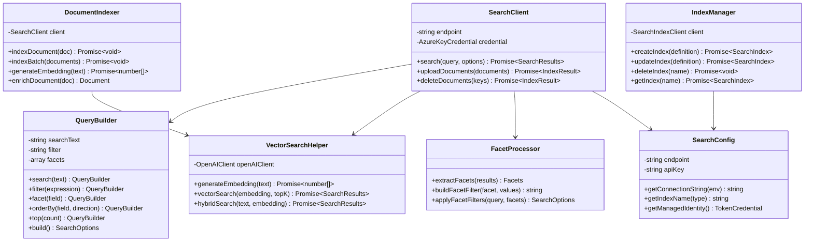

# Azure AI Search Integration

## Metadata

- **Name**: Azure AI Search Integration
- **Type**: Enabler
- **ID**: ENB-833590
- **Approval**: Approved
- **Capability ID**: CAP-833529
- **Owner**: Development Team
- **Status**: Ready for Implementation
- **Priority**: High
- **Analysis Review**: Not Required
- **Code Review**: Not Required

## Technical Overview
### Purpose
Integrate Azure AI Search (formerly Azure Cognitive Search) for full-text search, semantic search, and vector search capabilities on document collections. Support search index management, document ingestion, complex queries, filters, facets, and vector embeddings for semantic similarity with environment-specific configuration.

## Functional Requirements

| ID | Name | Requirement | Priority | Status | Approval |
|----|------|-------------|----------|--------|----------|
| FR-833590-01 | Index Management | Create, update, and delete search indexes with field definitions and analyzers | High | Draft | Not Approved |
| FR-833590-02 | Document Indexing | Index documents from Cosmos DB or Blob Storage with automatic refresh | High | Draft | Not Approved |
| FR-833590-03 | Full-Text Search | Execute full-text search queries with relevance scoring and highlighting | High | Draft | Not Approved |
| FR-833590-04 | Faceted Navigation | Support faceted search for filtering by categories, dates, and numeric ranges | High | Draft | Not Approved |
| FR-833590-05 | Vector Search | Store and search document embeddings for semantic similarity queries | High | Draft | Not Approved |
| FR-833590-06 | Autocomplete | Provide autocomplete and suggestion capabilities for search queries | Medium | Draft | Not Approved |
| FR-833590-07 | Search Filters | Apply OData filters to refine search results by multiple criteria | High | Draft | Not Approved |
| FR-833590-08 | Geospatial Search | Support location-based search with distance and polygon filters | Medium | Draft | Not Approved |
| FR-833590-09 | Indexer Configuration | Configure indexers to automatically pull data from data sources | High | Draft | Not Approved |
| FR-833590-10 | Environment Configuration | Configure search service endpoints and keys per environment (dev, test, prod) | High | Draft | Not Approved |
| FR-833590-11 | Authentication | Support managed identity, admin keys, and query keys for authentication | High | Draft | Not Approved |

## Non-Functional Requirements

| ID | Name | Type | Requirement | Priority | Status | Approval |
|----|------|------|-------------|----------|--------|----------|
| NFR-833590-01 | Search Latency | Return search results within 200ms for simple queries | High | Draft | Not Approved |
| NFR-833590-02 | Index Performance | Index up to 10,000 documents per minute during bulk operations | High | Draft | Not Approved |
| NFR-833590-03 | Scalability | Support search indexes with up to 50 million documents in production | High | Draft | Not Approved |
| NFR-833590-04 | Relevance Quality | Achieve 85%+ precision on top 10 search results using semantic ranking | High | Draft | Not Approved |
| NFR-833590-05 | Availability | Guarantee 99.9% availability for search operations | High | Draft | Not Approved |
| NFR-833590-06 | Cost Management | Optimize index size and query complexity to manage search unit costs | Medium | Draft | Not Approved |
| NFR-833608 | Security | Encrypt search indexes at rest and in transit with RBAC for index access | Must Have | Ready for Implementation | Approved |

## Dependencies

### Internal Upstream Dependency

| Enabler ID | Description |
|------------|-------------|
| ENB-847341 | Environment Configuration provides AI Search endpoints and keys |
| ENB-833570 | Cosmos DB Integration provides documents for indexing |
| ENB-833550 | Blob Storage Integration provides document content for indexing |

### Internal Downstream Impact

| Enabler ID | Description |
|------------|-------------|
| ENB-847292 | RESTful API executes search queries via AI Search |

### External Dependencies

**External Upstream Dependencies**: Azure AI Search service, Azure OpenAI for embeddings, Azure Active Directory for managed identity

**External Downstream Impact**: Client applications performing search operations

## Technical Specifications

### Enabler Dependency Flow Diagram

```mermaid
flowchart TD
    ENB_833590["ENB-833590<br/>Azure AI Search Integration<br/>🔍"]
    
    CONFIG["Environment Config<br/>Search Endpoint<br/>⚙️"]
    AUTH["Authentication<br/>API Keys / Managed Identity<br/>🔐"]
    
    CONFIG --> ENB_833590
    AUTH --> ENB_833590
    
    COSMOS["Cosmos DB<br/>Document Source<br/>🗄️"]
    BLOB["Blob Storage<br/>File Source<br/>📦"]
    
    COSMOS --> ENB_833590
    BLOB --> ENB_833590
    
    INDEX["Index Management<br/>Create/Update Schema<br/>📋"]
    INDEXER["Indexer<br/>Auto-Pull Data<br/>🔄"]
    EMBEDDING["Vector Embeddings<br/>Azure OpenAI<br/>🧠"]
    
    ENB_833590 --> INDEX
    ENB_833590 --> INDEXER
    ENB_833590 --> EMBEDDING
    
    FULLTEXT["Full-Text Search<br/>Keyword Queries<br/>📝"]
    VECTOR["Vector Search<br/>Semantic Similarity<br/>🎯"]
    FACETS["Faceted Search<br/>Filters & Categories<br/>🗂️"]
    
    ENB_833590 --> FULLTEXT
    ENB_833590 --> VECTOR
    ENB_833590 --> FACETS
    
    AUTOCOMPLETE["Autocomplete<br/>Suggestions<br/>💡"]
    GEOSPATIAL["Geospatial Search<br/>Location Filters<br/>🌍"]
    
    ENB_833590 --> AUTOCOMPLETE
    ENB_833590 --> GEOSPATIAL
    
    RESULTS["Search Results<br/>Ranked & Highlighted<br/>⭐"]
    MONITORING["Application Insights<br/>Query Metrics<br/>📊"]
    
    FULLTEXT --> RESULTS
    VECTOR --> RESULTS
    FACETS --> RESULTS
    
    ENB_833590 --> MONITORING

    classDef enabler fill:#e3f2fd,stroke:#1976d2,stroke-width:2px
    classDef config fill:#fff3e0,stroke:#f57c00,stroke-width:2px
    classDef source fill:#f3e5f5,stroke:#7b1fa2,stroke-width:2px
    classDef core fill:#e8f5e8,stroke:#388e3c,stroke-width:2px
    classDef advanced fill:#ffebee,stroke:#c62828,stroke-width:2px
    
    class ENB_833590 enabler
    class CONFIG,AUTH config
    class COSMOS,BLOB source
    class INDEX,INDEXER,EMBEDDING,FULLTEXT,VECTOR,FACETS core
    class AUTOCOMPLETE,GEOSPATIAL,RESULTS,MONITORING advanced
```


### API Technical Specifications

| API Type | Operation | Channel / Endpoint | Description | Request / Publish Payload | Response / Subscribe Data |
|----------|-----------|---------------------|-------------|----------------------------|----------------------------|
| REST | POST | https://{service}.search.windows.net/indexes/{index}/docs/search | Search documents | Search query JSON | Search results with scores |
| REST | POST | https://{service}.search.windows.net/indexes/{index}/docs/index | Upload documents | Document batch | Index result |
| REST | PUT | https://{service}.search.windows.net/indexes/{name} | Create/update index | Index definition | Index metadata |
| REST | GET | https://{service}.search.windows.net/indexes/{name} | Get index definition | - | Index schema |
| REST | POST | https://{service}.search.windows.net/indexes/{index}/docs/autocomplete | Autocomplete query | Partial text | Suggestions array |
| SDK | Method | searchClient.search(query) | Search using Node.js SDK | SearchOptions | SearchResults |
| SDK | Method | searchClient.uploadDocuments(docs) | Upload using SDK | Documents array | IndexDocumentsResult |

### Data Models


### Class Diagrams


### Sequence Diagrams


### Dataflow Diagrams


### State Diagrams


## Configuration Examples

### Search Service Configuration
```typescript
interface AISearchConfig {
  endpoint: string;
  adminKey: string;
  queryKey: string;
  indexName: string;
  openAIEndpoint: string;
  openAIKey: string;
  embeddingModel: string;
}

const config: Record<string, AISearchConfig> = {
  development: {
    endpoint: process.env.SEARCH_ENDPOINT_DEV,
    adminKey: process.env.SEARCH_ADMIN_KEY_DEV,
    queryKey: process.env.SEARCH_QUERY_KEY_DEV,
    indexName: 'lease-documents-dev',
    openAIEndpoint: process.env.OPENAI_ENDPOINT_DEV,
    openAIKey: process.env.OPENAI_KEY_DEV,
    embeddingModel: 'text-embedding-ada-002'
  },
  production: {
    endpoint: process.env.SEARCH_ENDPOINT_PROD,
    adminKey: process.env.SEARCH_ADMIN_KEY_PROD,
    queryKey: process.env.SEARCH_QUERY_KEY_PROD,
    indexName: 'lease-documents',
    openAIEndpoint: process.env.OPENAI_ENDPOINT_PROD,
    openAIKey: process.env.OPENAI_KEY_PROD,
    embeddingModel: 'text-embedding-ada-002'
  }
};
```

### Index Definition Example
```typescript
import { SearchIndexClient, AzureKeyCredential } from "@azure/search-documents";

const indexClient = new SearchIndexClient(
  config.endpoint,
  new AzureKeyCredential(config.adminKey)
);

const indexDefinition = {
  name: config.indexName,
  fields: [
    { name: 'id', type: 'Edm.String', key: true, filterable: true },
    { name: 'leaseId', type: 'Edm.String', filterable: true, sortable: true },
    { name: 'title', type: 'Edm.String', searchable: true },
    { name: 'content', type: 'Edm.String', searchable: true, analyzer: 'en.microsoft' },
    { name: 'propertyAddress', type: 'Edm.String', searchable: true, filterable: true },
    { name: 'tenantName', type: 'Edm.String', searchable: true, filterable: true },
    { name: 'startDate', type: 'Edm.DateTimeOffset', filterable: true, sortable: true },
    { name: 'endDate', type: 'Edm.DateTimeOffset', filterable: true, sortable: true },
    { name: 'monthlyRent', type: 'Edm.Double', filterable: true, sortable: true, facetable: true },
    { name: 'status', type: 'Edm.String', filterable: true, facetable: true },
    { name: 'contentVector', type: 'Collection(Edm.Single)', searchable: true, dimensions: 1536, vectorSearchProfile: 'vector-profile' }
  ],
  vectorSearch: {
    algorithms: [{
      name: 'hnsw-algorithm',
      kind: 'hnsw',
      hnswParameters: {
        m: 4,
        efConstruction: 400,
        efSearch: 500,
        metric: 'cosine'
      }
    }],
    profiles: [{
      name: 'vector-profile',
      algorithm: 'hnsw-algorithm'
    }]
  },
  suggesters: [{
    name: 'sg',
    searchMode: 'analyzingInfixMatching',
    sourceFields: ['title', 'propertyAddress', 'tenantName']
  }]
};

await indexClient.createIndex(indexDefinition);
```

### Search Query Example
```typescript
import { SearchClient, AzureKeyCredential } from "@azure/search-documents";
import { OpenAIClient } from "@azure/openai";

const searchClient = new SearchClient(
  config.endpoint,
  config.indexName,
  new AzureKeyCredential(config.queryKey)
);

// Full-text search with facets
const results = await searchClient.search('downtown apartment lease', {
  filter: "status eq 'active' and monthlyRent lt 3000",
  facets: ['status', 'monthlyRent,interval:500'],
  orderBy: ['monthlyRent asc'],
  top: 10,
  includeTotalCount: true,
  highlightFields: ['content', 'title']
});

// Vector search for semantic similarity
const openAIClient = new OpenAIClient(config.openAIEndpoint, new AzureKeyCredential(config.openAIKey));
const embedding = await openAIClient.getEmbeddings(config.embeddingModel, ['find leases near parks']);
const embeddingVector = embedding.data[0].embedding;

const vectorResults = await searchClient.search('*', {
  vectorQueries: [{
    kind: 'vector',
    vector: embeddingVector,
    fields: ['contentVector'],
    kNearestNeighborsCount: 10
  }]
});

// Hybrid search (text + vector)
const hybridResults = await searchClient.search('downtown apartment', {
  vectorQueries: [{
    kind: 'vector',
    vector: embeddingVector,
    fields: ['contentVector'],
    kNearestNeighborsCount: 10
  }],
  top: 10
});
```
