# RESTful API Endpoints

## Metadata

- **Name**: RESTful API Endpoints
- **Type**: Enabler
- **ID**: ENB-847292
- **Approval**: Approved
- **Capability ID**: CAP-847291
- **Owner**: Development Team
- **Status**: Ready for Implementation
- **Priority**: High
- **Analysis Review**: Not Required
- **Code Review**: Not Required

## Technical Overview
### Purpose
Implement RESTful API endpoints supporting standard HTTP methods (GET, POST, PUT, DELETE, PATCH) with proper request/response handling, data validation, and error management.

## Functional Requirements

| ID | Name | Requirement | Priority | Status | Approval |
|----|------|-------------|----------|--------|----------|
| FR-847292-01 | HTTP Method Support | Implement routing infrastructure that supports standard HTTP methods: GET, POST, PUT, DELETE, PATCH (framework/library configuration only) | High | Ready for Implementation | Approved |
| FR-847292-02 | Request Validation | Create reusable request validation utilities/middleware for payload and parameter validation | High | Ready for Implementation | Approved |
| FR-847292-03 | Response Formatting | Create response formatting utilities that return JSON format with appropriate HTTP status codes | High | Ready for Implementation | Approved |
| FR-847292-04 | Error Handling | Create error handling middleware/utilities that provide structured error responses with meaningful error messages | High | Ready for Implementation | Approved |
| FR-847292-05 | Standards | All REST infrastructure must follow OpenAPI standards found here https://swagger.io/specification/ | High | Ready for Implementation | Approved |
| FR-847292-06 | No Demo Code | STRICTLY PROHIBITED: Do NOT create any sample resource handlers (e.g., Recipe, Product, User models), demonstration CRUD endpoints, or example API routes. ONLY implement: (1) HTTP routing configuration, (2) middleware utilities, (3) request/response formatting helpers, (4) validation utilities. The implementation must provide infrastructure components that OTHER services can use, not working examples. | High | Ready for Implementation | Approved |

## Non-Functional Requirements

| ID | Name | Type | Requirement | Priority | Status | Approval |
|----|------|------|-------------|----------|--------|----------|
| NFR-847292-01 | Response Time | Performance | REST infrastructure should add minimal overhead (< 5ms) to request processing | High | Ready for Implementation | Approved |
| NFR-847292-02 | Concurrent Requests | Scalability | Infrastructure must handle at least 100 concurrent requests without degradation | High | Ready for Implementation | Approved |
| NFR-847292-03 | Content Type Support | Compatibility | Infrastructure must support application/json content type for request and response | High | Ready for Implementation | Approved |
| NFR-847292-04 | Minimal Implementation | Simplicity | Only implement infrastructure components explicitly required. No speculative or demonstration code. This enabler provides building blocks, not complete applications. See FR-847303 for explicit prohibitions. | High | Ready for Implementation | Approved |

## Dependencies

### Internal Upstream Dependency

| Enabler ID | Description |
|------------|-------------|
| | |

### Internal Downstream Impact

| Enabler ID | Description |
|------------|-------------|
| | |

### External Dependencies

**External Upstream Dependencies**: None identified.

**External Downstream Impact**: None identified.

## Technical Specifications

### Enabler Dependency Flow Diagram

```mermaid
flowchart TD
    ENB_847292["ENB-847292<br/>RESTful API Endpoints<br/>🔌"]
    
    ENB_449234["ENB-449234<br/>Application Logging<br/>📝"]
    
    ENB_847292 --> ENB_449234

    classDef enabler fill:#e3f2fd,stroke:#1976d2,stroke-width:2px
    class ENB_847292,ENB_847293 enabler
```

### API Technical Specifications

| API Type | Operation | Channel / Endpoint | Description | Request / Publish Payload | Response / Subscribe Data |
|----------|-----------|---------------------|-------------|----------------------------|----------------------------|
| REST | GET | /api/resources | Retrieve all resources | None | `{"data": [ResourceObject], "count": number}` |
| REST | GET | /api/resources/{id} | Retrieve specific resource by ID | None | `{"data": ResourceObject}` |
| REST | POST | /api/resources | Create new resource | `{"name": string, "description": string}` | `{"data": ResourceObject, "id": string}` |
| REST | PUT | /api/resources/{id} | Update existing resource | `{"name": string, "description": string}` | `{"data": ResourceObject}` |
| REST | DELETE | /api/resources/{id} | Delete resource | None | `{"success": boolean, "message": string}` |

### Data Models

### Class Diagrams

### Sequence Diagrams

### Dataflow Diagrams

### State Diagrams

