# Health Check Endpoint

## Metadata

- **Name**: Health Check Endpoint
- **Type**: Enabler
- **ID**: ENB-847295
- **Approval**: Approved
- **Capability ID**: CAP-847291
- **Owner**: Development Team
- **Status**: Ready for Implementation
- **Priority**: High
- **Analysis Review**: Not Required
- **Code Review**: Not Required

## Technical Overview
### Purpose
Provide standardized health check endpoints for monitoring service availability, dependencies status, and system readiness for load balancers and orchestration platforms.

## Functional Requirements

| ID | Name | Requirement | Priority | Status | Approval |
|----|------|-------------|----------|--------|----------|
| FR-847317 | Liveness Check | Provide /health/live endpoint to indicate service is running | Must Have | Ready for Implementation | Approved |
| FR-847318 | Readiness Check | Provide /health/ready endpoint to indicate service can accept traffic | Must Have | Ready for Implementation | Approved |
| FR-847319 | Detailed Status | Provide /health endpoint with detailed component status | Must Have | Ready for Implementation | Approved |
| FR-847320 | Dependency Checks | Verify status of critical dependencies (database, external services) | Must Have | Ready for Implementation | Approved |

## Non-Functional Requirements

| ID | Name | Type | Requirement | Priority | Status | Approval |
|----|------|------|-------------|----------|--------|----------|
| NFR-847321 | Response Time | Performance | Health checks should respond within 100ms | Must Have | Ready for Implementation | Approved |
| NFR-847322 | Lightweight | Performance | Health checks should not consume significant resources | Must Have | Ready for Implementation | Approved |
| NFR-847323 | Standard Format | Compatibility | Follow RFC 7807 problem details or similar health check standards | Must Have | Ready for Implementation | Approved |
| NFR-569990 |  |  |  | Must Have | In Draft | Not Approved |

## Dependencies

### Internal Upstream Dependency

| Enabler ID | Description |
|------------|-------------|
| | |

### Internal Downstream Impact

| Enabler ID | Description |
|------------|-------------|
| | |

### External Dependencies

**External Upstream Dependencies**: None identified.

**External Downstream Impact**: None identified.

## Technical Specifications

### Enabler Dependency Flow Diagram

```mermaid
flowchart TD
    ENB_847295["ENB-847295<br/>Health Check Endpoint<br/>🏥"]
    
    DB["Database<br/>Data Store<br/>💾"]
    CACHE["Cache Service<br/>Redis/Memory<br/>⚡"]
    EXTERNAL["External Services<br/>Third-party APIs<br/>🌐"]
    ENB_449234["ENB-449234<br/>Application Logging<br/>📝"]
    
    ENB_847295 --> DB
    ENB_847295 --> CACHE
    ENB_847295 --> EXTERNAL
    ENB_847295 --> ENB_449234

    classDef enabler fill:#e3f2fd,stroke:#1976d2,stroke-width:2px
    classDef dependency fill:#f3e5f5,stroke:#7b1fa2,stroke-width:2px
    
    class ENB_847295,ENB_847293 enabler
    class DB,CACHE,EXTERNAL dependency
```

### API Technical Specifications

| API Type | Operation | Channel / Endpoint | Description | Request / Publish Payload | Response / Subscribe Data |
|----------|-----------|---------------------|-------------|----------------------------|----------------------------|
| REST | GET | /health | Comprehensive health status | None | `{"status": "healthy/unhealthy", "components": {...}, "timestamp": string}` |
| REST | GET | /health/live | Liveness probe | None | `{"status": "alive", "timestamp": string}` |
| REST | GET | /health/ready | Readiness probe | None | `{"status": "ready/not-ready", "checks": {...}, "timestamp": string}` |
| REST | GET | /health/startup | Startup probe (K8s) | None | `{"status": "started/starting", "timestamp": string}` |

### Data Models

### Class Diagrams

### Sequence Diagrams

### Dataflow Diagrams

### State Diagrams

