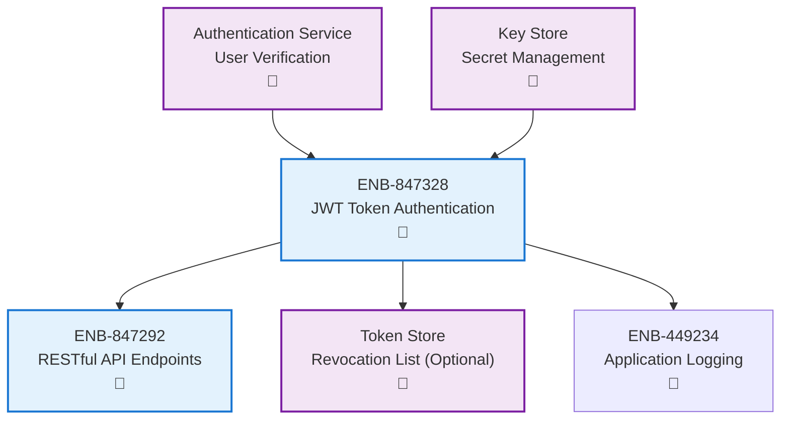
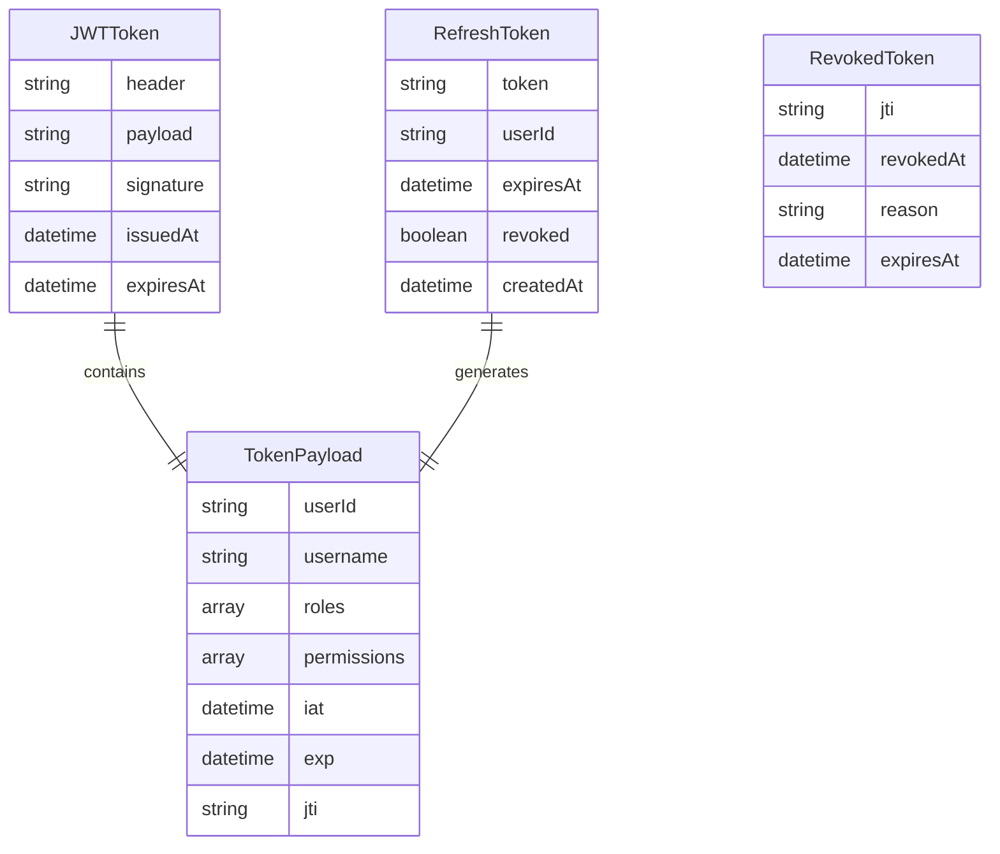
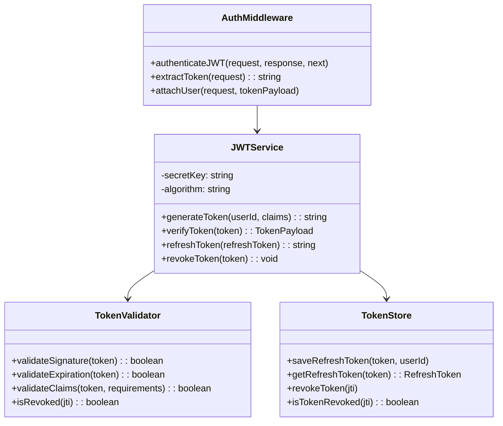
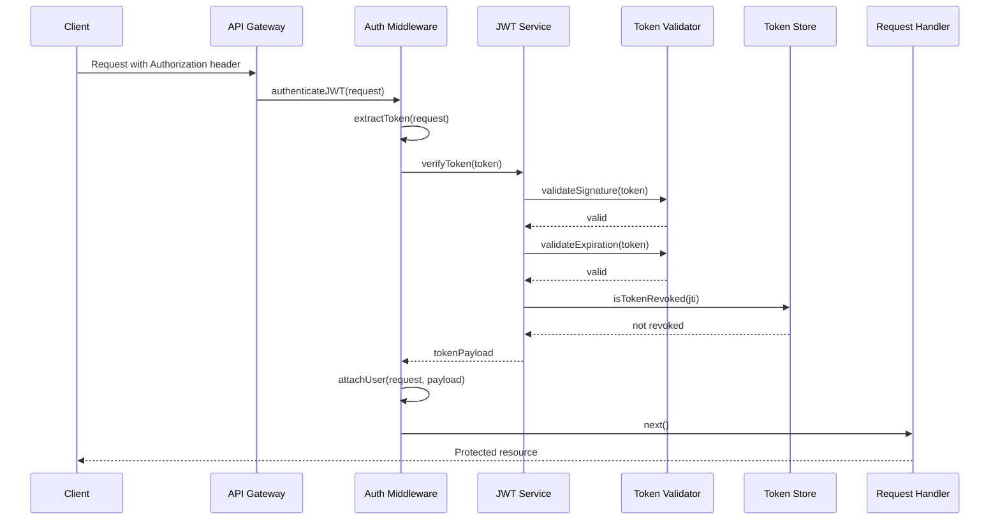
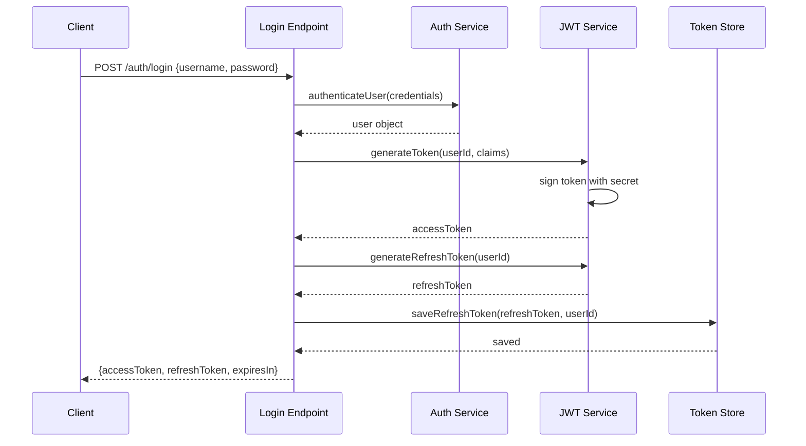
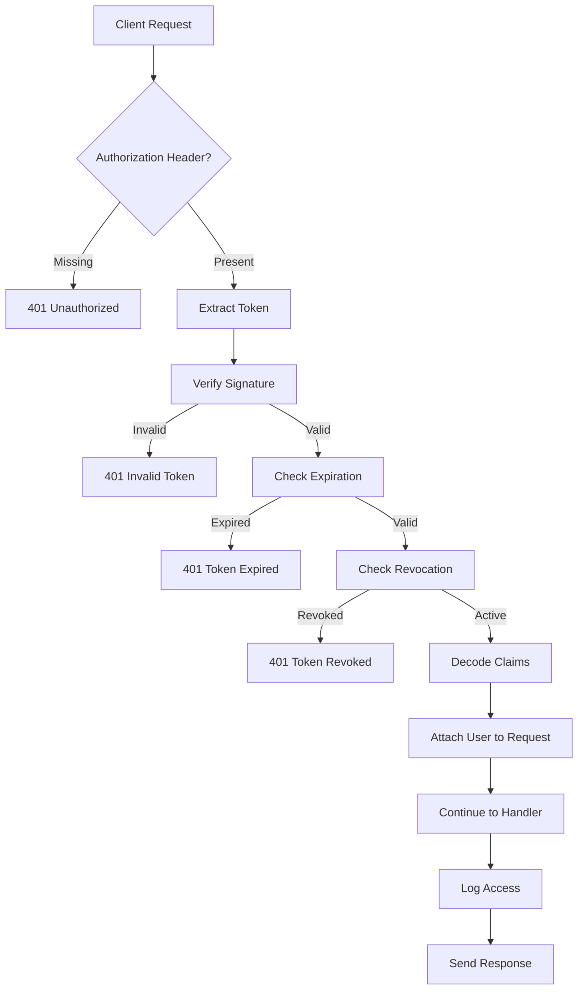
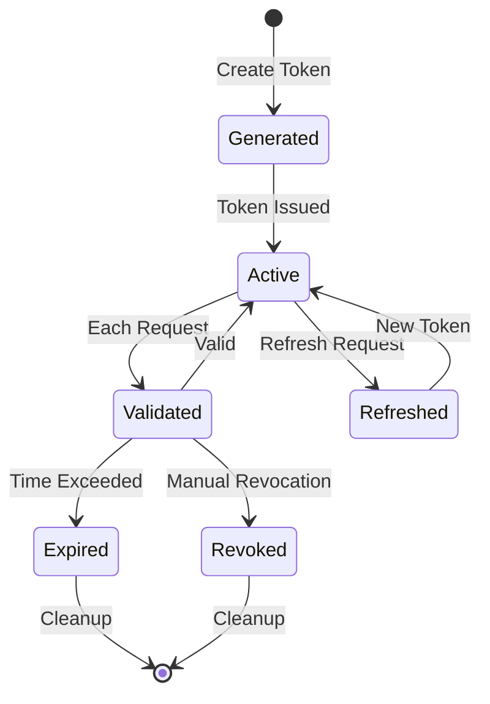
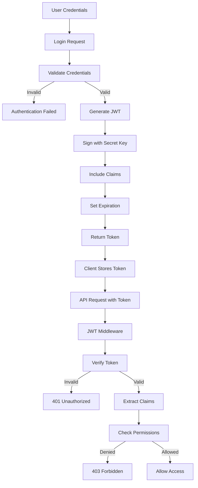

# JWT Authentication Middleware

## Metadata

- **Name**: JWT Authentication Middleware
- **Type**: Enabler
- **ID**: ENB-847328
- **Approval**: Approved
- **Capability ID**: CAP-847291
- **Owner**: Development Team
- **Status**: Ready for Implementation
- **Priority**: High
- **Analysis Review**: Not Required
- **Code Review**: Not Required

## Technical Overview
### Purpose
Provide secure API access control using JSON Web Token (JWT) authentication with token generation, validation, and refresh capabilities for protected endpoints.

## Functional Requirements

| ID | Name | Requirement | Priority | Status | Approval |
|----|------|-------------|----------|--------|----------|
| FR-847329 | Token Generation | Generate JWT tokens upon successful authentication with user claims | Must Have | Ready for Implementation | Approved |
| FR-847401 | Token Validation | Validate JWT tokens on protected endpoints including signature and expiration | Must Have | Ready for Implementation | Approved |
| FR-847402 | Token Refresh | Provide mechanism to refresh expired tokens using refresh tokens | Must Have | Ready for Implementation | Approved |
| FR-847403 | Protected Endpoints | Secure API endpoints requiring valid JWT tokens | Must Have | Ready for Implementation | Approved |
| FR-847404 | Token Revocation | Support token revocation for logout and security events | Must Have | Ready for Implementation | Approved |

## Non-Functional Requirements

| ID | Name | Type | Requirement | Priority | Status | Approval |
|----|------|------|-------------|----------|--------|----------|
| NFR-847405 | Token Expiration | Security | Access tokens should expire within 15 minutes, refresh tokens within 7 days | Must Have | Ready for Implementation | Approved |
| NFR-847406 | Signature Algorithm | Security | Use RS256 or HS256 algorithm for token signing | Must Have | Ready for Implementation | Approved |
| NFR-847407 | Secure Storage | Security | Store signing keys securely using environment variables or key management service | Must Have | Ready for Implementation | Approved |
| NFR-847408 | Performance | Performance | Token validation should add no more than 10ms overhead per request | Must Have | Ready for Implementation | Approved |

## Dependencies

### Internal Upstream Dependency

| Enabler ID | Description |
|------------|-------------|
| | |

### Internal Downstream Impact

| Enabler ID | Description |
|------------|-------------|
| | |

### External Dependencies

**External Upstream Dependencies**: None identified.

**External Downstream Impact**: None identified.

## Technical Specifications

### Enabler Dependency Flow Diagram

### API Technical Specifications

| API Type | Operation | Channel / Endpoint | Description | Request / Publish Payload | Response / Subscribe Data |
|----------|-----------|---------------------|-------------|----------------------------|----------------------------|
| REST | POST | /auth/login | Authenticate user and generate tokens | `{"username": string, "password": string}` | `{"accessToken": string, "refreshToken": string, "expiresIn": number}` |
| REST | POST | /auth/refresh | Refresh access token | `{"refreshToken": string}` | `{"accessToken": string, "expiresIn": number}` |
| REST | POST | /auth/logout | Revoke tokens | `{"token": string}` | `{"success": boolean, "message": string}` |
| REST | POST | /auth/verify | Verify token validity | `{"token": string}` | `{"valid": boolean, "claims": object}` |
| Middleware | Function | authenticateJWT() | Protect routes with JWT validation | Authorization header | Next() or 401 Unauthorized |

### Data Models

### Class Diagrams

### Sequence Diagrams

### Sequence Diagram - Token Generation

### Dataflow Diagrams

### State Diagrams

### Security Flow Diagram

