# Node.js

## Metadata

- **Name**: Node.js
- **Type**: Enabler
- **ID**: ENB-847346
- **Approval**: Approved
- **Capability ID**: CAP-227918
- **Owner**: Development Team
- **Status**: Ready for Implementation
- **Priority**: High
- **Analysis Review**: Not Required
- **Code Review**: Not Required

## Technical Overview
### Purpose
Implement the web service backend using Node.js programming language to provide high-performance RESTful API endpoints with strong typing, simple deployment, and efficient resource utilization.

## Functional Requirements

| ID | Name | Requirement | Priority | Status | Approval |
|----|------|-------------|----------|--------|----------|
| FR-847001 | Node.js Runtime | Use Node.js LTS version (v20.x or later) as the runtime environment | High | Ready for Design | Approved |
| FR-847002 | Express Framework | Implement RESTful API using Express.js framework for routing and middleware | High | Ready for Design | Approved |
| FR-847003 | TypeScript Support | Use TypeScript for type safety and enhanced developer experience | High | Ready for Design | Approved |
| FR-847004 | Environment Configuration | Support environment-specific configuration using dotenv or similar | High | Ready for Design | Approved |
| FR-847005 | Async/Await Pattern | Use async/await for asynchronous operations instead of callbacks | High | Ready for Design | Approved |
| FR-847006 | Error Handling Middleware | Implement centralized error handling middleware for consistent error responses | High | Ready for Design | Approved |
| FR-847007 | Request Validation | Validate incoming requests using express-validator or similar library | High | Ready for Design | Approved |
| FR-847008 | CORS Support | Configure CORS middleware for cross-origin requests | Medium | Ready for Design | Approved |
| FR-847009 | Graceful Shutdown | Implement graceful shutdown handling for SIGTERM and SIGINT signals | Medium | Ready for Design | Approved |
| FR-847010 | Module System | Use ES modules (import/export) instead of CommonJS (require) | Medium | Ready for Design | Approved |

## Non-Functional Requirements

| ID | Name | Type | Requirement | Priority | Status | Approval |
|----|------|------|-------------|----------|--------|----------|
| NFR-847001 | Performance | Handle minimum 1000 requests per second with p95 latency under 100ms | High | Ready for Design | Approved |
| NFR-847002 | Memory Efficiency | Maintain memory usage under 512MB for typical workloads | High | Ready for Design | Approved |
| NFR-847003 | Startup Time | Application must start and be ready to serve requests within 5 seconds | Medium | Ready for Design | Approved |
| NFR-847004 | Code Quality | Maintain minimum 80% code coverage with automated tests | High | Ready for Design | Approved |
| NFR-847005 | Error Recovery | Automatically recover from uncaught exceptions using process managers (PM2) | High | Ready for Design | Approved |
| NFR-847006 | Dependency Management | Use npm or pnpm for dependency management with lock files | High | Ready for Design | Approved |
| NFR-847007 | Security | Keep dependencies up-to-date and scan for vulnerabilities using npm audit | High | Ready for Design | Approved |
| NFR-847008 | Logging Standards | Use structured logging (Winston, Pino) with appropriate log levels | High | Ready for Design | Approved |
| NFR-847009 | Code Style | Enforce consistent code style using ESLint and Prettier | Medium | Ready for Design | Approved |
| NFR-847010 | Build Performance | Complete TypeScript compilation in under 10 seconds for incremental builds | Medium | Ready for Design | Approved |

## Dependencies

### Internal Upstream Dependency

| Enabler ID | Description |
|------------|-------------|
| ENB-449229 | Runtime environment provides Node.js runtime and npm/pnpm |

### Internal Downstream Impact

| Enabler ID | Description |
|------------|-------------|
| ENB-847292 | RESTful API endpoints implemented using Express framework |
| ENB-449234 | Logging service uses Node.js structured logging libraries (Winston/Pino) |
| ENB-847294 | Swagger documentation generated from TypeScript annotations |
| ENB-847295 | Health check endpoint implemented as Express route handler |
| ENB-847328 | JWT authentication implemented using jsonwebtoken library |
| ENB-449256 | Docker container packages Node.js application for deployment |

### External Dependencies

**External Upstream Dependencies**: Node.js LTS runtime, npm/pnpm package manager

**External Downstream Impact**: All Web Service enablers depend on Node.js + Express implementation

## Technical Specifications

### Enabler Dependency Flow Diagram

```mermaid
flowchart TD
    ENB_847346["ENB-847346<br/>Node.js + Express<br/>🚀"]
    
    ENB_449229["ENB-449229<br/>Runtime Environment<br/>⚙️"]
    
    NODE_RUNTIME["Node.js Runtime<br/>Node.js v20.x LTS<br/>🔧"]
    EXPRESS_FW["Express Framework<br/>Web Framework<br/>🌐"]
    NPM_PKG["NPM/PNPM<br/>Package Manager<br/>📦"]
    TYPESCRIPT["TypeScript<br/>Type System<br/>📘"]
    
    ENB_449229 --> NODE_RUNTIME
    NODE_RUNTIME --> ENB_847346
    EXPRESS_FW --> ENB_847346
    NPM_PKG --> ENB_847346
    TYPESCRIPT --> ENB_847346
    
    ENB_847292["ENB-847292<br/>RESTful API<br/>🔌"]
    ENB_449234["ENB-449234<br/>Logging<br/>📝"]
    ENB_847294["ENB-847294<br/>Swagger Docs<br/>📚"]
    ENB_847295["ENB-847295<br/>Health Check<br/>🏥"]
    ENB_847328["ENB-847328<br/>JWT Auth<br/>🔐"]
    ENB_449256["ENB-449256<br/>Docker<br/>🐳"]
    
    ENB_847346 --> ENB_847292
    ENB_847346 --> ENB_449234
    ENB_847346 --> ENB_847294
    ENB_847346 --> ENB_847295
    ENB_847346 --> ENB_847328
    ENB_847346 --> ENB_449256

    classDef enabler fill:#e3f2fd,stroke:#1976d2,stroke-width:2px
    classDef runtime fill:#f3e5f5,stroke:#7b1fa2,stroke-width:2px
    classDef downstream fill:#e8f5e8,stroke:#388e3c,stroke-width:2px
    
    class ENB_847341,ENB_847346,ENB_847292,ENB_847293,ENB_847294,ENB_847295,ENB_847328,ENB_847329 enabler
    class NODE_RUNTIME,EXPRESS_FW,NPM_PKG,TYPESCRIPT runtime
```

### API Technical Specifications

| API Type | Operation | Channel / Endpoint | Description | Request / Publish Payload | Response / Subscribe Data |
|----------|-----------|---------------------|-------------|----------------------------|----------------------------|
| CLI | Command | npm start | Run development server with ts-node | None | Server starts on configured port |
| CLI | Command | npm run build | Compile TypeScript to JavaScript | None | Compiled JS in dist/ directory |
| CLI | Command | npm test | Run all tests with Jest/Mocha | None | Test results and coverage |
| CLI | Command | npm run dev | Run with auto-reload using nodemon | None | Development server with hot reload |
| CLI | Command | npm audit | Check for security vulnerabilities | None | Security audit report |
| Internal | Function | express() | Create Express application instance | None | Express app object |
| Internal | Function | app.get(path, handler) | Register GET route | Path string, handler function | Route registration |
| Internal | Function | app.post(path, handler) | Register POST route | Path string, handler function | Route registration |
| Internal | Function | app.use(middleware) | Register middleware | Middleware function | Middleware registration |
| Internal | Function | app.listen(port, callback) | Start HTTP server | Port number, callback | HTTP server instance |

### Data Models

### Class Diagrams

### Sequence Diagrams

### Dataflow Diagrams

### State Diagrams

