# Get Notifications API

## Metadata

- **Name**: Get Notifications API
- **Type**: Enabler
- **ID**: ENB-092055
- **Approval**: Approved
- **Capability ID**: CAP-228030
- **Owner**: Product Team
- **Status**: Ready for Implementation
- **Priority**: High
- **Analysis Review**: Required
- **Code Review**: Not Required

## Technical Overview
### Purpose
A webservice notification operation:
- GET method
- path /notification
- returns a list of notifications

Retrieves the notification document from the "notification" container in cosmos db for the user based on their user id from the JWT
If the notifications count is greater than 10 then remove the bottom ones in the array until it there are only 10
Update notification in the "notification" container of the cosmos db
Return the notification

## Functional Requirements

| ID | Name | Requirement | Priority | Status | Approval |
|----|------|-------------|----------|--------|----------|
| FR-092055-01 | Notification Endpoint | Implement GET /notification endpoint | Must Have | Ready for Implementation | Approved |
| FR-092055-02 | JWT User Extraction | Extract user ID from JWT token | Must Have | Ready for Implementation | Approved |
| FR-092055-03 | Notification Query | Query notification documents from notification container in Cosmos DB | Must Have | Ready for Implementation | Approved |
| FR-092055-04 | User Filtering | Filter notifications by user ID | Must Have | Ready for Implementation | Approved |
| FR-092055-05 | Notification Limit | If notifications count is greater than 10, remove bottom ones until only 10 remain | Should Have | Ready for Implementation | Approved |
| FR-092055-06 | Database Update | Update notification document in Cosmos DB after trimming | Should Have | Ready for Implementation | Approved |
| FR-092055-07 | Notification Response | Return list of notification documents with type, contract ID, and status | Must Have | Ready for Implementation | Approved |
| FR-092055-08 | HTTP Status Codes | Return appropriate HTTP status codes for success and errors | Must Have | Ready for Implementation | Approved |
| FR-092055-09 | Authentication Handling | Handle authentication errors and unauthorized access | Must Have | Ready for Implementation | Approved |
| FR-092055-10 | Error Responses | Provide meaningful error messages for failed requests | Should Have | Ready for Implementation | Approved |

## Non-Functional Requirements

| ID | Name | Type | Requirement | Priority | Status | Approval |
|----|------|------|-------------|----------|--------|----------|
| NFR-092055-01 | Response Time | Performance | API response time under 2 seconds | Must Have | Ready for Implementation | Approved |
| NFR-092055-02 | JWT Security | Security | Secure token handling and validation | Must Have | Ready for Implementation | Approved |
| NFR-092055-03 | Data Consistency | Reliability | Ensure notification trimming and updates are atomic | Should Have | Ready for Implementation | Approved |
| NFR-092055-04 | Error Logging | Observability | Log all notification retrievals and errors | Should Have | Ready for Implementation | Approved |
| NFR-092055-03 | Efficient Cosmos DB queries | Draft | High |
| NFR-092055-04 | Handle high request volume from periodic refreshes | Draft | High |
| NFR-092055-05 | Comprehensive error logging | Draft | Medium |
| NFR-092055-06 | Support up to 10 notifications per user | Draft | Medium |

## Dependencies

### Internal Upstream Dependency

| Enabler ID | Description |
|------------|-------------|
| | |

### Internal Downstream Impact

| Enabler ID | Description |
|------------|-------------|
| ENB-624132 | Notification Web Component - Will consume this API for notification data |
| | |

### External Dependencies

**External Upstream Dependencies**: None identified.

**External Downstream Impact**: None identified.

## Technical Specifications (Template)

### Enabler Dependency Flow Diagram

```mermaid
flowchart TD
    ENB_XXXXXX["ENB-092055<br/>[Enabler Name]<br/>📡"]

    %% Add your dependency flows here

    classDef enabler fill:#e3f2fd,stroke:#1976d2,stroke-width:2px
    class ENB_XXXXXX enabler
```

### API Technical Specifications (if applicable)

| API Type | Operation | Channel / Endpoint | Description | Request / Publish Payload | Response / Subscribe Data |
|----------|-----------|---------------------|-------------|----------------------------|----------------------------|
| | | | | | |

### Data Models

### Class Diagrams

### Sequence Diagrams

### Dataflow Diagrams

### State Diagrams

