# Get Notifications API

## Metadata

- **Name**: Get Notifications API
- **Type**: Enabler
- **ID**: ENB-092055
- **Approval**: Approved
- **Capability ID**: CAP-228030
- **Owner**: Product Team
- **Status**: Ready for Implementation
- **Priority**: High
- **Analysis Review**: Required
- **Code Review**: Not Required

## Technical Overview
### Purpose
A webservice notification operation:
- GET method
- path /notification
- returns a list of notifications

Retrieves the notification document from the "notification" container in cosmos db for the user based on their user id from the JWT

## Functional Requirements

| ID | Requirement | Status | Priority |
|----|------------|--------|----------|
| FR-092055-01 | Implement GET /notification endpoint | Draft | High |
| FR-092055-02 | Extract user ID from JWT JWT | Draft | High |
| FR-092055-03 | Query notification documents from notification container in Cosmos DB | Draft | High |
| FR-092055-04 | Filter notifications by user ID | Draft | High |
| FR-092055-05 | Return list of notification documents | Draft | High |
| FR-092055-06 | Include notification type (analysis or contract) in response | Draft | High |
| FR-092055-07 | Include contract ID for each notification | Draft | High |
| FR-092055-08 | Include processing status for each notification | Draft | High |
| FR-092055-09 | Return appropriate HTTP status codes | Draft | High |
| FR-092055-10 | Handle authentication errors | Draft | High |

## Non-Functional Requirements

| ID | Requirement | Status | Priority |
|----|------------|--------|----------|
| NFR-092055-01 | Response time under 2 seconds | Draft | High |
| NFR-092055-02 | Secure token handling and validation | Draft | High |
| NFR-092055-03 | Efficient Cosmos DB queries | Draft | High |
| NFR-092055-04 | Handle high request volume from periodic refreshes | Draft | High |
| NFR-092055-05 | Comprehensive error logging | Draft | Medium |
| NFR-092055-06 | Support up to 10 notifications per user | Draft | Medium |

## Dependencies

### Internal Upstream Dependency

| Enabler ID | Description |
|------------|-------------|
| | |

### Internal Downstream Impact

| Enabler ID | Description |
|------------|-------------|
| ENB-624132 | Notification Web Component - Will consume this API for notification data |
| | |

### External Dependencies

**External Upstream Dependencies**: None identified.

**External Downstream Impact**: None identified.

## Technical Specifications (Template)

### Enabler Dependency Flow Diagram

```mermaid
flowchart TD
    ENB_XXXXXX["ENB-092055<br/>[Enabler Name]<br/>📡"]

    %% Add your dependency flows here

    classDef enabler fill:#e3f2fd,stroke:#1976d2,stroke-width:2px
    class ENB_XXXXXX enabler
```

### API Technical Specifications (if applicable)

| API Type | Operation | Channel / Endpoint | Description | Request / Publish Payload | Response / Subscribe Data |
|----------|-----------|---------------------|-------------|----------------------------|----------------------------|
| | | | | | |

### Data Models

### Class Diagrams

### Sequence Diagrams

### Dataflow Diagrams

### State Diagrams

