# Change Password Web Component

## Metadata

- **Name**: Change Password Web Component
- **Type**: Enabler
- **ID**: ENB-106466
- **Approval**: Approved
- **Capability ID**: CAP-614158
- **Owner**: Product Team
- **Status**: Ready for Implementation
- **Priority**: High
- **Analysis Review**: Required
- **Code Review**: Not Required

## Technical Overview
### Purpose
This web component enables the user to change their password:
- This page is independently navigable by a unique url (/changepassword).
- Displays the change password options from Azure App Service Authentication (Easy Auth)
- Integrates with Azure App Service Authentication (Easy Auth)

On successful change password, navigate to the Contracts Page (/contracts)

## Functional Requirements

| ID | Name | Requirement | Priority | Status | Approval |
|----|------|-------------|----------|--------|----------|
| FR-106466-01 |  | Display change password page at /changepassword | High | Ready for Implementation | Approved |
| FR-106466-02 |  | Show change password options from Azure Easy Auth | High | Ready for Implementation | Approved |
| FR-106466-03 |  | Integrate with Azure App Service Authentication | High | Ready for Implementation | Approved |
| FR-106466-04 |  | Handle password change flow | High | Ready for Implementation | Approved |
| FR-106466-05 |  | Validate new password requirements | High | Ready for Implementation | Approved |
| FR-106466-06 |  | Navigate to /contracts on successful change | High | Ready for Implementation | Approved |
| FR-106466-07 |  | Handle change failures and display errors | High | Ready for Implementation | Approved |
| FR-106466-08 |  | Ensure page is independently navigable | Medium | Ready for Implementation | Approved |

## Non-Functional Requirements

| ID | Name | Type | Requirement | Priority | Status | Approval |
|----|------|------|-------------|----------|--------|----------|
| NFR-106466-01 |  |  | Secure password handling | High | Ready for Implementation | Approved |
| NFR-106466-02 |  |  | Responsive page design | High | Ready for Implementation | Approved |
| NFR-106466-03 |  |  | Accessible password change interface | High | Ready for Implementation | Approved |
| NFR-106466-04 |  |  | Fast page loading | High | Ready for Implementation | Approved |
| NFR-106466-05 |  |  | Compatible with Azure Easy Auth | High | Ready for Implementation | Approved |
| NFR-106466-06 |  |  | Error logging for debugging | Medium | Ready for Implementation | Approved |

## Dependencies

### Internal Upstream Dependency

| Enabler ID | Description |
|------------|-------------|
| | |

### Internal Downstream Impact

| Enabler ID | Description |
|------------|-------------|
| | |

### External Dependencies

**External Upstream Dependencies**: None identified.

**External Downstream Impact**: None identified.

## Technical Specifications (Template)

### Enabler Dependency Flow Diagram

```mermaid
flowchart TD
    ENB_XXXXXX["ENB-106466<br/>[Enabler Name]<br/>📡"]

    %% Add your dependency flows here

    classDef enabler fill:#e3f2fd,stroke:#1976d2,stroke-width:2px
    class ENB_XXXXXX enabler
```

### API Technical Specifications (if applicable)

| API Type | Operation | Channel / Endpoint | Description | Request / Publish Payload | Response / Subscribe Data |
|----------|-----------|---------------------|-------------|----------------------------|----------------------------|
| | | | | | |

### Data Models

### Class Diagrams

### Sequence Diagrams

### Dataflow Diagrams

### State Diagrams

