# Delete Subscription Web Component

## Metadata

- **Name**: Delete Subscription Web Component
- **Type**: Enabler
- **ID**: ENB-163246
- **Approval**: Approved
- **Capability ID**: CAP-919075
- **Owner**: Product Team
- **Status**: Ready for Implementation
- **Priority**: High
- **Analysis Review**: Required
- **Code Review**: Not Required

## Technical Overview
### Purpose
This web component provides the capabilities to delete the current user's subscription:
- Single button titled "Delete Subscription" with caution styling as its a significant operation

On submission, a confirmation dialog with a warning that the subscription will be canceled and all data will be deleted and no longer recoverable. 
On confirmation the DELETE webservice API operation (/subscription) will be called
On success, the user is logged out the site and is navigated to the home page (/home)

## Functional Requirements

| ID | Name | Requirement | Priority | Status | Approval |
|----|------|-------------|----------|--------|----------|
| FR-163246-01 |  | Display Delete Subscription button with caution styling | High | Ready for Implementation | Approved |
| FR-163246-02 |  | Show confirmation dialog on button click with data deletion warning | High | Ready for Implementation | Approved |
| FR-163246-03 |  | Include warning about subscription cancellation and unrecoverable data loss | High | Ready for Implementation | Approved |
| FR-163246-04 |  | Call DELETE /subscription API on confirmation | High | Ready for Implementation | Approved |
| FR-163246-05 |  | Log out user on successful deletion | High | Ready for Implementation | Approved |
| FR-163246-06 |  | Navigate to home page (/home) after successful deletion | High | Ready for Implementation | Approved |
| FR-163246-07 |  | Handle API error responses gracefully | High | Ready for Implementation | Approved |
| FR-163246-08 |  | Keep confirmation dialog open on API errors | Medium | Ready for Implementation | Approved |
| FR-163246-09 |  | Provide clear success/error feedback to user | Medium | Ready for Implementation | Approved |

## Non-Functional Requirements

| ID | Name | Type | Requirement | Priority | Status | Approval |
|----|------|------|-------------|----------|--------|----------|
| NFR-163246-01 |  |  | Clear caution styling for destructive action | High | Ready for Implementation | Approved |
| NFR-163246-02 |  |  | Accessible button and dialog controls | High | Ready for Implementation | Approved |
| NFR-163246-03 |  |  | Fast dialog loading and response | High | Ready for Implementation | Approved |
| NFR-163246-04 |  |  | Secure API call handling | High | Ready for Implementation | Approved |
| NFR-163246-05 |  |  | Comprehensive error messaging | High | Ready for Implementation | Approved |
| NFR-163246-06 |  |  | Smooth logout and navigation transition | Medium | Ready for Implementation | Approved |
| NFR-163246-07 |  |  | Compatible with modern browsers | Medium | Ready for Implementation | Approved |

## Dependencies

### Internal Upstream Dependency

| Enabler ID | Description |
|------------|-------------|
| | |

### Internal Downstream Impact

| Enabler ID | Description |
|------------|-------------|
| | |

### External Dependencies

**External Upstream Dependencies**: None identified.

**External Downstream Impact**: None identified.

## Technical Specifications (Template)

### Enabler Dependency Flow Diagram

```mermaid
flowchart TD
    ENB_XXXXXX["ENB-163246<br/>[Enabler Name]<br/>📡"]

    %% Add your dependency flows here

    classDef enabler fill:#e3f2fd,stroke:#1976d2,stroke-width:2px
    class ENB_XXXXXX enabler
```

### API Technical Specifications (if applicable)

| API Type | Operation | Channel / Endpoint | Description | Request / Publish Payload | Response / Subscribe Data |
|----------|-----------|---------------------|-------------|----------------------------|----------------------------|
| | | | | | |

### Data Models

### Class Diagrams

### Sequence Diagrams

### Dataflow Diagrams

### State Diagrams

