# Delete Subscription API

## Metadata

- **Name**: Delete Subscription API
- **Type**: Enabler
- **ID**: ENB-167373
- **Approval**: Not Approved
- **Capability ID**: CAP-919075
- **Owner**: Product Team
- **Status**: In Draft
- **Priority**: High
- **Analysis Review**: Required
- **Code Review**: Not Required

## Technical Overview
### Purpose
A webservice API that deletes an existing subscription
- DELETE method
- /subscription path

Gets the account document from the "account" container from cosmos db by the user id of the user id in the bearer token
Uses the Stripe integration to cancel the subscription with the account document information
Creates a delete bus message
Adds the user id of the from the bearer token
Publishes the delete bus message to Event Grid

## Functional Requirements

| ID | Name | Requirement | Priority | Status | Approval |
|----|------|-------------|----------|--------|----------|
| FR-167373-01 |  | Implement DELETE /subscription endpoint | High | Draft | Not Approved |
| FR-167373-02 |  | Extract user id from bearer token | High | Draft | Not Approved |
| FR-167373-03 |  | Retrieve account document from accounts container using user id | High | Draft | Not Approved |
| FR-167373-04 |  | Cancel Stripe subscription using account document information | High | Draft | Not Approved |
| FR-167373-05 |  | Create delete bus message with user id | High | Draft | Not Approved |
| FR-167373-06 |  | Publish delete bus message to Event Grid | High | Draft | Not Approved |
| FR-167373-07 |  | Handle Stripe cancellation errors | High | Draft | Not Approved |
| FR-167373-08 |  | Return success/error responses | High | Draft | Not Approved |
| FR-167373-09 |  | Log subscription deletion activity | Medium | Draft | Not Approved |

## Non-Functional Requirements

| ID | Name | Type | Requirement | Priority | Status | Approval |
|----|------|------|-------------|----------|--------|----------|
| NFR-167373-01 |  |  | Secure handling of bearer tokens and account data | High | Draft | Not Approved |
| NFR-167373-02 |  |  | Guaranteed message delivery to Event Grid | High | Draft | Not Approved |
| NFR-167373-03 |  |  | Response time under 5 seconds | High | Draft | Not Approved |
| NFR-167373-04 |  |  | Comprehensive error logging | Medium | Draft | Not Approved |
| NFR-167373-05 |  |  | Stripe API rate limit handling | High | Draft | Not Approved |
| NFR-167373-06 |  |  | Atomic subscription cancellation and message publishing | High | Draft | Not Approved |
| NFR-167373-07 |  |  | Audit trail for subscription deletions | Medium | Draft | Not Approved |

## Dependencies

### Internal Upstream Dependency

| Enabler ID | Description |
|------------|-------------|
| | |

### Internal Downstream Impact

| Enabler ID | Description |
|------------|-------------|
| | |

### External Dependencies

**External Upstream Dependencies**: None identified.

**External Downstream Impact**: None identified.

## Technical Specifications (Template)

### Enabler Dependency Flow Diagram

```mermaid
flowchart TD
    ENB_XXXXXX["ENB-167373<br/>[Enabler Name]<br/>📡"]

    %% Add your dependency flows here

    classDef enabler fill:#e3f2fd,stroke:#1976d2,stroke-width:2px
    class ENB_XXXXXX enabler
```

### API Technical Specifications (if applicable)

| API Type | Operation | Channel / Endpoint | Description | Request / Publish Payload | Response / Subscribe Data |
|----------|-----------|---------------------|-------------|----------------------------|----------------------------|
| | | | | | |

### Data Models

### Class Diagrams

### Sequence Diagrams

### Dataflow Diagrams

### State Diagrams

