# Footer Web Component

## Metadata

- **Name**: Footer Web Component
- **Type**: Enabler
- **ID**: ENB-265470
- **Approval**: Not Approved
- **Capability ID**: CAP-924443
- **Owner**: Product Team
- **Status**: In Draft
- **Priority**: High
- **Analysis Review**: Required
- **Code Review**: Not Required

## Technical Overview
### Purpose
A footer at the bottom of every page that is always pinned to the bottom. That footer contains:
- a centered title: "Lease Sentry (c)" linked to the homepage.
- on the right hand side text: Need help with a button that pops up the Support dialoge

## Functional Requirements

| ID | Requirement | Status | Priority |
|----|------------|--------|----------|
| FR-265470-01 | Display footer at bottom of every page | Draft | High |
| FR-265470-02 | Pin footer to bottom of viewport regardless of content height | Draft | High |
| FR-265470-03 | Show centered title "Lease Sentry ©" | Draft | High |
| FR-265470-04 | Make title clickable link to homepage | Draft | High |
| FR-265470-05 | Display "Need help" text on the right side | Draft | High |
| FR-265470-06 | Include button next to "Need help" text | Draft | High |
| FR-265470-07 | Button click opens Support dialog component | Draft | High |
| FR-265470-08 | Integrate with Support Web Component (ENB-376918) | Draft | High |
| FR-265470-09 | Ensure consistent footer appearance across all pages | Draft | Medium |

## Non-Functional Requirements

| ID | Requirement | Status | Priority |
|----|------------|--------|----------|
| NFR-265470-01 | Responsive design for desktop, tablet, and mobile | Draft | High |
| NFR-265470-02 | WCAG 2.1 AA accessibility compliance | Draft | High |
| NFR-265470-03 | No impact on page load performance | Draft | Medium |
| NFR-265470-04 | Compatible with modern browsers | Draft | Medium |
| NFR-265470-05 | Modular and maintainable code structure | Draft | Low |
| NFR-265470-06 | Proper visual hierarchy and spacing | Draft | Medium |
| NFR-265470-07 | Smooth support dialog integration | Draft | Medium |

## Dependencies

### Internal Upstream Dependency

| Enabler ID | Description |
|------------|-------------|
| | |

### Internal Downstream Impact

| Enabler ID | Description |
|------------|-------------|
| | |

### External Dependencies

**External Upstream Dependencies**: None identified.

**External Downstream Impact**: None identified.

## Technical Specifications (Template)

### Enabler Dependency Flow Diagram

```mermaid
flowchart TD
    ENB_XXXXXX["ENB-265470<br/>[Enabler Name]<br/>📡"]

    %% Add your dependency flows here

    classDef enabler fill:#e3f2fd,stroke:#1976d2,stroke-width:2px
    class ENB_XXXXXX enabler
```

### API Technical Specifications (if applicable)

| API Type | Operation | Channel / Endpoint | Description | Request / Publish Payload | Response / Subscribe Data |
|----------|-----------|---------------------|-------------|----------------------------|----------------------------|
| | | | | | |

### Data Models

### Class Diagrams

### Sequence Diagrams

### Dataflow Diagrams

### State Diagrams

