# Home Page

## Metadata

- **Name**: Home Page
- **Type**: Enabler
- **ID**: ENB-299518
- **Approval**: Approved
- **Capability ID**: CAP-924443
- **Owner**: Product Team
- **Status**: Ready for Implementation
- **Priority**: High
- **Analysis Review**: Completed
- **Code Review**: Not Required

## Technical Overview
### Purpose
Create a comprehensive, professional homepage that serves as the primary landing page for the lease-sentry web application. This enabler implements a modern, conversion-optimized homepage with hero section, feature showcase, pricing tiers, testimonials, and clear call-to-action elements that effectively communicate the value proposition and drive user engagement.

## Functional Requirements

| ID | Name | Requirement | Priority | Status | Approval |
|----|------|-------------|----------|--------|----------|
| FR-299518-001 | Navigation Header | Implement responsive navigation with logo, menu items, theme toggle, and call-to-action button | High | Completed | Approved |
| FR-299518-002 | Hero Section | Create compelling hero section with headline, subheadline, background image/gradient, and primary CTA | High | Completed | Approved |
| FR-299518-003 | Features Showcase | Display feature grid with icons, titles, descriptions, and visual elements highlighting key capabilities | High | Completed | Approved |
| FR-299518-004 | Benefits Section | Include benefits list emphasizing value proposition and problem-solution fit | Medium | Completed | Approved |
| FR-299518-005 | Pricing Tiers | Implement pricing section with three tiers (Free, Starter, Pro) including features and CTAs | High | Completed | Approved |
| FR-299518-006 | Testimonials | Add customer testimonials with names, roles, ratings, and quotes | Medium | Completed | Approved |
| FR-299518-007 | Statistics Display | Include key metrics and statistics to build credibility and trust | Low | Completed | Approved |
| FR-299518-008 | Footer Section | Implement comprehensive footer with links, contact info, and legal pages | Medium | Completed | Approved |
| FR-299518-009 | Theme Integration | Ensure homepage works seamlessly in both light and dark themes | High | Completed | Approved |
| FR-299518-010 | Responsive Design | Homepage must be fully responsive across desktop, tablet, and mobile devices | High | Completed | Approved |

## Non-Functional Requirements

| ID | Name | Type | Requirement | Priority | Status | Approval |
|----|------|------|-------------|----------|--------|----------|
| NFR-299518-001 | Performance | Performance | Homepage must load within 2 seconds on standard broadband connection | High | Completed | Approved |
| NFR-299518-002 | Accessibility | Accessibility | Homepage must meet WCAG 2.1 AA standards with proper heading hierarchy, alt text, and keyboard navigation | High | Completed | Approved |
| NFR-299518-003 | SEO Optimization | Usability | Homepage must include proper meta tags, semantic HTML, and structured data for search engines | Medium | Completed | Approved |
| NFR-299518-004 | Mobile Performance | Performance | Homepage must perform well on mobile devices with optimized images and minimal layout shifts | High | Completed | Approved |
| NFR-299518-005 | Visual Consistency | Usability | All elements must follow the established design system and style guide | High | Completed | Approved |
| NFR-299518-006 | Conversion Optimization | Usability | Homepage must include clear value propositions and strategically placed call-to-action buttons | High | Completed | Approved |
| NFR-299518-007 | Brand Consistency | Usability | Homepage must maintain consistent branding with logo, colors, and messaging | High | Completed | Approved |
| NFR-299518-008 | Content Accuracy | Reliability | All claims, statistics, and testimonials must be accurate and verifiable | Medium | Completed | Approved |
| NFR-299518-009 | Cross-browser Compatibility | Compatibility | Homepage must work correctly in all modern browsers (Chrome, Firefox, Safari, Edge) | High | Completed | Approved |
| NFR-299518-010 | Analytics Ready | Maintainability | Homepage structure must support implementation of analytics tracking and conversion measurement | Low | Completed | Approved |

## Dependencies

### Internal Upstream Dependency

| Enabler ID | Description |
|------------|-------------|
| ENB-189342 | Design System Implementation - provides color palette, typography scale, spacing system |
| ENB-951534 | Header - includes site header with navigation and theme toggle |
| ENB-874140 | Layout - provides layout structure and responsive grid system |
| ENB-558298 | Style Guide - defines visual design standards and component usage patterns |
| ENB-858955 | Example Website - provides the foundation website structure and theming |

### Internal Downstream Impact

| Enabler ID | Description |
|------------|-------------|
| ENB-299518 | Web Application - home page serves as landing/entry point to application |

### External Dependencies

**External Upstream Dependencies**: None identified.

**External Downstream Impact**: None identified.

## Technical Specifications (Template)

### Enabler Dependency Flow Diagram

```mermaid
flowchart TD
    ENB_189342["ENB-189342<br/>Design System<br/>🎨"]
    ENB_951534["ENB-951534<br/>Header<br/>📡"]
    ENB_874140["ENB-874140<br/>Layout<br/>📐"]
    ENB_299518["ENB-299518<br/>Home Page<br/>🏠"]
    ENB_501283["ENB-501283<br/>Web Application<br/>🌐"]

    ENB_189342 --> ENB_951534
    ENB_189342 --> ENB_874140
    ENB_951534 --> ENB_874140
    ENB_189342 --> ENB_299518
    ENB_951534 --> ENB_299518
    ENB_874140 --> ENB_299518
    ENB_299518 --> ENB_501283

    classDef enabler fill:#e3f2fd,stroke:#1976d2,stroke-width:2px
    class ENB_189342,ENB_951534,ENB_874140,ENB_299518,ENB_501283 enabler
```

### API Technical Specifications (if applicable)

| API Type | Operation | Channel / Endpoint | Description | Request / Publish Payload | Response / Subscribe Data |
|----------|-----------|---------------------|-------------|----------------------------|----------------------------|
| REST API | GET | `/api/homepage/content` | Retrieve homepage content data | - | `{hero: {...}, features: [...], cta: {...}}` |
| REST API | PUT | `/api/homepage/content` | Update homepage content | `{hero: {...}, features: [...], cta: {...}}` | `{success: true, updatedAt: "2024-01-01T00:00:00Z"}` |
| WebSocket | Subscribe | `/ws/homepage/analytics` | Real-time homepage analytics | - | `{pageViews: 1234, conversions: 56, avgTime: 120}` |

### Homepage Content Structure
```typescript
interface HomePageContent {
  hero: HeroSection;
  features: FeatureSection;
  cta: CTASection;
  seo: SEOMetadata;
}

interface HeroSection {
  headline: string;
  subheadline: string;
  backgroundImage?: string;
  primaryCTA: CTAButton;
  scrollIndicator: boolean;
}

interface FeatureSection {
  title: string;
  features: Feature[];
  columns: 1 | 2 | 3;
}

interface Feature {
  icon: string;
  title: string;
  description: string;
  order: number;
}

interface CTASection {
  headline: string;
  description: string;
  buttons: CTAButton[];
  backgroundStyle: 'gradient' | 'solid' | 'image';
}

interface CTAButton {
  label: string;
  url: string;
  variant: 'primary' | 'secondary' | 'outline';
  icon?: string;
}

interface SEOMetadata {
  title: string;
  description: string;
  keywords: string[];
  ogImage?: string;
}
```

### Component Architecture


### Data Models


### Class Diagrams


### Sequence Diagrams


### Dataflow Diagrams


### State Diagrams


### Data Models

### Class Diagrams

### Sequence Diagrams

### Dataflow Diagrams

### State Diagrams


