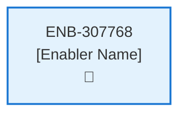
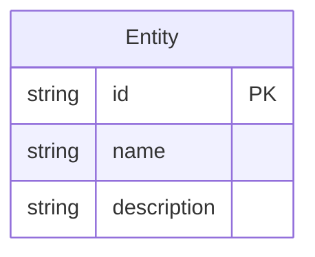
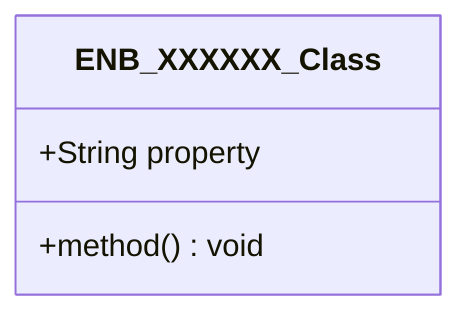
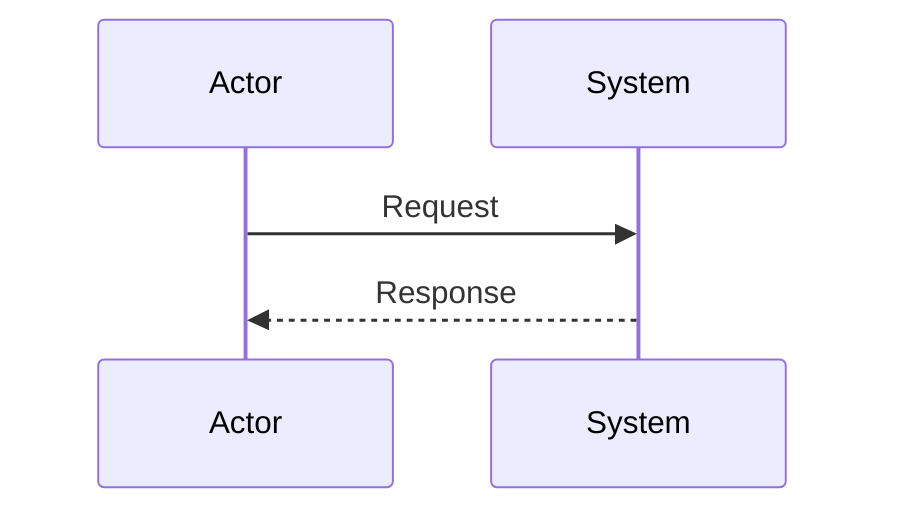
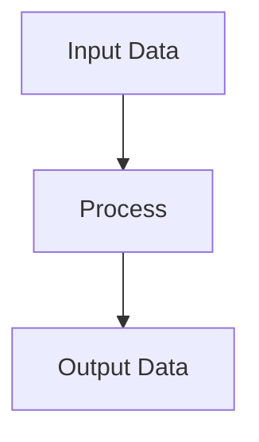
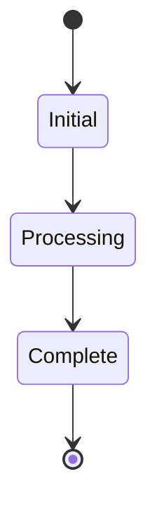

# Review Web Component

## Metadata

- **Name**: Review Web Component
- **Type**: Enabler
- **ID**: ENB-307768
- **Approval**: Approved
- **Capability ID**: CAP-615262
- **Owner**: Product Team
- **Status**: Ready for Implementation
- **Priority**: High
- **Analysis Review**: Required
- **Code Review**: Not Required

## Technical Overview
### Purpose
[What is the purpose?]

## Functional Requirements

| ID | Name | Requirement | Priority | Status | Approval |
|----|------|-------------|----------|--------|----------|
| FR-307768-01 |  | Display pop-up dialog for review submission | High | Draft | Not Approved |
| FR-307768-02 |  | Provide star rating selection (1-5) | High | Draft | Not Approved |
| FR-307768-03 |  | Provide text area for detailed comment | High | Draft | Not Approved |
| FR-307768-04 |  | Pre-populate email field if user email available | Medium | Draft | Not Approved |
| FR-307768-05 |  | Validate rating and comment inputs | High | Draft | Not Approved |
| FR-307768-06 |  | Submit review data to /review API | High | Draft | Not Approved |
| FR-307768-07 |  | Handle API success and close dialog | High | Draft | Not Approved |
| FR-307768-08 |  | Handle API errors and display messages | High | Draft | Not Approved |
| FR-307768-09 |  | Allow dialog dismissal without submission | Medium | Draft | Not Approved |

## Non-Functional Requirements

| ID | Name | Type | Requirement | Priority | Status | Approval |
|----|------|------|-------------|----------|--------|----------|
| NFR-307768-01 |  |  | Responsive dialog design | High | Draft | Not Approved |
| NFR-307768-02 |  |  | Accessible rating and form controls | High | Draft | Not Approved |
| NFR-307768-03 |  |  | Secure form submission | High | Draft | Not Approved |
| NFR-307768-04 |  |  | Fast dialog loading | High | Draft | Not Approved |
| NFR-307768-05 |  |  | Intuitive user interface | Medium | Draft | Not Approved |
| NFR-307768-06 |  |  | Compatible with modern browsers | Medium | Draft | Not Approved |

## Dependencies

### Internal Upstream Dependency

| Enabler ID | Description |
|------------|-------------|
| | |

### Internal Downstream Impact

| Enabler ID | Description |
|------------|-------------|
| | |

### External Dependencies

**External Upstream Dependencies**: None identified.

**External Downstream Impact**: None identified.

## Technical Specifications (Template)

### Enabler Dependency Flow Diagram

### API Technical Specifications (if applicable)

| API Type | Operation | Channel / Endpoint | Description | Request / Publish Payload | Response / Subscribe Data |
|----------|-----------|---------------------|-------------|----------------------------|----------------------------|
| | | | | | |

### Data Models

### Class Diagrams

### Sequence Diagrams

### Dataflow Diagrams

### State Diagrams

