# API Webserver Client

## Metadata

- **Name**: API Webserver Client
- **Type**: Enabler
- **ID**: ENB-335470
- **Approval**: Approved
- **Capability ID**: CAP-924443
- **Owner**: Product Team
- **Status**: Ready for Implementation
- **Priority**: High
- **Analysis Review**: Required
- **Code Review**: Not Required

## Technical Overview
### Purpose
A client wrapper around the webserver API calls defined in the references\api-schema.yaml and the data schema defined in references\data-schema.md. All calls from the website to the webservice should be captured and go through this client. Each request and response should logged in the console.

## Functional Requirements

| ID | Name | Requirement | Priority | Status | Approval |
|----|------|-------------|----------|--------|----------|
| FR-335470-01 | Subscription Management | Implement methods for POST, PUT, and DELETE /subscription endpoints, handling unauthenticated POST and authenticated PUT/DELETE. | High | Ready for Implementation | Approved |
| FR-335470-02 | Profile Management | Implement methods for GET and PUT /profile endpoints, ensuring authenticated access. | High | Ready for Implementation | Approved |
| FR-335470-03 | Support Submission | Implement method for POST /support endpoint, allowing unauthenticated requests. | Medium | Ready for Implementation | Approved |
| FR-335470-04 | Review Submission | Implement method for POST /review endpoint, ensuring authenticated access. | Medium | Ready for Implementation | Approved |
| FR-335470-05 | Contract Creation | Implement method for POST /contract endpoint, ensuring authenticated access and returning created contract data. | High | Ready for Implementation | Approved |
| FR-335470-06 | Contract Retrieval | Implement methods for GET /contract (list with paging/sorting/filtering) and GET /contract/{id} (single contract), ensuring authenticated access. | High | Ready for Implementation | Approved |
| FR-335470-07 | Request Logging | Log each API request to the console, including URL, method, headers, and body. | High | Ready for Implementation | Approved |
| FR-335470-08 | Response Logging | Log each API response to the console, including status code, headers, and body. | High | Ready for Implementation | Approved |
| FR-335470-09 | Authentication Handling | Include JWT in requests for authenticated endpoints, retrieved from application auth state. | High | Ready for Implementation | Approved |
| FR-335470-10 | Error Handling | Handle HTTP errors (4xx, 5xx) and network failures, returning appropriate error objects to callers. | High | Ready for Implementation | Approved |
| FR-335470-11 | Async Operations | Ensure all API calls are asynchronous, returning Promises for integration with async/await. | High | Ready for Implementation | Approved |
| FR-335470-12 | Data Validation | Validate request payloads against the data schemas defined in references/data-schema.md before sending. | Medium | Ready for Implementation | Approved |

## Non-Functional Requirements

| ID | Name | Type | Requirement | Priority | Status | Approval |
|----|------|------|-------------|----------|--------|----------|
| NFR-335470-01 | Response Time | Performance | API calls should complete within 2 seconds under normal network conditions. | High | Ready for Implementation | Approved |
| NFR-335470-02 | Throughput | Performance | Support at least 100 concurrent API calls without degradation. | Medium | Ready for Implementation | Approved |
| NFR-335470-03 | Security | Security | Securely handle and transmit authentication tokens, avoiding exposure in logs or storage. | High | Ready for Implementation | Approved |
| NFR-335470-04 | Reliability | Reliability | Handle network timeouts and retries for failed requests up to 3 times. | High | Ready for Implementation | Approved |
| NFR-335470-05 | Availability | Reliability | Maintain 99% uptime for API client operations. | Medium | Ready for Implementation | Approved |
| NFR-335470-06 | Usability | Usability | Provide a simple, intuitive API for developers to call endpoints without deep knowledge of HTTP. | Medium | Ready for Implementation | Approved |
| NFR-335470-07 | Maintainability | Maintainability | Code should be modular, well-documented, and follow TypeScript best practices. | Medium | Ready for Implementation | Approved |
| NFR-335470-08 | Compatibility | Compatibility | Compatible with modern browsers and Node.js environments. | Low | Ready for Implementation | Approved |
| NFR-335470-09 | Scalability | Scalability | Designed to handle increased load by supporting multiple instances without shared state. | Medium | Ready for Implementation | Approved |
| NFR-335470-10 | Logging | Observability | Logs should be structured and include timestamps, request IDs, and error details for debugging. | High | Ready for Implementation | Approved |

## Dependencies

### Internal Upstream Dependency

| Enabler ID | Description |
|------------|-------------|
| | |

### Internal Downstream Impact

| Enabler ID | Description |
|------------|-------------|
| | |

### External Dependencies

**External Upstream Dependencies**: None identified.

**External Downstream Impact**: None identified.

## Technical Specifications (Template)

### Enabler Dependency Flow Diagram

```mermaid
flowchart TD
    ENB_XXXXXX["ENB-335470<br/>[Enabler Name]<br/>📡"]

    %% Add your dependency flows here

    classDef enabler fill:#e3f2fd,stroke:#1976d2,stroke-width:2px
    class ENB_XXXXXX enabler
```

### API Technical Specifications (if applicable)

| API Type | Operation | Channel / Endpoint | Description | Request / Publish Payload | Response / Subscribe Data |
|----------|-----------|---------------------|-------------|----------------------------|----------------------------|
| | | | | | |

### Data Models

### Class Diagrams

### Sequence Diagrams

### Dataflow Diagrams

### State Diagrams

