# Support Web Component

## Metadata

- **Name**: Support Web Component
- **Type**: Enabler
- **ID**: ENB-376918
- **Approval**: Approved
- **Capability ID**: CAP-827120
- **Owner**: Product Team
- **Status**: Ready for Implementation
- **Priority**: High
- **Analysis Review**: Required
- **Code Review**: Not Required

## Technical Overview
### Purpose
This pop-up dialogue is for support requests and has:
- a greeting
- a subject dropdown containing: General Questions, Billing Question, Technical Issue
- a comment field that accepts up to 1000 characters
- email input populated with the user's email if the user is logged in and the email is available

On submission, the Support API is called

## Functional Requirements

| ID | Name | Requirement | Priority | Status | Approval |
|----|------|-------------|----------|--------|----------|
| FR-376918-01 |  | Display pop-up support dialog | High | Draft | Not Approved |
| FR-376918-02 |  | Show helpful greeting with response commitment | High | Draft | Not Approved |
| FR-376918-03 |  | Provide subject dropdown with options | High | Draft | Not Approved |
| FR-376918-04 |  | Include comment text box | High | Draft | Not Approved |
| FR-376918-05 |  | Include email input field | High | Draft | Not Approved |
| FR-376918-06 |  | Pre-populate email if user is authenticated | High | Draft | Not Approved |
| FR-376918-07 |  | Validate required fields before submission | High | Draft | Not Approved |
| FR-376918-08 |  | Submit support request to API | High | Draft | Not Approved |
| FR-376918-09 |  | Show success/error feedback | High | Draft | Not Approved |

## Non-Functional Requirements

| ID | Name | Type | Requirement | Priority | Status | Approval |
|----|------|------|-------------|----------|--------|----------|
| NFR-376918-01 |  |  | Responsive design for mobile/desktop | High | Draft | Not Approved |
| NFR-376918-02 |  |  | Accessible form controls | High | Draft | Not Approved |
| NFR-376918-03 |  |  | Fast dialog loading | Medium | Draft | Not Approved |
| NFR-376918-04 |  |  | Clear error messaging | High | Draft | Not Approved |
| NFR-376918-05 |  |  | Secure form handling | High | Draft | Not Approved |
| NFR-376918-06 |  |  | Consistent UI styling | Medium | Draft | Not Approved |

## Dependencies

### Internal Upstream Dependency

| Enabler ID | Description |
|------------|-------------|
| | |

### Internal Downstream Impact

| Enabler ID | Description |
|------------|-------------|
| | |

### External Dependencies

**External Upstream Dependencies**: None identified.

**External Downstream Impact**: None identified.

## Technical Specifications (Template)

### Enabler Dependency Flow Diagram

```mermaid
flowchart TD
    ENB_XXXXXX["ENB-376918<br/>[Enabler Name]<br/>📡"]

    %% Add your dependency flows here

    classDef enabler fill:#e3f2fd,stroke:#1976d2,stroke-width:2px
    class ENB_XXXXXX enabler
```

### API Technical Specifications (if applicable)

| API Type | Operation | Channel / Endpoint | Description | Request / Publish Payload | Response / Subscribe Data |
|----------|-----------|---------------------|-------------|----------------------------|----------------------------|
| | | | | | |

### Data Models

### Class Diagrams

### Sequence Diagrams

### Dataflow Diagrams

### State Diagrams

