# Get Profile API

## Metadata

- **Name**: Get Profile API
- **Type**: Enabler
- **ID**: ENB-392023
- **Approval**: Not Approved
- **Capability ID**: CAP-537783
- **Owner**: Product Team
- **Status**: In Draft
- **Priority**: High
- **Analysis Review**: Required
- **Code Review**: Not Required

## Technical Overview
### Purpose
The profile operation in the web service:
- GET method
- Url (/profile) 
- Returns profile document

Get the user's profile from the "profile" container in comsos db based on the user id in the bearer token

## Functional Requirements

| ID | Name | Requirement | Priority | Status | Approval |
|----|------|-------------|----------|--------|----------|
| FR-392023-01 |  | Implement GET /profile endpoint | High | Draft | Not Approved |
| FR-392023-02 |  | Extract user id from bearer token | High | Draft | Not Approved |
| FR-392023-03 |  | Query profile from profiles container in cosmos by user id | High | Draft | Not Approved |
| FR-392023-04 |  | Return profile document in response | High | Draft | Not Approved |
| FR-392023-05 |  | Handle case when profile not found | High | Draft | Not Approved |
| FR-392023-06 |  | Validate authentication | High | Draft | Not Approved |

## Non-Functional Requirements

| ID | Name | Type | Requirement | Priority | Status | Approval |
|----|------|------|-------------|----------|--------|----------|
| NFR-392023-01 |  |  | Secure token handling | High | Draft | Not Approved |
| NFR-392023-02 |  |  | Response time under 1 second | High | Draft | Not Approved |
| NFR-392023-03 |  |  | Efficient cosmos query | High | Draft | Not Approved |
| NFR-392023-04 |  |  | Comprehensive error logging | Medium | Draft | Not Approved |
| NFR-392023-05 |  |  | Handle high request volume | Medium | Draft | Not Approved |

## Dependencies

### Internal Upstream Dependency

| Enabler ID | Description |
|------------|-------------|
| | |

### Internal Downstream Impact

| Enabler ID | Description |
|------------|-------------|
| | |

### External Dependencies

**External Upstream Dependencies**: None identified.

**External Downstream Impact**: None identified.

## Technical Specifications (Template)

### Enabler Dependency Flow Diagram

```mermaid
flowchart TD
    ENB_XXXXXX["ENB-392023<br/>[Enabler Name]<br/>📡"]

    %% Add your dependency flows here

    classDef enabler fill:#e3f2fd,stroke:#1976d2,stroke-width:2px
    class ENB_XXXXXX enabler
```

### API Technical Specifications (if applicable)

| API Type | Operation | Channel / Endpoint | Description | Request / Publish Payload | Response / Subscribe Data |
|----------|-----------|---------------------|-------------|----------------------------|----------------------------|
| | | | | | |

### Data Models

### Class Diagrams

### Sequence Diagrams

### Dataflow Diagrams

### State Diagrams

