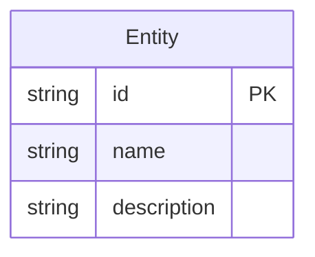
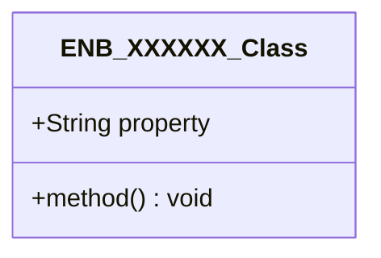
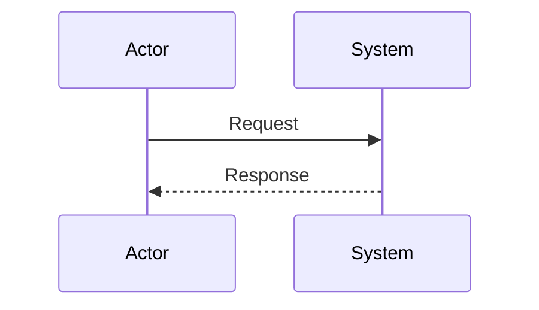
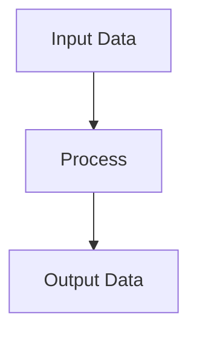
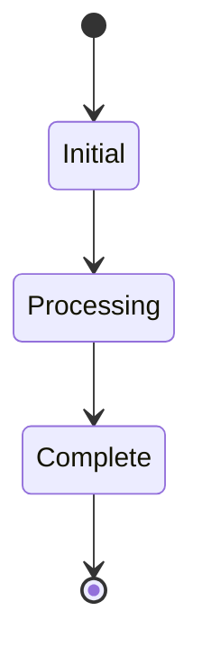

# Subscription Page

## Metadata

- **Name**: Subscription Page
- **Type**: Enabler
- **ID**: ENB-406492
- **Approval**: Not Approved
- **Capability ID**: CAP-919075
- **Owner**: Product Team
- **Status**: In Draft
- **Priority**: High
- **Analysis Review**: Required
- **Code Review**: Not Required

## Technical Overview
### Purpose
This web page enables the current user to change or delete the subscription. 
Top section:
- Describes the ability to change the subscription
- Displays the Change Subscription Web Component

Bottom section:
- Describes the ability to cancel the subscription and delete all historical analysis. This will be unrecoverable.
- Section should be styled as a cautious action
- Displays the Delete Subscription Web Component

## Functional Requirements

| ID | Name | Requirement | Priority | Status | Approval |
|----|------|-------------|----------|--------|----------|
| FR-406492-01 |  | Display top section describing subscription change capability | High | Draft | Not Approved |
| FR-406492-02 |  | Embed Change Subscription Web Component in top section | High | Draft | Not Approved |
| FR-406492-03 |  | Display bottom section describing subscription cancellation | High | Draft | Not Approved |
| FR-406492-04 |  | Style bottom section with caution/cautionary appearance | High | Draft | Not Approved |
| FR-406492-05 |  | Embed Delete Subscription Web Component in bottom section | High | Draft | Not Approved |
| FR-406492-06 |  | Ensure proper visual separation between sections | Medium | Draft | Not Approved |
| FR-406492-07 |  | Handle authentication and redirect if user not logged in | High | Draft | Not Approved |

## Non-Functional Requirements

| ID | Name | Type | Requirement | Priority | Status | Approval |
|----|------|------|-------------|----------|--------|----------|
| NFR-406492-01 |  |  | Page loads within 2 seconds | High | Draft | Not Approved |
| NFR-406492-02 |  |  | Responsive layout for mobile and desktop | High | Draft | Not Approved |
| NFR-406492-03 |  |  | Accessible navigation and content structure | High | Draft | Not Approved |
| NFR-406492-04 |  |  | Clear visual hierarchy between change and delete sections | High | Draft | Not Approved |
| NFR-406492-05 |  |  | Consistent styling with application theme | Medium | Draft | Not Approved |
| NFR-406492-06 |  |  | Secure page access requiring authentication | High | Draft | Not Approved |
| NFR-406492-07 |  |  | Intuitive user experience for subscription management | Medium | Draft | Not Approved |

## Dependencies

### Internal Upstream Dependency

| Enabler ID | Description |
|------------|-------------|
| | |

### Internal Downstream Impact

| Enabler ID | Description |
|------------|-------------|
| | |

### External Dependencies

**External Upstream Dependencies**: None identified.

**External Downstream Impact**: None identified.

## Technical Specifications (Template)

### Enabler Dependency Flow Diagram

```mermaid
flowchart TD
    ENB_XXXXXX["ENB-406492<br/>[Enabler Name]<br/>📡"]

    %% Add your dependency flows here

    classDef enabler fill:#e3f2fd,stroke:#1976d2,stroke-width:2px
    class ENB_XXXXXX enabler
```

### API Technical Specifications (if applicable)

| API Type | Operation | Channel / Endpoint | Description | Request / Publish Payload | Response / Subscribe Data |
|----------|-----------|---------------------|-------------|----------------------------|----------------------------|
| | | | | | |

### Data Models

### Class Diagrams

### Sequence Diagrams

### Dataflow Diagrams

### State Diagrams

