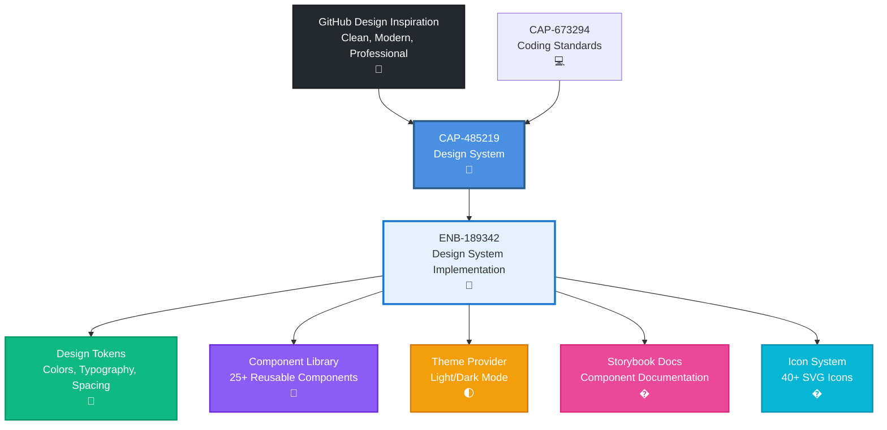

# Design System

## Metadata

- **Name**: Design System
- **Type**: Capability
- **System**: ls
- **Component**: web-site
- **ID**: CAP-485219
- **Approval**: Approved
- **Owner**: Product Team
- **Status**: Ready for Implementation
- **Priority**: High
- **Analysis Review**: Required

## Technical Overview
### Purpose
Establish a comprehensive design system for the web application, inspired by modern, clean, and professional UI patterns exemplified by GitHub's design language. This capability provides design tokens, reusable React components, theming infrastructure, and development tooling to ensure consistent visual design, user experience, and component architecture across all user interfaces, creating an intuitive and accessible application that balances functionality with aesthetic appeal.

## Enablers

| Enabler ID |
|------------|
| ENB-189342 | Design System Implementation |

## Dependencies

### Internal Upstream Dependency

| Capability ID | Description |
|---------------|-------------|
| CAP-673294 | Coding Standards - Ensures consistent code patterns in UI components |
| CAP-758392 | Docker Containerization - Deployment of styled web application |

### Internal Downstream Impact

| Capability ID | Description |
|---------------|-------------|
| | |

### External Dependencies

**External Upstream Dependencies**: CSS frameworks (Tailwind CSS or styled-components), React component libraries, design tokens specification, accessibility standards (WCAG 2.1 AA)

**External Downstream Impact**: All UI developers must follow the design system specifications

**Reference Documents**:
- `specifications/website/reference/STYLE_GUIDE.md` - Comprehensive style guide with CSS values and component patterns
- `specifications/website/reference/CSS_STANDARDS.md` - Standardized CSS tokens and implementation guidelines
- ENB-189342 - Design System Implementation enabler with technical specifications

## Technical Specifications (Template)

### Capability Dependency Flow Diagram

