# Change Subscription API

## Metadata

- **Name**: Change Subscription API
- **Type**: Enabler
- **ID**: ENB-551364
- **Approval**: Approved
- **Capability ID**: CAP-919075
- **Owner**: Product Team
- **Status**: Ready for Implementation
- **Priority**: High
- **Analysis Review**: Required
- **Code Review**: Not Required

## Technical Overview
### Purpose
A webservice API that updates an existing subscription
- PUT method
- /subscription path
- Accepts a subscription request

Retrieves the account document for the user id in the JWT from "account" container in cosmos db
Updates the Stripe subscription using the price id of the new subscription type with the subscription id and subscription item id from the account document
Updates and save the account document with the new subscription item id and subscription type (starter or pro)

## Functional Requirements

| ID | Name | Requirement | Priority | Status | Approval |
|----|------|-------------|----------|--------|----------|
| FR-551364-01 |  | Implement PUT /subscription endpoint | High | Ready for Implementation | Approved |
| FR-551364-02 |  | Accept subscription request in payload | High | Ready for Implementation | Approved |
| FR-551364-03 |  | Extract user id from JWT | High | Ready for Implementation | Approved |
| FR-551364-04 |  | Retrieve account document from accounts container using user id | High | Ready for Implementation | Approved |
| FR-551364-05 |  | Update Stripe subscription with new price id using subscription id and item id | High | Ready for Implementation | Approved |
| FR-551364-06 |  | Update account document with new subscription item id and type | High | Ready for Implementation | Approved |
| FR-551364-07 |  | Save updated account document to accounts container | High | Ready for Implementation | Approved |
| FR-551364-08 |  | Validate subscription type (starter or pro) | High | Ready for Implementation | Approved |
| FR-551364-09 |  | Handle Stripe API errors gracefully | High | Ready for Implementation | Approved |
| FR-551364-10 |  | Return success/error responses | High | Ready for Implementation | Approved |

## Non-Functional Requirements

| ID | Name | Type | Requirement | Priority | Status | Approval |
|----|------|------|-------------|----------|--------|----------|
| NFR-551364-01 |  |  | Secure handling of JWTs and account data | High | Ready for Implementation | Approved |
| NFR-551364-02 |  |  | Validate all inputs against data schema | High | Ready for Implementation | Approved |
| NFR-551364-03 |  |  | Response time under 5 seconds | High | Ready for Implementation | Approved |
| NFR-551364-04 |  |  | Atomic account document updates | High | Ready for Implementation | Approved |
| NFR-551364-05 |  |  | Comprehensive error logging | Medium | Ready for Implementation | Approved |
| NFR-551364-06 |  |  | Stripe API rate limit handling | High | Ready for Implementation | Approved |
| NFR-551364-07 |  |  | Idempotent subscription changes | Medium | Ready for Implementation | Approved |

## Dependencies

### Internal Upstream Dependency

| Enabler ID | Description |
|------------|-------------|
| | |

### Internal Downstream Impact

| Enabler ID | Description |
|------------|-------------|
| | |

### External Dependencies

**External Upstream Dependencies**: None identified.

**External Downstream Impact**: None identified.

## Technical Specifications (Template)

### Enabler Dependency Flow Diagram

```mermaid
flowchart TD
    ENB_XXXXXX["ENB-551364<br/>[Enabler Name]<br/>📡"]

    %% Add your dependency flows here

    classDef enabler fill:#e3f2fd,stroke:#1976d2,stroke-width:2px
    class ENB_XXXXXX enabler
```

### API Technical Specifications (if applicable)

| API Type | Operation | Channel / Endpoint | Description | Request / Publish Payload | Response / Subscribe Data |
|----------|-----------|---------------------|-------------|----------------------------|----------------------------|
| | | | | | |

### Data Models

### Class Diagrams

### Sequence Diagrams

### Dataflow Diagrams

### State Diagrams

