# Style Guide

## Metadata

- **Name**: Style Guide
- **Type**: Enabler
- **ID**: ENB-558298
- **Approval**: Approved
- **Capability ID**: CAP-485219
- **Owner**: Product Team
- **Status**: Ready for Implementation
- **Priority**: High
- **Analysis Review**: Completed
- **Code Review**: Not Required

## Technical Overview
### Purpose
Establish and maintain a comprehensive style guide that serves as the authoritative reference for all visual design, component usage, and user interface patterns across the lease-sentry web application. This enabler ensures consistent implementation of the design system through detailed documentation, code examples, and development guidelines that cover typography, color systems, spacing, components, accessibility, and responsive design patterns.

## Functional Requirements

| ID | Name | Requirement | Priority | Status | Approval |
|----|------|-------------|----------|--------|----------|
| FR-558298-001 | Design System Documentation | Create comprehensive style guide documentation covering technology stack, color system, typography, spacing, components, and theme support | High | Completed | Approved |
| FR-558298-002 | Component Library Documentation | Document all 40+ shadcn/ui components with usage examples, props, and styling guidelines | High | Completed | Approved |
| FR-558298-003 | Color System Implementation | Implement OKLCH-based color system with CSS custom properties supporting light and dark themes | High | Completed | Approved |
| FR-558298-004 | Typography System | Define and document font system, sizes, weights, and responsive typography scale | High | Completed | Approved |
| FR-558298-005 | Theme Switching | Implement complete theme switching functionality with system preference detection and animated toggle | High | Completed | Approved |
| FR-558298-006 | Responsive Design Guidelines | Document responsive design patterns, breakpoints, and mobile-first approach | High | Completed | Approved |
| FR-558298-007 | Accessibility Standards | Define WCAG 2.1 AA compliant accessibility guidelines and implementation patterns | High | Completed | Approved |
| FR-558298-008 | Development Workflow | Establish development workflow for component creation, testing, and style guide maintenance | Medium | Completed | Approved |
| FR-558298-009 | Code Examples | Provide working, copy-paste ready code examples for all components and patterns | Medium | Completed | Approved |
| FR-558298-010 | Style Guide Maintenance | Establish process for updating style guide when new components or patterns are added | Medium | Completed | Approved |

## Non-Functional Requirements

| ID | Name | Type | Requirement | Priority | Status | Approval |
|----|------|------|-------------|----------|--------|----------|
| NFR-558298-001 | Accessibility Compliance | Accessibility | All components and patterns must meet WCAG 2.1 AA standards with proper ARIA labels, keyboard navigation, and screen reader support | High | Completed | Approved |
| NFR-558298-002 | Performance | Performance | Style guide documentation must load within 2 seconds and component examples must render efficiently | Medium | Completed | Approved |
| NFR-558298-003 | Maintainability | Maintainability | Style guide must be easily updatable with clear structure and version control | High | Completed | Approved |
| NFR-558298-004 | Consistency | Usability | All documented patterns must be consistent and follow established design principles | High | Completed | Approved |
| NFR-558298-005 | Cross-browser Compatibility | Compatibility | Style guide must work across all modern browsers (Chrome, Firefox, Safari, Edge) | High | Completed | Approved |
| NFR-558298-006 | Mobile Responsiveness | Usability | All component examples and documentation must be fully responsive across device sizes | High | Completed | Approved |
| NFR-558298-007 | Theme Consistency | Usability | Light and dark theme implementations must be consistent and seamless | High | Completed | Approved |
| NFR-558298-008 | Developer Experience | Usability | Style guide must provide clear, actionable guidance for developers implementing components | High | Completed | Approved |
| NFR-558298-009 | Documentation Accuracy | Reliability | All code examples and documentation must be accurate and functional | Critical | Completed | Approved |
| NFR-558298-010 | Scalability | Scalability | Style guide structure must support addition of new components and patterns without breaking existing documentation | Medium | Completed | Approved |

## Dependencies

### Internal Upstream Dependency

| Enabler ID | Description |
|------------|-------------|
| ENB-189342 | Design System Implementation - Provides the underlying design system that this style guide documents |

### Internal Downstream Impact

| Enabler ID | Description |
|------------|-------------|
| ENB-299518 | Design System Showcase Page - Depends on style guide for component documentation |
| ENB-951534 | Theme Toggle Implementation - Uses style guide theme switching patterns |

### External Dependencies

**External Upstream Dependencies**:
- shadcn/ui component library documentation
- Tailwind CSS v4 documentation
- Radix UI accessibility guidelines
- WCAG 2.1 AA accessibility standards

**External Downstream Impact**:
- All frontend developers must follow style guide specifications
- UI/UX designers must align with documented patterns
- QA team must validate against style guide requirements

## Technical Specifications

### Enabler Dependency Flow Diagram

```mermaid
flowchart TD
    ENB_189342["ENB-189342<br/>Design System<br/>Implementation<br/>🏗️"] --> ENB_558298
    ENB_558298["ENB-558298<br/>Style Guide<br/>📚"] --> ENB_299518["ENB-299518<br/>Design System<br/>Showcase<br/>🎨"]
    ENB_558298 --> ENB_951534["ENB-951534<br/>Theme Toggle<br/>🌙"]

    %% Styling
    classDef enabler fill:#e3f2fd,stroke:#1976d2,stroke-width:2px
    classDef downstream fill:#f3e5f5,stroke:#7b1fa2,stroke-width:2px
    class ENB_189342,ENB_558298 enabler
    class ENB_299518,ENB_951534 downstream
```


### Documentation Structure

**File Organization**:
```
specifications/website/reference/
├── STYLE_GUIDE.md           # Main style guide document
├── CSS_STANDARDS.md         # CSS implementation standards
└── [Future files]           # Additional reference materials
```

### Maintenance Process

**Style Guide Update Workflow**:
1. **Component Addition**: When new components are added to the design system
2. **Pattern Discovery**: When new UI patterns emerge from development
3. **Standard Updates**: When design standards evolve
4. **Accessibility Updates**: When accessibility requirements change
5. **Technology Updates**: When underlying technologies are upgraded

**Review Process**:
- Monthly review of style guide accuracy
- Update documentation for any new components
- Validate all code examples remain functional
- Ensure accessibility standards are current
```
### Dataflow Diagrams

### State Diagrams


