# Notification Web Component

## Metadata

- **Name**: Notification Web Component
- **Type**: Enabler
- **ID**: ENB-624132
- **Approval**: Approved
- **Capability ID**: CAP-228030
- **Owner**: Product Team
- **Status**: Ready for Implementation
- **Priority**: High
- **Analysis Review**: Required
- **Code Review**: Not Required

## Technical Overview
### Purpose
A web component drop down menu that:
- Has a notification icon (e.g. alarm bell)
- If there is a notification that is "processing" then the notification icon will have an animated progress bar under it.

When clicked, a list of notifications drop down:
- Each notification is a menu item
- Each notification type of analysis has an associated analysis icon
- Each notification type of contract has an associated contract icon
- If the notification is of type contract and that notification type is "processing" then show spinning progress as the icon
- Each notification is a clickable link
- There will never by more than 10 notifications in the menu

Onclick of a contract menu item will navigate the user to Contract page passing the contract id
Onclick of an analysis menu item will navigate the user to the Analysis page passing the contract id

Notifications are retrieved by the Notification API
Notifications are refreshed every 5 seconds

## Functional Requirements

| ID | Requirement | Status | Priority |
|----|------------|--------|----------|
| FR-624132-01 | Display notification bell icon in header | Draft | High |
| FR-624132-02 | Show animated progress bar under icon when notifications are processing | Draft | High |
| FR-624132-03 | Display drop down menu when notification icon is clicked | Draft | High |
| FR-624132-04 | Show maximum of 10 notifications in the drop down | Draft | High |
| FR-624132-05 | Display appropriate icons for each notification type (analysis vs contract) | Draft | High |
| FR-624132-06 | Show spinning progress icon for contract notifications that are processing | Draft | High |
| FR-624132-07 | Make each notification item clickable | Draft | High |
| FR-624132-08 | Navigate to Contract page with contract ID when contract notification is clicked | Draft | High |
| FR-624132-09 | Navigate to Analysis page with contract ID when analysis notification is clicked | Draft | High |
| FR-624132-10 | Retrieve notifications using Get Notifications API (ENB-092055) | Draft | High |
| FR-624132-11 | Refresh notifications every 5 seconds | Draft | High |
| FR-624132-12 | Close drop down menu when clicking outside or selecting a notification | Draft | Medium |

## Non-Functional Requirements

| ID | Requirement | Status | Priority |
|----|------------|--------|----------|
| NFR-624132-01 | Responsive design for desktop, tablet, and mobile devices | Draft | High |
| NFR-624132-02 | Accessible keyboard navigation and screen reader support | Draft | High |
| NFR-624132-03 | Smooth drop down animations and transitions | Draft | Medium |
| NFR-624132-04 | Real-time notification updates without page refresh | Draft | High |
| NFR-624132-05 | Consistent visual design with application theme | Draft | High |
| NFR-624132-06 | Fast loading and rendering of notification list | Draft | High |
| NFR-624132-07 | Compatible with modern browsers | Draft | High |

## Dependencies

### Internal Upstream Dependency

| Enabler ID | Description |
|------------|-------------|
| ENB-092055 | Get Notifications API - Required to retrieve notification data |

### Internal Downstream Impact

| Enabler ID | Description |
|------------|-------------|
| ENB-092055 | Get Notifications API - Will be called periodically to refresh notifications |
| | |

### External Dependencies

**External Upstream Dependencies**: None identified.

**External Downstream Impact**: None identified.

## Technical Specifications (Template)

### Enabler Dependency Flow Diagram

```mermaid
flowchart TD
    ENB_XXXXXX["ENB-624132<br/>[Enabler Name]<br/>📡"]

    %% Add your dependency flows here

    classDef enabler fill:#e3f2fd,stroke:#1976d2,stroke-width:2px
    class ENB_XXXXXX enabler
```

### API Technical Specifications (if applicable)

| API Type | Operation | Channel / Endpoint | Description | Request / Publish Payload | Response / Subscribe Data |
|----------|-----------|---------------------|-------------|----------------------------|----------------------------|
| | | | | | |

### Data Models

### Class Diagrams

### Sequence Diagrams

### Dataflow Diagrams

### State Diagrams

