# Notification Web Component

## Metadata

- **Name**: Notification Web Component
- **Type**: Enabler
- **ID**: ENB-624132
- **Approval**: Approved
- **Capability ID**: CAP-228030
- **Owner**: Product Team
- **Status**: Ready for Implementation
- **Priority**: High
- **Analysis Review**: Required
- **Code Review**: Not Required

## Technical Overview
### Purpose
A web component drop down menu that:
- Has an icon (e.g. alarm bell)
- If there is an item in the notifications array that is "processing" then the icon will have an animated progress bar under it.

When clicked, a list of notifications drop down:
- Each item in the notifications array is a menu item
- Each item in the notifications array with a type of analysis has an associated analysis icon
- Each item in the notifications array with a type of contract has an associated contract icon
- If the item in the notifications array is of type contract and that item status is "processing" then show spinning progress as the icon
- Each menu item has a title next to the icon that is the title of the item
- Each notifications item is a clickable link
- There will never by more than 10 notifications item in the menu

Onclick of a contract menu item will navigate the user to Contract page passing the contract id
Onclick of an analysis menu item will navigate the user to the Analysis page passing the contract id

Notifications are retrieved by the Notification API
Notifications are refreshed every 5 seconds

## Functional Requirements

| ID | Name | Requirement | Priority | Status | Approval |
|----|------|-------------|----------|--------|----------|
| FR-624132-01 |  | Display notification bell icon in header | High | Draft | Not Approved |
| FR-624132-02 |  | Show animated progress bar under icon when notifications are processing | High | Draft | Not Approved |
| FR-624132-03 |  | Display drop down menu when notification icon is clicked | High | Draft | Not Approved |
| FR-624132-04 |  | Show maximum of 10 notifications in the drop down | High | Draft | Not Approved |
| FR-624132-05 |  | Display appropriate icons for each notification type (analysis vs contract) | High | Draft | Not Approved |
| FR-624132-06 |  | Show spinning progress icon for contract notifications that are processing | High | Draft | Not Approved |
| FR-624132-07 |  | Make each notification item clickable | High | Draft | Not Approved |
| FR-624132-08 |  | Navigate to Contract page with contract ID when contract notification is clicked | High | Draft | Not Approved |
| FR-624132-09 |  | Navigate to Analysis page with contract ID when analysis notification is clicked | High | Draft | Not Approved |
| FR-624132-10 |  | Retrieve notifications using Get Notifications API (ENB-092055) | High | Draft | Not Approved |
| FR-624132-11 |  | Refresh notifications every 5 seconds | High | Draft | Not Approved |
| FR-624132-12 |  | Close drop down menu when clicking outside or selecting a notification | Medium | Draft | Not Approved |

## Non-Functional Requirements

| ID | Name | Type | Requirement | Priority | Status | Approval |
|----|------|------|-------------|----------|--------|----------|
| NFR-624132-01 |  |  | Responsive design for desktop, tablet, and mobile devices | High | Draft | Not Approved |
| NFR-624132-02 |  |  | Accessible keyboard navigation and screen reader support | High | Draft | Not Approved |
| NFR-624132-03 |  |  | Smooth drop down animations and transitions | Medium | Draft | Not Approved |
| NFR-624132-04 |  |  | Real-time notification updates without page refresh | High | Draft | Not Approved |
| NFR-624132-05 |  |  | Consistent visual design with application theme | High | Draft | Not Approved |
| NFR-624132-06 |  |  | Fast loading and rendering of notification list | High | Draft | Not Approved |
| NFR-624132-07 |  |  | Compatible with modern browsers | High | Draft | Not Approved |

## Dependencies

### Internal Upstream Dependency

| Enabler ID | Description |
|------------|-------------|
| ENB-092055 | Get Notifications API - Required to retrieve notification data |

### Internal Downstream Impact

| Enabler ID | Description |
|------------|-------------|
| ENB-092055 | Get Notifications API - Will be called periodically to refresh notifications |

### External Dependencies

**External Upstream Dependencies**: None identified.

**External Downstream Impact**: None identified.

## Technical Specifications (Template)

### Enabler Dependency Flow Diagram

```mermaid
flowchart TD
    ENB_XXXXXX["ENB-624132<br/>[Enabler Name]<br/>📡"]

    %% Add your dependency flows here

    classDef enabler fill:#e3f2fd,stroke:#1976d2,stroke-width:2px
    class ENB_XXXXXX enabler
```

### API Technical Specifications (if applicable)

| API Type | Operation | Channel / Endpoint | Description | Request / Publish Payload | Response / Subscribe Data |
|----------|-----------|---------------------|-------------|----------------------------|----------------------------|
| | | | | | |

### Data Models

### Class Diagrams

### Sequence Diagrams

### Dataflow Diagrams

### State Diagrams

