# Application Insights

## Metadata

- **Name**: Application Insights
- **Type**: Enabler
- **ID**: ENB-731163
- **Approval**: Approved
- **Capability ID**: CAP-529947
- **Owner**: Product Team
- **Status**: Ready for Implementation
- **Priority**: High
- **Analysis Review**: Required
- **Code Review**: Not Required

## Technical Overview
### Purpose
Instrument the website with Application Insights to provide comprehensive telemetry and monitoring. This includes logging critical user business actions (starting free trials, subscription payments), identifying users via email upon login, tracking all page transitions (client-side routing), and monitoring all webservice interactions from the API client. The Application Insights instrumentation key must be configurable via environment variables to support multiple deployment environments.

## Functional Requirements

| ID | Name | Requirement | Priority | Status | Approval |
|----|------|-------------|----------|--------|----------|
| FR-731163-01 | Free Trial Logging | Log a custom event named 'FreeTrialStarted' when a user successfully initiates a free trial | High | Ready for Implementation | Approved |
| FR-731163-02 | Subscription Payment Logging | Log a custom event named 'SubscriptionPaid' when a user successfully completes a subscription payment | High | Ready for Implementation | Approved |
| FR-731163-03 | User Identification | Set the authenticated user context using the user's email address in Application Insights immediately after successful login | High | Ready for Implementation | Approved |
| FR-731163-04 | Page View Logging | Automatically log 'PageView' events for all client-side route transitions, capturing page names and durations | High | Ready for Implementation | Approved |
| FR-731163-05 | API Request Logging | Log all outgoing API client requests as dependencies or custom events, capturing method, URL, status code, and duration | High | Ready for Implementation | Approved |
| FR-731163-06 | Configuration Loading | Load the Application Insights instrumentation key from the `VITE_APPINSIGHTS_KEY` environment variable | High | Ready for Implementation | Approved |
| FR-731163-07 | Service Initialization | Initialize the Application Insights SDK service at application startup before any React components mount | High | Ready for Implementation | Approved |

## Non-Functional Requirements

| ID | Name | Type | Requirement | Priority | Status | Approval |
|----|------|------|-------------|----------|--------|----------|
| NFR-731163-01 | Performance Impact | Performance | Telemetry logging operations must be asynchronous and non-blocking to ensure no degradation of UI responsiveness (latency < 5ms) | High | Ready for Implementation | Approved |
| NFR-731163-02 | Fail-Safe Operation | Reliability | Any failures in the telemetry service (e.g., network errors, initialization failures) must be caught and must NOT crash the application or interrupt user flows | High | Ready for Implementation | Approved |
| NFR-731163-03 | Data Privacy | Security | The system must NOT log sensitive PII (passwords, credit card numbers, tokens) in any custom events, traces, or exception details, with the exception of the authorized user email for context | High | Ready for Implementation | Approved |
| NFR-731163-04 | Environment Isolation | Configuration | The system must support distinct instrumentation keys for Development, Test, and Production environments to prevent data pollution | High | Ready for Implementation | Approved |
| NFR-731163-05 | Browser Compatibility | Compatibility | Telemetry collection must function correctly on all supported modern browsers (Chrome, Firefox, Safari, Edge) | Medium | Ready for Implementation | Approved |

## Dependencies

### Internal Upstream Dependency

| Enabler ID | Description |
|------------|-------------|
| ENB-847347 | React + Vite Framework - Provides the application entry point and lifecycle for initialization |
| ENB-847341 | Environment Configuration - Provides the `VITE_APPINSIGHTS_KEY` environment variable |
| ENB-847343 | NPM Package Management - Required to install `@microsoft/applicationinsights-web` and related packages |

### Internal Downstream Impact

| Enabler ID | Description |
|------------|-------------|
| ENB-501283 | Web Application - Will be instrumented with Application Insights for monitoring |
| ENB-335470 | API Webserver Client - Will utilize the logging service to track API requests |
| ENB-925037 | Initial Log In Web Component - Will trigger user identification logging |
| ENB-079527 | Change Subscription Web Component - Will trigger subscription payment logging |

### External Dependencies

**External Upstream Dependencies**:
- Microsoft Azure Application Insights (Service)
- `@microsoft/applicationinsights-web` (NPM Package)
- `@microsoft/applicationinsights-react-js` (NPM Package)

**External Downstream Impact**: None identified.

## Technical Specifications (Template)

### Enabler Dependency Flow Diagram

```mermaid
flowchart TD
    ENB_731163["ENB-731163<br/>Application Insights<br/>📡"]
    ENB_847347["ENB-847347<br/>React + Vite<br/>⚛️"]
    ENB_847341["ENB-847341<br/>Env Config<br/>⚙️"]
    
    ENB_847347 --> ENB_731163
    ENB_847341 --> ENB_731163
    
    classDef enabler fill:#e3f2fd,stroke:#1976d2,stroke-width:2px
    class ENB_731163,ENB_847347,ENB_847341 enabler
```

### API Technical Specifications (if applicable)

| API Type | Operation | Channel / Endpoint | Description | Request / Publish Payload | Response / Subscribe Data |
|----------|-----------|---------------------|-------------|----------------------------|----------------------------|
| | | | | | |

### Data Models

### Class Diagrams

### Sequence Diagrams

### Dataflow Diagrams

### State Diagrams

