# Header Menu - Not Logged In

## Metadata

- **Name**: Header Menu - Not Logged In
- **Type**: Enabler
- **ID**: ENB-817784
- **Approval**: Approved
- **Capability ID**: CAP-924443
- **Owner**: Product Team
- **Status**: Ready for Implementation
- **Priority**: High
- **Analysis Review**: Required
- **Code Review**: Not Required

## Technical Overview
### Purpose
A header web component that:
- Is at the top of the page
- Is present on all pages where the user is not logged in
- Has the site logo and title
- Title is configurable based on environment (e.g. Lease Sentry (test) or Lease Sentry (dev)
- Free Trial button is pinned to the right

This web component is only present when the user has not been logged into the site and a JWT is present
On click of the Free Trial button, navigation to the Initial Free Login (/freelogin)

## Functional Requirements

| ID | Requirement | Status | Priority |
|----|------------|--------|----------|
| FR-817784-01 | Display header at top of page for non-logged-in users only | Ready for Implementation | High |
| FR-817784-02 | Check for absence of JWT token to determine visibility | Ready for Implementation | High |
| FR-817784-03 | Display site logo on the left side of header | Ready for Implementation | High |
| FR-817784-04 | Display configurable site title next to logo | Ready for Implementation | High |
| FR-817784-05 | Support environment-based title configuration (dev, test, prod) | Ready for Implementation | High |
| FR-817784-06 | Display Free Trial button pinned to the right | Ready for Implementation | High |
| FR-817784-07 | Navigate to /freelogin when Free Trial button is clicked | Ready for Implementation | High |
| FR-817784-08 | Ensure header is present on all non-authenticated pages | Ready for Implementation | High |
| FR-817784-09 | Hide header completely when user is logged in | Ready for Implementation | High |
| FR-817784-10 | Maintain consistent header layout across all public pages | Ready for Implementation | Medium |

## Non-Functional Requirements

| ID | Requirement | Status | Priority |
|----|------------|--------|----------|
| NFR-817784-01 | Responsive design for desktop, tablet, and mobile devices | Ready for Implementation | High |
| NFR-817784-02 | Accessible navigation and screen reader support | Ready for Implementation | High |
| NFR-817784-03 | Fast header rendering without blocking page load | Ready for Implementation | High |
| NFR-817784-04 | Consistent visual design following design system | Ready for Implementation | High |
| NFR-817784-05 | Compatible with modern browsers | Ready for Implementation | High |
| NFR-817784-06 | Minimal impact on page performance and load times | Ready for Implementation | Medium |
| NFR-817784-07 | Clear call-to-action styling for Free Trial button | Ready for Implementation | Medium |

## Dependencies

### Internal Upstream Dependency

| Enabler ID | Description |
|------------|-------------|
| ENB-189342 | Design System Implementation - provides color scheme, typography, and spacing standards |

### Internal Downstream Impact

| Enabler ID | Description |
|------------|-------------|
| ENB-501283 | Web Application - uses the header component on all public pages |
| ENB-925037 | Initial Log In Web Component - accessed via Free Trial button navigation to /freelogin |

### External Dependencies

**External Upstream Dependencies**: None identified.

**External Downstream Impact**: None identified.

## Technical Specifications (Template)

### Enabler Dependency Flow Diagram

```mermaid
flowchart TD
    ENB_XXXXXX["ENB-817784<br/>[Enabler Name]<br/>📡"]

    %% Add your dependency flows here

    classDef enabler fill:#e3f2fd,stroke:#1976d2,stroke-width:2px
    class ENB_XXXXXX enabler
```

### API Technical Specifications (if applicable)

| API Type | Operation | Channel / Endpoint | Description | Request / Publish Payload | Response / Subscribe Data |
|----------|-----------|---------------------|-------------|----------------------------|----------------------------|
| | | | | | |

### Data Models

### Class Diagrams

### Sequence Diagrams

### Dataflow Diagrams

### State Diagrams

