# Example Website

## Metadata

- **Name**: Example Website
- **Type**: Enabler
- **ID**: ENB-858955
- **Approval**: Approved
- **Capability ID**: CAP-924443
- **Owner**: Product Team
- **Status**: Ready for Implementation
- **Priority**: High
- **Analysis Review**: Completed
- **Code Review**: Not Required

## Technical Overview
### Purpose
Create a comprehensive example website that serves as a reference implementation and demonstration of the lease-sentry web application user interface. This enabler establishes the foundation website structure with proper theming (dark homepage, light application pages), navigation patterns, component integration, and responsive design that showcases the complete design system implementation.

## Functional Requirements

| ID | Name | Requirement | Priority | Status | Approval |
|----|------|-------------|----------|--------|----------|
| FR-858955-001 | Website Structure | Create multi-page website with homepage and analysis tool sections | High | Completed | Approved |
| FR-858955-002 | Dark Theme Homepage | Implement homepage with dark theme styling using gradient backgrounds and dark navigation | High | Completed | Approved |
| FR-858955-003 | Light Theme Application | Implement analysis tool and other pages with light theme following design system | High | Completed | Approved |
| FR-858955-004 | Theme Switching | Add functional theme toggle button with animated icons and system preference detection | High | Completed | Approved |
| FR-858955-005 | Navigation System | Implement responsive navigation with proper routing between homepage and analysis tool | High | Completed | Approved |
| FR-858955-006 | Component Integration | Integrate 40+ shadcn/ui components throughout the website with proper theming | High | Completed | Approved |
| FR-858955-007 | Responsive Design | Ensure all pages and components work across desktop, tablet, and mobile devices | High | Completed | Approved |
| FR-858955-008 | Icon Usage | Implement Lucide React icons consistently throughout the interface | Medium | Completed | Approved |
| FR-858955-009 | Background Images | Integrate appropriate background images for visual appeal and branding | Medium | Completed | Approved |
| FR-858955-010 | Development Server | Set up Vite development server for local development and testing | Medium | Completed | Approved |

## Non-Functional Requirements

| ID | Name | Type | Requirement | Priority | Status | Approval |
|----|------|------|-------------|----------|--------|----------|
| NFR-858955-001 | Performance | Performance | Website must load within 3 seconds on standard broadband connection | High | Completed | Approved |
| NFR-858955-002 | Accessibility | Accessibility | All pages must meet WCAG 2.1 AA standards with proper ARIA labels and keyboard navigation | High | Completed | Approved |
| NFR-858955-003 | Cross-browser Compatibility | Compatibility | Website must work correctly in Chrome, Firefox, Safari, and Edge browsers | High | Completed | Approved |
| NFR-858955-004 | Mobile Responsiveness | Usability | All pages must be fully functional and visually appealing on mobile devices (320px+) | High | Completed | Approved |
| NFR-858955-005 | Theme Consistency | Usability | Light and dark themes must switch seamlessly without layout shifts or visual glitches | High | Completed | Approved |
| NFR-858955-006 | Visual Consistency | Usability | All components must follow the established design system and style guide | High | Completed | Approved |
| NFR-858955-007 | Code Quality | Maintainability | Code must follow React and TypeScript best practices with proper component structure | Medium | Completed | Approved |
| NFR-858955-008 | Bundle Size | Performance | Production bundle must be optimized and under 2MB total size | Medium | Completed | Approved |
| NFR-858955-009 | SEO Readiness | Usability | Website structure must support future SEO implementation with proper meta tags | Low | Completed | Approved |
| NFR-858955-010 | Development Experience | Maintainability | Development setup must be easy to use with hot reload and clear error messages | Medium | Completed | Approved |

## Dependencies

### Internal Upstream Dependency

| Enabler ID | Description |
|------------|-------------|
| ENB-189342 | Design System Implementation - Provides the component library and theming system |
| ENB-558298 | Style Guide - Defines the visual design standards and usage patterns |
| ENB-951534 | Header - Provides navigation component for the website |

### Internal Downstream Impact

| Enabler ID | Description |
|------------|-------------|
| ENB-299518 | Design System Showcase Page - Uses the example website as a foundation |
| ENB-874140 | Layout System - Builds upon the website structure established here |

### External Dependencies

**External Upstream Dependencies**:
- React 18 and TypeScript for component development
- Vite for development server and build tooling
- Tailwind CSS v4 for styling
- shadcn/ui component library
- Lucide React for icons
- next-themes for theme switching

**External Downstream Impact**:
- Frontend developers will use this as reference implementation
- QA team will test against this example website
- Designers will validate against the implemented design system

## Technical Specifications

### Enabler Dependency Flow Diagram

```mermaid
flowchart TD
    ENB_189342["ENB-189342<br/>Design System<br/>Implementation<br/>🏗️"] --> ENB_858955
    ENB_558298["ENB-558298<br/>Style Guide<br/>📚"] --> ENB_858955
    ENB_951534["ENB-951534<br/>Header<br/>📡"] --> ENB_858955
    ENB_858955["ENB-858955<br/>Example Website<br/>🌐"] --> ENB_299518["ENB-299518<br/>Design System<br/>Showcase<br/>🎨"]
    ENB_858955 --> ENB_874140["ENB-874140<br/>Layout System<br/>📐"]

    %% Styling
    classDef enabler fill:#e3f2fd,stroke:#1976d2,stroke-width:2px
    classDef downstream fill:#f3e5f5,stroke:#7b1fa2,stroke-width:2px
    class ENB_189342,ENB_558298,ENB_951534,ENB_858955 enabler
    class ENB_299518,ENB_874140 downstream
```


### Website Architecture

**Technology Stack**:
- **Frontend Framework**: React 18 with TypeScript
- **Build Tool**: Vite for development and production builds
- **Styling**: Tailwind CSS v4 with custom design tokens
- **Component Library**: shadcn/ui with Radix UI primitives
- **Icons**: Lucide React
- **Theming**: next-themes for light/dark mode switching

**Page Structure**:
```
/
├── Homepage (Dark Theme)
│   ├── Hero section with background image
│   ├── Features grid
│   ├── Pricing tiers
│   └── Testimonials
├── Analysis Tool (Light Theme)
│   ├── File upload interface
│   ├── Contract analysis display
│   └── Results visualization
└── Shared Components
    ├── Navigation header
    ├── Theme toggle
    └── Footer
```

### Development Workflow

**Local Development Setup**:
1. Install dependencies: `npm install`
2. Start development server: `npm run dev`
3. Access at `http://localhost:3000`
4. Hot reload enabled for real-time development

**Build Process**:
1. Production build: `npm run build`
2. Preview production build: `npm run preview`
3. Optimized bundle with code splitting and minification
```
### Dataflow Diagrams

### State Diagrams


