# User Menu Web Component

## Metadata

- **Name**: User Menu Web Component
- **Type**: Enabler
- **ID**: ENB-859789
- **Approval**: Approved
- **Capability ID**: CAP-463559
- **Owner**: Product Team
- **Status**: Ready for Implementation
- **Priority**: High
- **Analysis Review**: Required
- **Code Review**: Not Required

## Technical Overview
### Purpose
Drop down menu web component that:
- displays the user's image if one is available from their auth provider or shows a generic user icon if not

On clicking the menu a drop down appears that has:
- Menu item named "Profile", with a profile icon, that when clicked navigates the user to the Profile page
- Menu item named "Subscription", with a subscription icon, that when clicked navigates the user to the Subscription page
- Menu item named "Change Password", with a password icon, that when clicked navigates the user to the Change Password page
- Menu item named "Need Help", with a help icon, that when clicked pops up the Support Dialogue

## Functional Requirements

| ID | Requirement | Status | Priority |
|----|------------|--------|----------|
| FR-859789-01 | Display user image from auth provider or generic user icon | Ready for Implementation | High |
| FR-859789-02 | Show drop down menu when user clicks the component | Ready for Implementation | High |
| FR-859789-03 | Include "Profile" menu item with profile icon | Ready for Implementation | High |
| FR-859789-04 | Navigate to Profile page when Profile menu item is clicked | Ready for Implementation | High |
| FR-859789-05 | Include "Subscription" menu item with subscription icon | Ready for Implementation | High |
| FR-859789-06 | Navigate to Subscription page when Subscription menu item is clicked | Ready for Implementation | High |
| FR-859789-07 | Include "Change Password" menu item with password icon | Ready for Implementation | High |
| FR-859789-08 | Navigate to Change Password page when Change Password menu item is clicked | Ready for Implementation | High |
| FR-859789-09 | Include "Need Help" menu item with help icon | Ready for Implementation | High |
| FR-859789-10 | Open Support Dialogue popup when Need Help menu item is clicked | Ready for Implementation | High |
| FR-859789-11 | Integrate with Support Web Component (ENB-376918) for help functionality | Ready for Implementation | High |
| FR-859789-12 | Close drop down menu when clicking outside or selecting a menu item | Ready for Implementation | Medium |

## Non-Functional Requirements

| ID | Requirement | Status | Priority |
|----|------------|--------|----------|
| NFR-859789-01 | Responsive design for desktop, tablet, and mobile devices | Ready for Implementation | High |
| NFR-859789-02 | Accessible keyboard navigation and screen reader support | Ready for Implementation | High |
| NFR-859789-03 | Consistent visual design with application theme | Ready for Implementation | High |
| NFR-859789-04 | Smooth drop down animation and transitions | Ready for Implementation | Medium |
| NFR-859789-05 | Fast loading of user avatar image | Ready for Implementation | Medium |
| NFR-859789-06 | Secure handling of user profile images | Ready for Implementation | High |
| NFR-859789-07 | Compatible with modern browsers | Ready for Implementation | High |

## Dependencies

### Internal Upstream Dependency

| Enabler ID | Description |
|------------|-------------|
| ENB-376918 | Support Web Component - Required for the "Need Help" menu item popup functionality |

### Internal Downstream Impact

| Enabler ID | Description |
|------------|-------------|
| ENB-376918 | Support Web Component - Will be triggered by "Need Help" menu item |
| | |

### External Dependencies

**External Upstream Dependencies**: None identified.

**External Downstream Impact**: None identified.

## Technical Specifications (Template)

### Enabler Dependency Flow Diagram

```mermaid
flowchart TD
    ENB_XXXXXX["ENB-859789<br/>[Enabler Name]<br/>📡"]

    %% Add your dependency flows here

    classDef enabler fill:#e3f2fd,stroke:#1976d2,stroke-width:2px
    class ENB_XXXXXX enabler
```

### API Technical Specifications (if applicable)

| API Type | Operation | Channel / Endpoint | Description | Request / Publish Payload | Response / Subscribe Data |
|----------|-----------|---------------------|-------------|----------------------------|----------------------------|
| | | | | | |

### Data Models

### Class Diagrams

### Sequence Diagrams

### Dataflow Diagrams

### State Diagrams

