# Header Menu

## Metadata

- **Name**: Header Menu
- **Type**: Enabler
- **ID**: ENB-928863
- **Approval**: Not Approved
- **Capability ID**: CAP-924443
- **Owner**: Product Team
- **Status**: In Draft
- **Priority**: High
- **Analysis Review**: Required
- **Code Review**: Not Required

## Technical Overview
### Purpose
A collapsable menu in the header on the right will provide the following navigable options:
- Log in\Log out
- If Logged in: My Profile, Account Information, Change My Password, I Need Support, Provide a Review, Log Out
- If not Logged in: Log In

## Functional Requirements

| ID | Name | Requirement | Priority | Status | Approval |
|----|------|-------------|----------|--------|----------|
| FR-928863-01 | Menu Display | Display a collapsible menu in the header on the right side of every page. | High | Draft | Not Approved |
| FR-928863-02 | Authentication State Detection | Detect user authentication state and display appropriate menu options. | High | Draft | Not Approved |
| FR-928863-03 | Logged-In Menu Options | When logged in, show options: My Profile, Account Information, Change My Password, I Need Support, Provide a Review, Log Out. | High | Draft | Not Approved |
| FR-928863-04 | Logged-Out Menu Option | When not logged in, show option: Log In. | High | Draft | Not Approved |
| FR-928863-05 | Menu Toggle | Allow users to expand/collapse the menu via a button or icon. | High | Draft | Not Approved |
| FR-928863-06 | Navigation Links | Each menu option should navigate to the corresponding page or trigger the appropriate action. | High | Draft | Not Approved |
| FR-928863-07 | Log Out Functionality | The Log Out option should clear authentication state and redirect to homepage. | High | Draft | Not Approved |
| FR-928863-08 | Menu Accessibility | Ensure the menu is accessible via keyboard navigation and screen readers. | Medium | Draft | Not Approved |

## Non-Functional Requirements

| ID | Name | Type | Requirement | Priority | Status | Approval |
|----|------|------|-------------|----------|--------|----------|
| NFR-928863-01 | Responsiveness | Usability | Menu should be responsive, collapsing appropriately on mobile devices. | High | Draft | Not Approved |
| NFR-928863-02 | Accessibility | Usability | Meet WCAG 2.1 AA standards for keyboard navigation, focus management, and screen reader support. | High | Draft | Not Approved |
| NFR-928863-03 | Performance | Performance | Menu rendering and toggling should not impact page load or interaction performance. | Medium | Draft | Not Approved |
| NFR-928863-04 | Browser Compatibility | Compatibility | Work in all modern browsers (Chrome, Firefox, Safari, Edge). | Medium | Draft | Not Approved |
| NFR-928863-05 | Security | Security | Ensure menu options respect authentication state and do not expose unauthorized actions. | High | Draft | Not Approved |
| NFR-928863-06 | Maintainability | Maintainability | Code should be modular and easy to update menu options or add new ones. | Low | Draft | Not Approved |

## Dependencies

### Internal Upstream Dependency

| Enabler ID | Description |
|------------|-------------|
| | |

### Internal Downstream Impact

| Enabler ID | Description |
|------------|-------------|
| | |

### External Dependencies

**External Upstream Dependencies**: None identified.

**External Downstream Impact**: None identified.

## Technical Specifications (Template)

### Enabler Dependency Flow Diagram

```mermaid
flowchart TD
    ENB_XXXXXX["ENB-928863<br/>[Enabler Name]<br/>📡"]

    %% Add your dependency flows here

    classDef enabler fill:#e3f2fd,stroke:#1976d2,stroke-width:2px
    class ENB_XXXXXX enabler
```

### API Technical Specifications (if applicable)

| API Type | Operation | Channel / Endpoint | Description | Request / Publish Payload | Response / Subscribe Data |
|----------|-----------|---------------------|-------------|----------------------------|----------------------------|
| | | | | | |

### Data Models

### Class Diagrams

### Sequence Diagrams

### Dataflow Diagrams

### State Diagrams

