# Header - Logged In

## Metadata

- **Name**: Header - Logged In
- **Type**: Enabler
- **ID**: ENB-951534
- **Approval**: Approved
- **Capability ID**: CAP-924443
- **Owner**: Product Team
- **Status**: Fully implemented with theme toggle and matches STYLE_GUIDE.md specifications
- **Priority**: High
- **Analysis Review**: Required
- **Code Review**: Not Required

## Technical Overview
### Purpose
A header web component that:
- Is at the top of the page
- Is present on all pages where the user has been logged in
- Has the site logo and title
- Title is configurable based on environment (e.g. Lease Sentry (test) or Lease Sentry (dev)
- User Menu is present and pinned to the right
- Notification Menu is present and pinned next to the left of the User Menu

This web component is only present when the user has been logged into the site and a JWT is present

## Functional Requirements

| ID | Requirement | Status | Priority |
|----|------------|--------|----------|
| FR-951534-01 | Display header at top of page for logged-in users only | Draft | High |
| FR-951534-02 | Check for presence of JWT token to determine visibility | Draft | High |
| FR-951534-03 | Display site logo on the left side of header | Draft | High |
| FR-951534-04 | Display configurable site title next to logo | Draft | High |
| FR-951534-05 | Support environment-based title configuration (dev, test, prod) | Draft | High |
| FR-951534-06 | Integrate User Menu component pinned to the right | Draft | High |
| FR-951534-07 | Integrate Notification Menu component next to User Menu | Draft | High |
| FR-951534-08 | Ensure header is present on all authenticated pages | Draft | High |
| FR-951534-09 | Hide header completely when user is not logged in | Draft | High |
| FR-951534-10 | Maintain consistent header layout across all pages | Draft | Medium |

## Non-Functional Requirements

| ID | Requirement | Status | Priority |
|----|------------|--------|----------|
| NFR-951534-01 | Responsive design for desktop, tablet, and mobile devices | Draft | High |
| NFR-951534-02 | Accessible navigation and screen reader support | Draft | High |
| NFR-951534-03 | Fast header rendering without blocking page load | Draft | High |
| NFR-951534-04 | Consistent visual design following design system | Draft | High |
| NFR-951534-05 | Secure JWT token validation without exposing sensitive data | Draft | High |
| NFR-951534-06 | Compatible with modern browsers | Draft | High |
| NFR-951534-07 | Minimal impact on page performance and load times | Draft | Medium | |

## Dependencies

### Internal Upstream Dependency

| Enabler ID | Description |
|------------|-------------|
| ENB-189342 | Design System Implementation - provides color scheme, typography, and spacing standards |
| ENB-859789 | User Menu Web Component - integrated into header on the right side |
| ENB-624132 | Notification Web Component - integrated into header next to user menu |

### Internal Downstream Impact

| Enabler ID | Description |
|------------|-------------|
| ENB-501283 | Web Application - uses the header component on all application pages |
| ENB-859789 | User Menu Web Component - depends on header for positioning and layout |
| ENB-624132 | Notification Web Component - depends on header for positioning and layout |

### External Dependencies

**External Upstream Dependencies**: None identified.

**External Downstream Impact**: None identified.

## Technical Specifications (Template)

### Enabler Dependency Flow Diagram

```mermaid
flowchart TD
    ENB_189342["ENB-189342<br/>Design System<br/>🎨"]
    ENB_951534["ENB-951534<br/>Header<br/>📡"]
    ENB_501283["ENB-501283<br/>Web Application<br/>ðŸŒ"]

    ENB_189342 --> ENB_951534
    ENB_951534 --> ENB_501283

    classDef enabler fill:#e3f2fd,stroke:#1976d2,stroke-width:2px
    class ENB_189342,ENB_951534,ENB_501283 enabler
```

### API Technical Specifications (if applicable)

| API Type | Operation | Channel / Endpoint | Description | Request / Publish Payload | Response / Subscribe Data |
|----------|-----------|---------------------|-------------|----------------------------|----------------------------|
| | | | | | |

### Data Models

### Class Diagrams

### Sequence Diagrams

### Dataflow Diagrams

### State Diagrams

